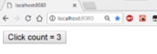
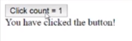

We kick off with the simple MobX React typescript application. We have `HelloData` that contains a simple `@observable` and an `@action`. We have a simple `Hello` `@observer` component that uses this `data` and the `render` method.

#### app.tsx

```typescript
import * as React from 'react';
import * as ReactDOM from 'react-dom';
import { observable, action } from 'mobx';
import { observer } from 'mobx-react';

class HelloData {
  @observable 
  clickedCount = 0;

  @action
  increment() {
    this.clickedCount++;
  }
}

@observer
class Hello extends React.Component<{}> {
  data = new HelloData();
  render() {
    return (
      <>
      <button onClick={() => this.data.increment()}>
        Click count = {this.data.clickedCount}
      </button>
      </>
    );
  }
}

ReactDOM.render(
  <Hello />,
  document.getElementById('root')
);
```

We render this component to the application root. When we click the button, an increment of the MobX observable causes the `Hello` component to re-render with the new `count`.



Now, let's say we want to show additional UI based on whether the button has been clicked at least once or not. We can do it easily with a simple conditional check and showing a `div` if the condition is met. 

```typescript
return (
  <>
  <button onClick={() => this.data.increment()}>
    Click count = {this.data.clickedCount}
  </button>
  {
    this.data.hasBeenClicked
    && <div>You have clicked the button!</div>
  }
  </>
);
```

Now, as we click the button, this new div shows up.



Since this condition is derived from the `clickedCount` member of the `data` class, we can move it into a nice getter with the semantic name into the `data` class that will help future maintenance of that class understand the data flow a bit better.

```typescript
get hasBeenClicked() {
  return this.clickedCount > 0;
}  
```

As we go and click the button, you can see the application still functions as expected. For these simple getters that can be derived from observables, MobX provides the `@computed` decorator which does not change the observed behavior of an application.

```typescript
import { observable, action, computed } from 'mobx';

@computed
get hasBeenClicked() {
  return this.clickedCount > 0;
}
```

If we go ahead and click the button, you can see that it still functions same as before. However, we get a neat optimization for free here. MobX will only re-run this getter if the value of the `clickedCount` changes. If none of the observables in a `@computed` have changed, the getter simply returns the last value without running its body.

To demonstrate this, let's go ahead and add a `log` to the getter body. 

```typescript
@computed
get hasBeenClicked() {
  console.log('called');
  return this.clickedCount > 0;
}
```

Within the `render` function, we access this getter twice. 

```typescript
return (
  <>
  <button onClick={() => this.data.increment()}>
    Click count = {this.data.clickedCount}
  </button>
  {
    this.data.hasBeenClicked
    && <div>You have clicked the button!</div>
  }
  {
    this.data.hasBeenClicked
    && <div>You have clicked the button!</div>
  }
  </>
);
```
Now, without the `@computed` annotation, the getter would get called twice.

However, as we've annotated it as a MobX `@computed`, when we run the application, you can see that the body of the getter only executes once for each `render`, even though its value is accessed twice. This is because MobX knows that the observable value used by the getter hasn't changed, and therefore doesn't need to re-run the body to get the new result.

This is just another example of MobX taking advantage of the observables to give you the best performing UI application with minimal effort.