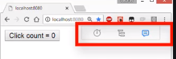
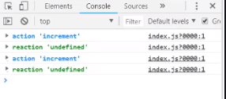

We kick off with the simple application from the previous step. We have `HelloData` that contains an `@observable` and an `@action`, and then a `Hello` component that uses this `data` within its `render` method. Finally, we render this component to the application route.

#### app.tsx
```typescript
class HelloData {
  @observable clickedCount = 0;

  @action
  increment() {
    this.clickedCount++;
  }
}

@observer
class Hello extends React.Component<{}> {
  data = new HelloData();
  render() {
    return (
      <button onClick={() => this.data.increment()}>
        Click count = {this.data.clickedCount}
      </button>
    );
  }
}

ReactDOM.render(
  <Hello />,
  document.getElementById('root')
);
```

We go ahead and `npm start` this application and visit it at [http://localhost:8080](http://localhost:8080). As we go ahead and click the button, the `data.increment` method gets called, causing the `Hello` component to re-render with the new `clickedCount`.

MobX provide excellent `mobx-react-devtools` that allow you to observe the changes that take place in actions along with the reactions that take place because of these changes. We install it from npm. 

```javascript
npm install mobx-react-devtools
```

Once installed, we can `import` it into our example application and then render it to the application route along with the `Hello` component.

```typescript
import MobxReactDevtools from 'mobx-react-devtools';
ReactDOM.render(
  <>
  <Hello />
  <MobxReactDevtools />
  </>,
  document.getElementById('root')
);
```

The MobX React devtools show up as a nice panel in the UI of our application. 



The last button in the panel can be used to log actions and reactions within MobX to the console. If we open up the console and click the button, you can see this take place.



Note that we are making all mutations within an action. By default, you can actually mutate observables outside of actions as well. MobX is smart enough to notice this fact and run any reactions that need to take place, for example, re-rendering the component.

```typescript
render() {
  return (
    <button onClick={() => this.data.clickedCount++}>
      Click count = {this.data.clickedCount}
    </button>
  );
}
```

However, it is highly recommended that you make all changes within actions and within the class that actually contains the data that you are changing. It is normally not a big deal, especially with TypeScript, when someone mutates data elsewhere, as you can easily find references reliably and refactor them into action calls.

Note that there is actually an option with MobX to configure it to only allow mutations within actions.

We import the `configure` method from `mobx` and ask it to `enforceActions` for all mutations. 

```typescript
import { configure } from 'mobx';
configure({
  enforceActions: true
});
```

If any mutation occurs outside of an action, MobX would now throw an error. This is not an option we normally set within projects, as the guidance of mutating data only within action methods is quite easy to follow.

One more thing to note is that MobX only re-renders any components that actually need to re-render to do some observable change. If we log out whenever we `render` the component, you can see that it renders on first application load and then whenever an observable change occurs in an action.

If we do not do any change in an observable, there is no reaction and therefore no need to re-render. This way, MobX provides PureComponent performance without the need to use complicated JavaScript patterns or immutable data structure libraries.