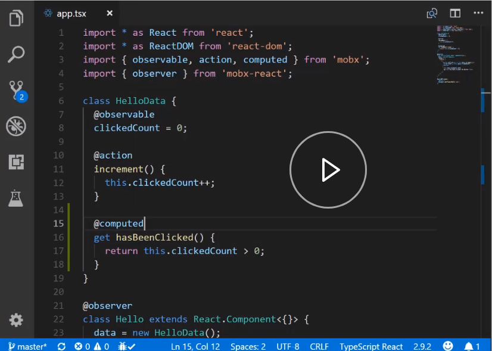
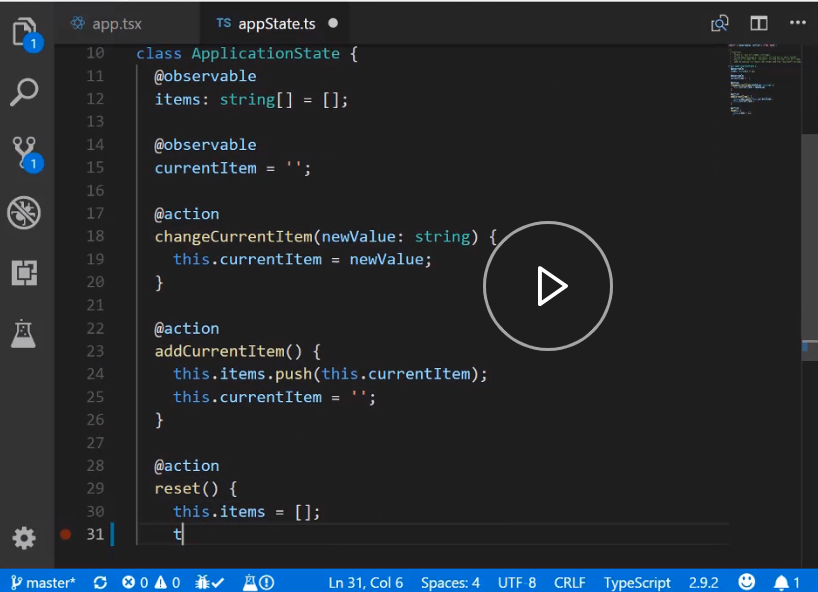

In this course, the idea we use again and again is that you can model your application logic using simple JavaScript classes, and with `mobx`, enable them as the beating heart of your React applications.

We start off covering just a few basic MobX concepts of `@observable`, `@action`, and `@computed`. 

Armed with this simple knowledge, you take a look at how you can extract the logic out of your component into well-defined state properties and mutations.

Next, we cover how you can even use this pattern to encapsulate your complete application logic into a simple application state `class`. 

This gives you a cohesive understanding of the data flow of your entire application. Then, we'll look at how you can create reusable state class driven components that work well with application classes for things like user input.

Finally, we even demonstrate how easy it is to test this state classes. Because MobX is transparent reactive, all you need to do is test your JavaScript classes using well-known testing patterns and strategies.

This state class pattern has scaled well in a large number of data-rich applications that I have developed with my colleagues, and I hope you enjoy using it as much as we do. Thank you.

