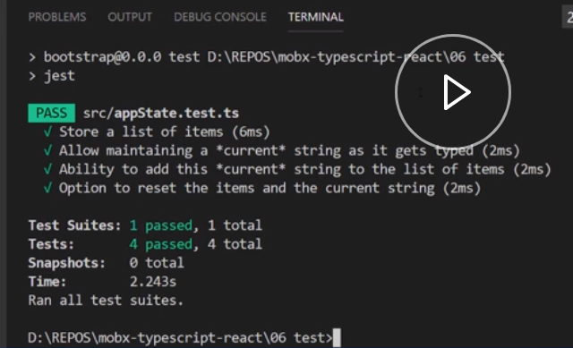
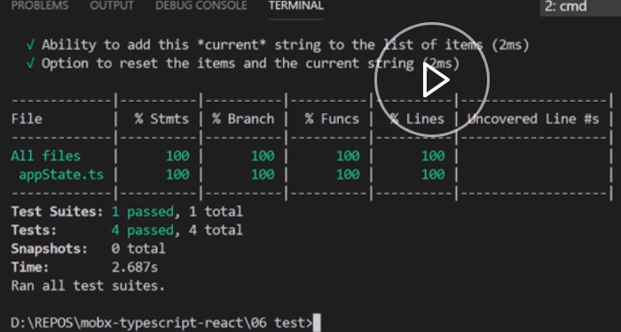

Here, we have a simple list application from a previous lesson. It allows us to add items and reset the items, if required. The behavior of this application is described by the `ApplicationState` class. In order to test the application behavior, we can go a long way by simply testing that the app state behaves as expected.

Since all we need to do is test simple JavaScript, we can use any testing framework like `Mocha`, `Jasmine`, or `Jest` with MobX. Let's go with `Jest` as that is the most common one used by React developers.

We already have `Jest` set up using the standard Typescript Jest process. We have a script target to run `Jest`. Installation was a simple `npm install` of the `@types`, `jest`, Jest itself, and `ts-jest`.

We've also configured `Jest` with the simple copy-paste of `jest.config.js` from our [Typescript React course](https://egghead.io/courses/use-typescript-to-develop-react-applications). Now, let's go ahead and add a test for the app state. You will test all the features that are provided by app state in individual tests.

We create a test file (appState.test.ts). 

Bring in the singleton `appState`. 

#### appState.test.ts
```typescript
import { appState } from './appState';
```

Before each test, you will go ahead and `reset` the `appState` to its initial state. 

```typescript
beforeEach(() => {
  appState.reset();
});
```

To test that it is going to store a list of items, we simply check the initial `items` to be an empty array.

```typescript
test('Store a list of items', () => {
  expect(appState.items).toEqual([]);
});
```

Next, to allow maintaining a current string as it gets typed, we check that the initial value is an empty string. 

```typescript
test('Allow maintaining a *current* string as it gets typed', () => {
  expect(appState.currentItem).toEqual('');
```

Then, we simulate a user type of character `a`, and ensure that the `currentItem` updates.

```typescript
appState.changeCurrentItem('a');
expect(appState.currentItem).toEqual('a');
```

Next, we type another character to make the value `ab`, and ensure that the `currentItem` updates accordingly. 

```typescript
appState.changeCurrentItem('ab');
expect(appState.currentItem).toEqual('ab');
```

To test the ability to add this current string to the list of items, we will go ahead and change the `currentItem` to some value and add it to the list.

```typescript
test('Ability to add this *current* string to the list of items', () => {
  appState.changeCurrentItem('ab');
  appState.addCurrentItem();
```

We expect the list to contain this item. 

```typescript
  expect(appState.items).toEqual(['ab']);
});
```

For the option to `reset` the `items` in the current string, we simply `addCurrentItem` to the list. We then `reset` the `appState` and `expect` the initial conditions.

```typescript
test('Option to reset the items and the current string', () => {
  appState.changeCurrentItem('a');
  appState.addCurrentItem();
  appState.reset();

  expect(appState.currentItem).toEqual('');
  expect(appState.items).toEqual([]);
});
```

Now, let's go ahead and run the test in the terminal using `npm t`.



You can see that the test passed with flying colors. Notice that as MobX is transparent reactive, you get to write simple JavaScript tests for your state behavior without having to go through complex APIs and patterns.

A neat feature of Jest is built in coverage support that you can activate with the `npm t -- --coverage` flag. 



You can see that our tests cover 100 percent of the application state behavior.