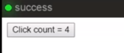
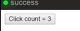

Let's kick off with a simple React TypeScript application.

We have a `Hello` component that maintains a local `clickedCount` state. 

#### app.tsx

```typescript
import * as React from 'react';
import * as ReactDOM from 'react-dom';

class Hello extends React.Component<{}, { clickedCount: number }> {
}
```
We initialize the state in the `constructor`. 

```typescript
constructor(props) {
  super(props);
  this.state = {
    clickedCount: 0
  };
}
```

We have a function that increments this using React's `setState`.

```typescript
increment() {
  this.setState({
    clickedCount: this.state.clickedCount + 1
  });
}
```

Finally, we `render` a `button` that increments this count `onClick` and shows the current `clickedCount` as its content. 

```typescript
render() {
  return (
    <button onClick={() => this.increment()}>
      Click count = {this.state.clickedCount}
    </button>
  );
}
```

We go ahead and render this component into the root of our page.

```typescript
ReactDOM.render(
  <Hello />,
  document.getElementById('root')
);
```

As we go ahead and click the button, the `clickedCount` is incremented and the UI updates accordingly. 



Using MobX in a React application is super easy. All we need to do is `npm install mobx mobx-react`. Since MobX is written in TypeScript, there is no additional setup or type definitions required.

The `mobx` module provides decorators, `observable`, to mark the property as `observable`, and `action`, to carry out mutations in a transactional manner.

```tsx
import { observable, action } from 'mobx';
```

`mobx-react` provides a decorator, `observer`, that can wrap a React component to make it reactive to observable's changes. 

```tsx
import { observer } from 'mobx-react';
```

These three, simple decorators are pretty much all you need to be highly productive with MobX.

Using MobX, we can isolate the state management for the `Hello` component into a simple `HelloData` class. It contains a simple `clickedCount` `@observable` property, and an `increment` `@action` that increments this `clickedCount` property using JavaScript.

```typescript
class HelloData {
  @observable clickedCount = 0;

  @action
  increment() {
    this.clickedCount++;
  }
}
```

To use this data class in a React component, we simply decorate the component as an `@observer`. Since we are no longer using React's state, we remove its generic annotation.

We simply initialize the `data` whenever the component is initiated, and then, use this `data` member in a `render` function to interact with the state. 

```typescript
@observer
class Hello extends React.Component<{}> {
  data = new HelloData();
  render() {
    return (
      <button onClick={() => this.data.increment()}>
        Click count = {this.data.clickedCount}
      </button>
    );
  }
}
```

If you run the demo, you can see that it works same as before.



Moving this data management out of the React component means it is completely independent of React. All the data management becomes simple JavaScript that can be tested and reasoned about in isolation, independent of its DOM representation.

Using MobX effectively turns React into a simple and effective data to DOM transform.