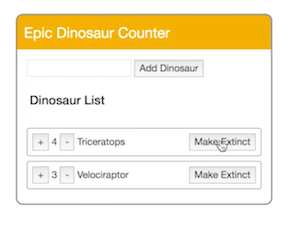

Here's a list of Dinosaurs. Let's prevent the heading from rendering, if there's no list. 



We'll add `v-if`, and set that to the comparison `dinos.length > 0`.

```html
<h4 v-if="dinos.length > 0">Dinosaur List</h4>
```

Now, our heading will be hidden if there are no dinosaurs, but that leaves the markup for the list. Let's create a new element called `template` and move our `v-if` statement onto it.

The element `template` won't be rendered in the view, but everything inside it will now be conditionally rendered. 

```html
<template v-if="dinos.length > 0">
	<h4>Dinosaur List</h4>
	<ul>
		<li v-for="dino in dinos">
			...
		</li>
	</ul>
</template>
```

If there isn't a list, we want to show a message.
Let's create a `p` tag with `v-else`, and give it some text. A `v-else` element will be rendered, if the previous `v-if` wasn't.

```html
<template v-if="dinos.length > 0">
	...
</template>
<p v-else>You have no dinosaurs yet!</p>
```

Now we want to conditionally show the addition and subtraction buttons based on the quantity of that species. For the addition `button`, let's add `v-show`, and set it equal to `dino.quantity < 5`.

```html
<button v-on:click="dino.quantity += 1"
		v-show="dino.quantity < 5">+</button>
```

For the subtraction, we'll set `v-show="dino.quantity > 1"`. `v-show` allows the element to be rendered in the view, and to be shown, or hidden with CSS.

```html
<button v-on:click="dino.quantity -= 1"
		v-show="dino.quantity > 1">-</button>
```