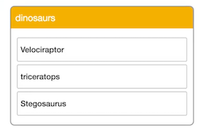

Here's a list of dinosaurs. 



Notice that some start with an uppercase letter and others don't. We can use **Vue.js** filters to fix this issue. Let's start out by adding more to our template. We'll add a `span` here that shows the dinosaur's name and his `weight`. Then we'll add a Wikipedia link to the bottom.

```html
<div id="card">
	<header>{{ title }}</header>
	<ul>
		<li v-for="dino in dinos">
			<h4>{{ dino.text }}</h4>
			<span>The {{ dino.text }} weighs {{ dino.weight }}.</span>
			<br>
			<a href="">https://en.wikipedia.org/wiki/{{ dino.text }}</a>
		</li>
	</ul>
</div>
```

At this point we're in a world of trouble. Let's start cleaning this up by capitalizing all of our titles. We need to create a block called filters in our component. Let's create a function called `capitalize` that accepts a param called `value`

```javascript
var card = new Vue({
	el: "#card",
	data: {<->},
	filters: {
		capitalize: function(value)
	}
})
```

After verifying that `value` is not empty and it is indeed a string, we'll return a version of it that begins with a capital letter. 

```javascript
var card = new Vue({
	el: "#card",
	data: {<->},
	filters: {
		capitalize: function(value){
			if (!value) return '';
			value = value.toString();
			return value.charAt(0).toUpperCase() + value.slice(1);
		}
	}
})
```

Now in Vue.js, filters only work inside the handlebar syntax of a template. We'll invoke the filter by piping it to `capitalize`. We'll do the same thing in our `h4`.

```html
<div id="card">
	<header>{{ title | capitalize }}</header>
	<ul>
		<li v-for="dino in dinos">
			<h4>{{ dino.text | capitalize }}</h4>
			<span>The {{ dino.text }} weighs {{ dino.weight }}.</span>
			<br>
			<a href="">https://en.wikipedia.org/wiki/{{ dino.text }}</a>
		</li>
	</ul>
</div>
```

Now that our titles are fixed, let's move on to the `span`s. We want them to be `undercase`. Let's create a new filter function called `undercase` We'll pass a `value` into it. We'll do the same empty and string checking as before, and return a lower case version of the string.

```javascript
var card = new Vue({
	el: "#card",
	data: {<->},
	filters: {
		capitalize: function(value){
			if (!value) return '';
			value = value.toString();
			return value.charAt(0).toUpperCase() + value.slice(1);
		},
		undercase: function(value){
			if (!value) return '';
			value = value.toString();
			return value.toLowerCase();
		}
	}
})
```

In our `span`, let's go ahead and pipe to `undercase`. We'll do the same thing in our anchor. 

```html
<div id="card">
	<header>{{ title | capitalize }}</header>
	<ul>
		<li v-for="dino in dinos">
			<h4>{{ dino.text | capitalize }}</h4>
			<span>The {{ dino.text | undercase }} weighs {{ dino.weight }}.</span>
			<br>
			<a href="">https://en.wikipedia.org/wiki/{{ dino.text | undercase }}</a>
		</li>
	</ul>
</div>
```

One of the powerful things about filters in Vue.js is you can chain them together. Let's create `url` filter. That filter's also going to take a `value`. After our glorious string empty combo, we're going to return a wiki link.

```javascript
var card = new Vue({
	el: "#card",
	data: {<->},
	filters: {
		capitalize: function(value){
			if (!value) return '';
			value = value.toString();
			return value.charAt(0).toUpperCase() + value.slice(1);
		},
		undercase: function(value){
			if (!value) return '';
			value = value.toString();
			return value.toLowerCase();
		},
		url: function(value){
			if (!value) return '';
			value = value.toString();
			return "https://en.wikipedia.org/wiki/" + value;
		}
	}
})
```

Let's chain these guys together. We're going to remove the old link. After `undercase`, we're just going to pipe it to `url`. That way `dino.text` moves through both the `undercase` and `url` filters.

```html
<div id="card">
	<header>{{ title | capitalize }}</header>
	<ul>
		<li v-for="dino in dinos">
			<h4>{{ dino.text | capitalize }}</h4>
			<span>The {{ dino.text | undercase }} weighs {{ dino.weight }}.</span>
			<br>
			<a href="">{{ dino.text | undercase | url }}</a>
		</li>
	</ul>
</div>
```