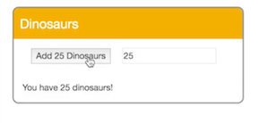

Here we have a `button`. Let's add `v-on:click`, and set that `"total += 1"` Now, when we click the Add Dinosaur `button`, our `total` is incremented by one. We'll add an `input` field of `type="number"` and set `v-model` to the `"amount"` attribute on our component.

```html
<div id="app">
	<header>Dinosaurs</header>
	<button v-on:click="total += 1">Add Dinosaurs</button>
	<input type="number" v-model="amount" />
	<p>You have {{ total }} dinosaurs!</p>	 
</div>
```

Let's change our click event on the `button` to `"addDinos"`. Now, we can type a number into the `input` field, and click the `button` to add that amount to our `total`. Let's change our `button` text to reflect the amount of Dinosaurs being added. We want to make it so that the user can just press enter from the `input` field, to add that amount of Dinosaurs.

```html
<div id="app">
	<header>Dinosaurs</header>
	<button v-on:click="addDinos">Add {{ amount }} Dinosaurs</button>
	<input type="number" v-model="amount" />
	<p>You have {{ total }} dinosaurs!</p>	 
</div>
```

```javascript
methods: {
	addDinos: function(){
		this.total += this.amount;
	}
}
```

Let's add `v-on:keyup.enter`, and set it equal to `"addDinos"` Let's make this more accessible by wrapping these elements in a `form` element. On our `form`, let's add `v-on:submit="addDinos"`

```html
<div id="app">
	<header>Dinosaurs</header>
	<form v-on:submit="addDinos">
		<button v-on:click="addDinos">Add {{ amount }} Dinosaurs</button>
		<input type="number" v-model="amount" v-on:keyup.enter="addDinos" />
	</form>
	<p>You have {{ total }} dinosaurs!</p>	 
</div>
```

We can remove the events from the `button` and the `input` field, since the `form` will be taking care of those. In order to prevent the default action of the `form`, we can use the event modifier `.prevent`.

```html
<div id="app">
	<header>Dinosaurs</header>
	<form v-on:submit.prevent="addDinos">
		<button>Add {{ amount }} Dinosaurs</button>
		<input type="number" v-model="amount" />
	</form>
	<p>You have {{ total }} dinosaurs!</p>	 
</div>
```

