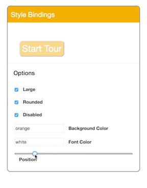

Here, we've got a list of inputs that are bound using `v-model` to our component's `data` block. Let's create a dynamic class by using `v-bind:class`, then create a ternary based on the result of `sizeToggle`. If true, return the string, `"large"` and if it's false, return an empty string.

```html
<div id="card">
	<header>{{ title }}</header>
	<button v-bind:class="sizeToggle ? 'large' : ''">Start Tour</button>
	...
</div>
```

Let's add another class. We do that by turning `v-bind:class` into an array. For the second item in the array, let's create a key value pair. Vue will render this key if the value returns true. We can use `v-bind:disabled` to bind the disable state of our button to a variable `"disabled"`.

```html
<div id="card">
	<header>{{ title }}</header>
	<button v-bind:class="[sizeToggle ? 'large' : '', { 'rounded': isRounded }]"
			v-bind:disabled="disabled">Start Tour</button>
	...
</div>
```

What if we wanted to bind to an entire block of inline styles? Let's add `v-bind:style` and set that equal to `styles`. `styles` will need to be a computed property in this case, so we'll create a computed block after `data` and add a `styles` method.

```html
<div id="card">
	<header>{{ title }}</header>
	<button v-bind:class="[sizeToggle ? 'large' : '', { 'rounded': isRounded }]"
			v-bind:style="styles"
			v-bind:disabled="disabled">Start Tour</button>
	...
</div>
```

That method will `return` a block of key value pairs. These keys and values will be displayed as inline styles in the view, so we need to use actual CSS properties. Now, we have a large rounded but disabled button with an orange background and white text that we can slide over to the left.

```javascript
data: {
	...
},
computed: {
	styles: function(){
		return {
			color: this.fontColor,
			background: this.backgroundColor,
			'margin-left': this.range + "%"	
		}
	}
}
```

