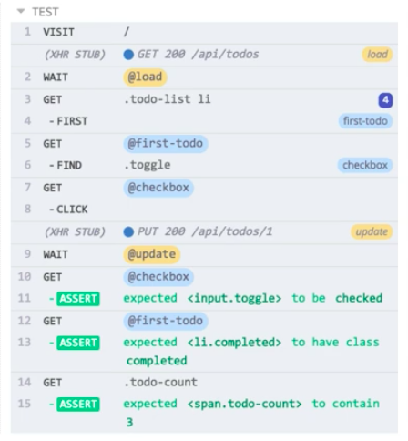
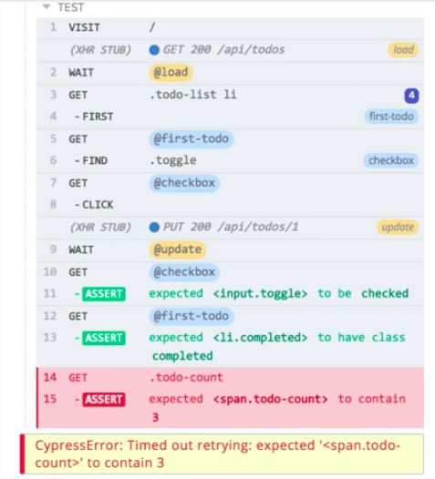
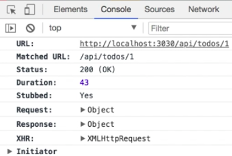
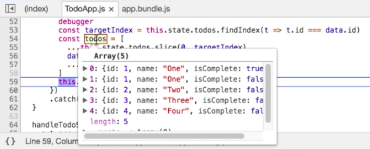

Instructor: [00:00] I've added a new test to verify the item-toggling behavior of our application. It's a relatively long test. Let's just walk through it real quick. 

[00:08] First we call `cy.server` so that we can set up a route to stub out our API calls. We have a call to `cy.seedAndVisit`, which is going to seed our application with its initial data and visit our page. 

[00:21] Then we have a call to `cy.fixture` that loads our `'todos'` fixture and then uses that to set up our route for our update API call. We grab the first `todo` off that list and set that as the `target`. Then we call `cy.route` with a `PUT` using the target's `id` as part of the URL. 

[00:39] Then our return value is going to be our existing target object with the `isComplete` flag set to `true`. We're doing this using lodash, which is exposed through the Cypress object. Then we give our route an alias of `'update'`. 

[00:56] With that setup done, we're going to go down. We're going to call `cy.get`. We're going to get our `'.todo-list li'` items. Grab the first off of those. Create an alias called `'first-todo'`. Then we're going to use that alias in a `get`. 

[01:08] Then we're going to find the underlying `'.toggle'`, which is our checkbox. We're going to give that an alias of `checkbox`. From there we `cy.get('@checkbox')`. We `click` it. Then we have a call to `cy.wait` on our update route to wait for the response from our API call. 

[01:25] Then we `cy.get('@checkbox')` again. Verify that it's checked. We get our `first-todo` using the alias. Verify that it has the class of completed. Then we get the `todo-count` from the footer and verify that it `'contains'` the number `3`. 

[01:39] Now that we've gone through that, let's see our test run. I'll open Cypress. I'll open the `list-items.spec.js` file. We'll see that our test runs successfully and all of our assertions are passing.

 

[01:55] I've introduced some broken code to this feature off-screen. Let's run our test again and see what happens. 



We'll see that our test fails after a long delay because it's retrying to get the desired state. We'll see down here that our todo count was expected to be three. It's four. 

[02:14] If we look at the snapshot, we can see why this assertion is failing. We actually have four todos left. We'll see that we also have our completed todos. We have an extra todo in here. Let's figure out why this is happening. 

[02:28] We can come over to the command log. We can walk up. We can see what happens at each step. We'll see on the 13th step, the expectation that our first item is completed is passing because that first item is checked. Same thing here with the checkbox. We're walking up. 

[02:47] We'll see here if we hover over this API call, `(XHR STUB) PUT 200/api/todos/1`, that it's going to flicker between two states. This is showing us before the request and after the request has completed. Let's click on this to pin it. 

[02:59] Now that it's pinned, we can manually do this. We can look at prerequest. We have our four items. If we look at after our response, we have five items. Four of those are left to do. One is our completed item. 

[03:14] We know where this code is because we own the application that we're testing. Let's go back to our code. Let's find that. I happen to know that's in the `TodoApp.js` file. This is our `updateTodo` method. 

[03:29] What I'm going to do is come into this `then` when we get our response. I'm going to throw a `debugger` statement in here. 

#### TodoApp.js
```javascript
updatetodo(updated)
  .then(({ data}) => {
    debugger
    ...
  })
```

I'm going to save that. Now I'm going to switch back to the Cypress runner. I'm going to open up Chrome's dev tools. 



[03:43] The first thing you'll see is that when we pin this stub, our console is going to show us a bunch of information about that request. If we wanted to come down here and look at the `response` and just verify that our expected response is coming back, we could do that. 

[03:59] Let's run our test again and see how we can take advantage of that debugger statement. I'm just going to come up here. Run test. We'll see that it's going to get paused in the debugger. It's going to drop to my debugger statement in the source map version of our file. 

[04:15] We can see that the data coming in already is exactly what we're getting from our response. That's as expected. Let's use our debugger. We'll step over. We'll come back down to the dev tools. 

[04:26] We can just hover over `this.state.todos` and verify that at the moment we have four todos. Exactly what we expect. Our initial items. One, two, three, and four. All of them are incomplete. 

[04:39] Then we can step over again. We can verify `targetIndex`. We'll see that that's zero. That's what we want because that's the first item that we're targeting. 

[04:49] Then we have this assignment statement where we're creating a new array to reflect the updated data and assigning that to `todos`. Let's step over. Let's check out todos. 

[05:01] We're going to see immediately that this array has an extra element. 



If we look at them, the first two are both `one`. They both have the same `id`. They have different `isComplete` flags. This is clearly where our problem is coming from. 

[05:15] We'll see once we get past this the next step is to assign it to `state`, which will trigger a render, which will give us our extra item. I'll just re-zoom the script. We'll see our test will have that extra four-second delay while it tries to wait for the state to catch up. Our test is still failing. 

[05:34] It's pretty clear where our problem is, but we can still use the dev tools to verify this. Let's run this test one more time with our debugger in place. What we're going to do is we're just going to step over. We know we don't care about target index. We want the todo assignment done. 

[05:51] Before we let the application call `setState`, let's jump over to the console. We can get a reference to todos here. So let's call it here in the console. We can see it, but we can also reassign it. Let's look at this. Let's give this a state we think we want and make sure that our test passes. 

[06:09] Looking at this, the way the data's coming back, our first todo is the one we expect. The second one is our duplicate. Let's reassign `todos`, keeping todos of zero. 

[06:24] Then I'm going to use the spread operator. Reference `todos` again. Then `slice` it from element two on. That's going to give us our first item, skip the second, and give us the rest of the array. 

#### console
```javascript
todos = [todos[0], ...todos.slice(2)]
```

[06:36] It's going to assign that to todos. Now that we have that done, we can resume execution. This time, our test is going to pass. We've verified that fixing that todo will make our test successful. 

[06:53] Now all we have to do is take this assumption, figure out how to fix the code, and we're in good shape. Let's switch back to our editor. I'm going to take the `debugger` statement out. I'm going to come down here. 

[07:06] It's pretty clear, through all this investigation, that our issue is we forgot to add one to this target index. 

#### TodoApp.js
```javascript
updateTodo(updated)
  .then(({ data}) => {
    const targetIndes = ...
    const todos = [
      ...this.state.todos.slice(0, targetIndex),
      data,
      this.state.todos.slice(targetIndex + 1)
    ]
    ...
  })
```

We can save this. Switch back to the test runner. I'll get the dev tools out of the way. Run this again. We're good. 

 

[07:25] I'm just going to do one more refactor. I don't really like this code. I'm going to take it out. I'm going to replace it. I'm just going to put back the code that I replaced to cause the break. 

[07:37] We're just reassigning todos using a map. 

```javascript
updateTodo(updated)
  .then(({ data}) => {
    const todos = this.state.todos.map(t => (t.id === data.id ? data: t))
    this.setState({ todos: todos })
  })
  .catch(() => this.setState({ error: true }))
```

We can save that. We can jump right back in and one more time make sure we didn't break it with our refactor. 

[07:48] Our test is passing. Our code works. Now we know how to debug through Chrome's dev tools while running a test in Cypress.