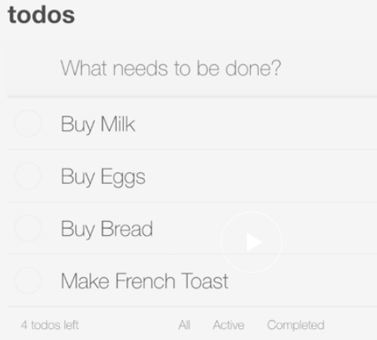
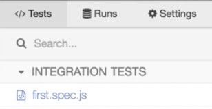
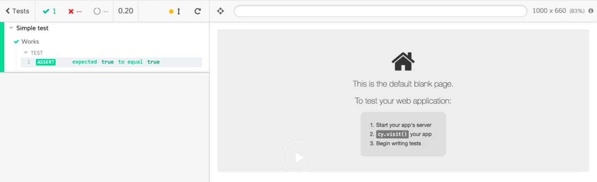

Instructor: [00:00] Here, I have a simple to-do application with most of the functionality implemented. It's built using React. It has a straightforward webpack configuration for the build. We also have a server. This is going to serve our static files, as well as provide the API that we're going to use to load and save data with our application. 

[00:19] I'll open the terminal. I can run this application by typing in `npm run dev` and pressing enter.

#### Terminal
```bash
$ npm run dev
```

We'll see that this is going to start up our server. We're also going to see some webpack build output. 

[00:32] Now, our application is running on `localhost 3030`. Let's open that up in a browser and take a look. We'll see that the application is running and has loaded some data from the API. 

[00:41] I can interact with this application. I can toggle todos. I can add new to-dos. I can delete existing to-dos. If I toggle a couple items, we'll see that our filters all work. Everything is working as we would expect it to. 



[00:59] Let's add Cypress to this project so we can create tests for this existing functionality. I'm going to switch back to the terminal. I'll stop the application for now. I'll add Cypress as a dev dependency using `npm install --save-dev cypress`. 

```Bash
$ npm install --save-dev cypress
```

[01:25] We'll see that the installer is telling us we can open Cypress with `node_modules/.bin/cypress open`. I'll copy this. I'll paste it into the terminal. We'll run this command. 

```Bash
$ node_modules/.bin/cypress open
```

[01:40] This will launch the Cypress UI. Since it's the first time we're running Cypress on this project, Cypress will seed our project with a Cypress directory with some sample files. It's also added a `cypress.json` to the root of our project. 

[01:53] We can click OK. Then, let's close Cypress for now. I don't want to have to type this entire command in every time I want to start Cypress. I'm going to add a command to our `package.json`. We'll drop under `"dev"`. We'll call this one `"cypress"`. We'll make this command `"cypress open"`.

#### package.json
```js
"dev": "concurrently \"npm run watch\" \"npm run serve/"",
"cypress": "cypress open"
```

[02:15] Now to run Cypress again, I'll go back to the terminal. I'll type `npm run cypress`. 

#### Terminal
```Bash
$ npm run cypress
```

That'll launch the Cypress UI for us again. This time we don't get the message letting us know about the seed files because that's already been taken care of. 

[02:35] Now, we have our `package.json` script in place. Let's close Cypress. I'll get the terminal out of the way for now and close `package.json`. Then, I'm going to go into that `cypress` directory that the application created for us. I'm going to go into Cypress `integration`. I'm going to right-click on this `example_spec.js` and delete it. 

[02:56] Now, let's create our own first test file. We'll create a new file. I'm going to call this one `first.spec.js`. Let's create a simple test just to make sure everything is working. 

[03:08] We'll start with a `describe` block. We'll just give that a description of `'Simple test'`. Then, we're going to add an `it` block for our test. We'll just say, `'Works'`. All we're going to do is run this test to make sure that Cypress is working and actually executing our test. We'll throw an `expect` in here. We're just going to expect `true` to equal `true`. 

#### first.spec.js
```javascript
describe('simple test', () => {
  it('Works', () => {
    expect(true).to.equal(true)
  })
}
```

I'll save this file. 

[03:36] Back in the terminal, I'll `npm run cypress`. We'll see that `first.spec.js` is showing up. 



We'll click on that. This will launch our Cypress test runner. We'll see that our test works. We have some nice output here in the command log. 



Now, our project has Cypress set up. We can execute our test with our npm script.