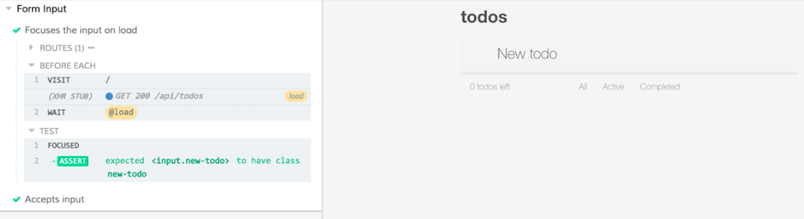
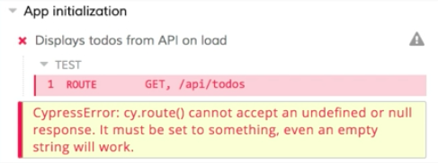

Instructor: [00:00] In this test, we're using `cy.server` and `cy.route` to stub out an API call that's made when this page loads. We're then calling `cy.visit` to visit the root of our application. We're using `cy.wait` to make sure we wait for that load to complete before we make any assertions or interact with our application in another way. 

#### app-init.spec.js
```javascript
describe('App initialization', () => {
  it('Displays todos from API on load', () => {
    cy.server()
    cy.route('GET', '/api/todos', 'fixture:todos').as('load')

    cy.visit('/')

    cy.wait('@load')

    cy.get('.todo-list li').should('have.length', 4)
  })
})
```

[00:16] We'll probably want to perform the same set of steps, or at least some variation of this set of steps, in most of our tests across all of our spec files. Luckily, Cypress gives us a way to very easily create custom commands that we can use right off the global `cy` object. 

[00:32] Let's create a custom command that encapsulates all of these commands. I'll start by copying this code. Then, under the `cypress` directory, I'm going to expand the `support` directory and open `commands.js`. `commands.js` has a bunch of comments that tell us how we can create different commands. 

[00:48] We're going to scroll down to the bottom. On a new line, we'll create our own custom command. We'll start with the global `Cypress.Commands.add`. 
Instructor: [00:00] In this test, we're using `cy.server` and `cy.route` to stub out an API call that's made when this page loads. We're then calling `cy.visit` to visit the root of our application. We're using `cy.wait` to make sure we wait for that load to complete before we make any assertions or interact with our application in another way. 

#### app-init.spec.js
```javascript
describe('App initialization', () => {
  it('Displays todos from API on load', () => {
    cy.server()
    cy.route('GET', '/api/todos', 'fixture:todos').as('load')

    cy.visit('/')

    cy.wait('@load')

    cy.get('.todo-list li').should('have.length', 4)
  })
})
```

[00:16] We'll probably want to perform the same set of steps, or at least some variation of this set of steps, in most of our tests across all of our spec files. Luckily, Cypress gives us a way to very easily create custom commands that we can use right off the global `cy` object. 

[00:32] Let's create a custom command that encapsulates all of these commands. I'll start by copying this code. Then, under the `cypress` directory, I'm going to expand the `support` directory and open `commands.js`. `commands.js` has a bunch of comments that tell us how we can create different commands. 

[00:48] We're going to scroll down to the bottom. On a new line, we'll create our own custom command. We'll start with the global `Cypress.Commands.add`. 

[00:59] The first argument to add is going to be the name of our command. We're going to seed and visit our application through this command. We'll just call it `seedAndVisit`. 

#### commands.js
```javascript
Cypress.Commands.add('seedAndVisit')
```

[01:16] The second argument is a function. This is where the logic for our command is going to live. 

[01:22] I copied that code. I'm going to paste it right in here. I'll format it. This is our custom command. 

```javascript
Cypress.Commands.add('seedAndVisit', () => {
  cy.server()
  cy.route('GET', '/api/todos', 'fixture:todos').as('load')

  cy.visit('/')

  cy.wait('@load')
}) 
```

[01:29] We'll save this. Back in my spec, I'm going to take these lines and delete them. I'm going to replace them with a call to `cy.seedAndVisit`. 

#### app-init.spec.js
```javascript
describe('App initialization', () => {
  it('Displays todos from API on load', () => {
    cy.seedAndVisit()

    cy.get('.todo-list li').should('have.length', 4)
  })
})
```

[01:39] With this in place, I'm going to save this, switch back to the runner, and we'll see that our test still runs. Everything's working the same way it was before. 

[01:50] Now we know our command is working. Let's switch back to the code. I'm going to open up our `form-input.spec.js` file. 

[01:58] This is using a beforeEach to visit the root of our application. It doesn't really say anything about the initial API call. 

#### form-input.spec.js
```javascript
describe('Form Input', () => {
  beforeEach(() => {
    cy.visit('/')
  })

  it('Focuses the input on load', () => {
    cy.focused().should('have.class', 'new-todo')
  })

  it.only('Accepts input', () => {
    const typedText = 'New todo'
    cy
      .get('.new-todo')
      .type(typedText)
      .should('have.value', typedText)
    })
})
```

[02:05] In this case, since that's not stubbed, it's going to call our actual API. Let's replace this call to `cy.visit` with a call to our custom command. 

```javascript
describe('Form Input', () => {
  beforeEach(() => {
    cy.seedAndVisit()
  })
  ...
})
```

[02:17] We'll save it. Then I'm going to switch back to Cypress and back to my test. I'm going to run the `form-input.spec.js` file now. 

[02:28] Now we'll see that we have our fixture data which is being loaded by a custom command. If I expand out the command log, we'll see that our XHR call for our initial get to `/api/todos` is being stubbed out. 


[02:42] This is great. Everything's working the way I expect it to. Neither one of these tests really care about the list. Let's update our custom command so that we can specific what to seed our application with. 

[02:55] I'll switch back to the code. In the case of these input form tests, I'd really like to be able to see the application with an empty array. The list isn't populated. We don't have to worry about that part. 

[03:07] Ideally, I could pass an empty array here. 

```javascript
describe('Form Input', () => {
  beforeEach(() => {
    cy.seedAndVisit([])
  })
  ...
})
```

That would be our seed data for our application. To make this work, we need to refactor our custom command, so we switch back into the `commands.js` file. 

[03:19] We'll see that we have a function here. This function can take arguments. I'm going give this an argument, which I'll call `seedData`. 

[03:27] Then I'm going to come down here. I'm going to cut this `fixture:todos`. I'm going to use `seedData` in my route as the response. 

#### commands.js
```javascript
Cypress.Commands.add('seedAndVisit', seedData => {
  cy.server()
  cy.route('GET', '/api/todos', seedData).as('load')

  cy.visit('/')

  cy.wait('@load')
}) 
```

[03:37] If everything's working properly, that form input spec is going to pass in that empty array. That'll be our seed. 

[03:43] I'm going to save the command. Then I'm going to save the tests. When the tests run again, we'll see that our tests are passing because they're testing the form behavior. We'll also notice that the preview doesn't contain any todo items because that initial API call is stubbed out. It's receiving an empty array as its response. 



[04:06] Now I'm going to go back to tests. I'm going to open up the `app-init.spec.js` file. We'll run that. We'll see this time we have a problem because we're getting a null or undefined passed in because we never passed this in an initial argument. 



[04:21] Let's switch back to the code. I'm going to update our command with a reasonable default. If `seedData` is not passed in, I want to set it to equal that `fixture:todo` string. 

```javascript
Cypress.Commands.add('seedAndVisit', (seedData = 'fixutre:todos') => {
  cy.server()
  cy.route('GET', '/api/todos', seedData).as('load')

  cy.visit('/')

  cy.wait('@load')
}) 
```

[04:47] This time when we run it, everything's going to work just fine. Our default is to load our todos from the fixture. If we need to override that behavior, all we have to do is pass a custom argument into that `seedAndVisit` command.
[00:59] The first argument to add is going to be the name of our command. We're going to seed and visit our application through this command. We'll just call it `seedAndVisit`. 

#### commands.js
```javascript
Cypress.Commands.add('seedAndVisit')
```

[01:16] The second argument is a function. This is where the logic for our command is going to live. 

[01:22] I copied that code. I'm going to paste it right in here. I'll format it. This is our custom command. 

```javascript
Cypress.Commands.add('seedAndVisit', () => {
  cy.server()
  cy.route('GET', '/api/todos', 'fixture:todos').as('load')

  cy.visit('/')

  cy.wait('@load')
}) 
```

[01:29] We'll save this. Back in my spec, I'm going to take these lines and delete them. I'm going to replace them with a call to `cy.seedAndVisit`. 

#### app-init.spec.js
```javascript
describe('App initialization', () => {
  it('Displays todos from API on load', () => {
    cy.seedAndVisit()

    cy.get('.todo-list li').should('have.length', 4)
  })
})
```

[01:39] With this in place, I'm going to save this, switch back to the runner, and we'll see that our test still runs. Everything's working the same way it was before. 

[01:50] Now we know our command is working. Let's switch back to the code. I'm going to open up our `form-input.spec.js` file. 

[01:58] This is using a beforeEach to visit the root of our application. It doesn't really say anything about the initial API call. 

#### form-input.spec.js
```javascript
describe('Form Input', () => {
  beforeEach(() => {
    cy.visit('/')
  })

  it('Focuses the input on load', () => {
    cy.focused().should('have.class', 'new-todo')
  })

  it.only('Accepts input', () => {
    const typedText = 'New todo'
    cy
      .get('.new-todo')
      .type(typedText)
      .should('have.value', typedText)
    })
})
```

[02:05] In this case, since that's not stubbed, it's going to call our actual API. Let's replace this call to `cy.visit` with a call to our custom command. 

```javascript
describe('Form Input', () => {
  beforeEach(() => {
    cy.seedAndVisit()
  })
  ...
})
```

[02:17] We'll save it. Then I'm going to switch back to Cypress and back to my test. I'm going to run the `form-input.spec.js` file now. 

[02:28] Now we'll see that we have our fixture data which is being loaded by a custom command. If I expand out the command log, we'll see that our XHR call for our initial get to api/todos is being stubbed out. 


[02:42] This is great. Everything's working the way I expect it to. Neither one of these tests really care about the list. Let's update our custom command so that we can specific what to seed our application with. 

[02:55] I'll switch back to the code. In the case of these input form tests, I'd really like to be able to see the application with an empty array. The list isn't populated. We don't have to worry about that part. 

[03:07] Ideally, I could pass an empty array here. 

```javascript
describe('Form Input', () => {
  beforeEach(() => {
    cy.seedAndVisit([])
  })
  ...
})
```

That would be our seed data for our application. In order to make this work, we need to refactor our custom command, so we switch back into the `commands.js` file. 

[03:19] We'll see that we have a function here. This function can take arguments. I'm going give this an argument, which I'll call `seedData`. 

[03:27] Then I'm going to come down here. I'm going to cut this `fixture:todos`. I'm going to use `seedData` in my route as the response. 

#### commands.js
```javascript
Cypress.Commands.add('seedAndVisit', seedData => {
  cy.server()
  cy.route('GET', '/api/todos', seedData).as('load')

  cy.visit('/')

  cy.wait('@load')
}) 
```

[03:37] If everything's working properly, that form input spec is going to pass in that empty array. That'll be our seed. 

[03:43] I'm going to save the command. Then I'm going to save the tests. When the tests run again, we'll see that our tests are passing because they're testing the form behavior. We'll also notice that the preview doesn't contain any todo items because that initial API call is stubbed out. It's receiving an empty array as its response. 


[04:06] Now I'm going to go back to tests. I'm going to open up the `app-init.spec.js` file. We'll run that. We'll see this time we have a problem because we're getting a null or undefined passed in because we never passed this in an initial argument. 


[04:21] Let's switch back to the code. I'm going to update our command with a reasonable default. If `seedData` is not passed in, I want to set it to equal that `fixture:todo` string. 

```javascript
Cypress.Commands.add('seedAndVisit', (seedData = 'fixutre:todos') => {
  cy.server()
  cy.route('GET', '/api/todos', seedData).as('load')

  cy.visit('/')

  cy.wait('@load')
}) 
```

[04:47] This time when we run it, everything's going to work just fine. Our default is to load our todos from the fixture. If we need to override that behavior, all we have to do is pass a custom argument into that `seedAndVisit` command.