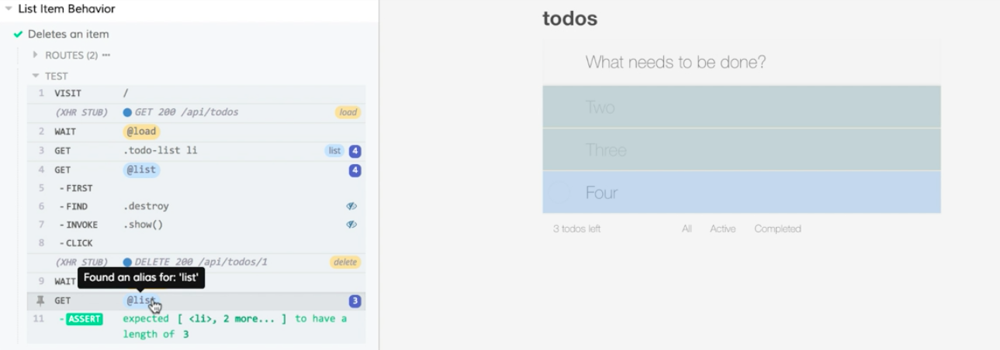

Instructor: [00:00] If we look at this test, `list-items.spec.js`-- and I'll just collapse everything up to `cy.seedAndVisit` to get it out of the way -- you'll see that we have two different calls to `cy.get`, that are using the same CSS selector. You might see something like this and want to remove this duplication. 

#### list-items.spec.js
```javascript
describe('List Item Behavior', () => {
  it('Deletes an item', () => {
    cy.server()
    cy...
    cy.seedAndVisit()

    cy.get('.todo-list li')
      .first()
      .find('.destroy')
      .invoke('show')
      .click()

    cy.wait('@delete')

    cy.get('.todo-list li')
      .should('have.length', 3)
  })
})
```

[00:13] You might be inclined to come up here and define a constant called `list` and assign that the result of `cy.get`. Then come down here and replace `cy.get` with a reference to list, and then do the same thing again with the second `cy.get`. 

[00:34] This seems perfectly logical until you realize that everything in Cypress runs asynchronously. This synchronous approach isn't going to work. The other issue that we could run into here is that if this DOM reference goes stale, things we do later in our test are not going to reference the current state of our application. 

[00:52] Let's undo those changes and see how we can remove this duplication in a safe way. If we expand this back out, we're stubbing out this `route`. We'll see we end it with a call to `as`, passing it the string `'delete'`. 

[01:05] This gives us the alias delete that we get to use down here in our `wait`. We can also create aliases for DOM selections. 

[01:12] I'm going to come up here. After this `cy.get`, I'm going to tack on an `as`. I'm going to pass it `list`. 

[01:24] Now I can use this `list` alias for my DOM elements in calls to cy.get. I'll prefix this with an @ symbol and use my `list` alias. 

[01:33] Then I can scroll down. I can do the same thing down here, where I can replace this with `'@list'`. 

```javascript
cy.get('.todo-list li')
  .as('list')

cy.get('@list')
  .first()
  .find('.destroy')
  .invoke('show')
  .click()

cy.wait('@delete')

cy.get('@list')
  .should('have.length', 3)
```

[01:44] Cypress still has a reference to these list items. It'll reuse those. If it detects that that DOM has gone stale through a rerender, it'll reselect those items using the original passed-in selector. 

[01:57] Now we have safe reuse. Let's save this. 

[02:01] In the Cypress UI, let's run our test again just to make sure our refactor hasn't broken anything. Everything still passes. We can see here -- in the command log -- references to our alias and the uses of that alias in our gets.

