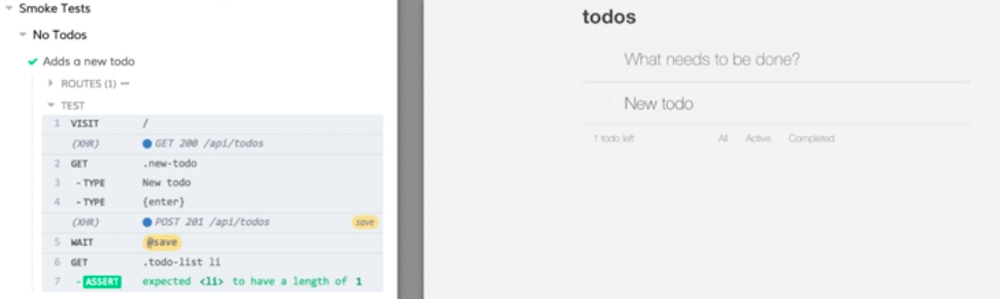
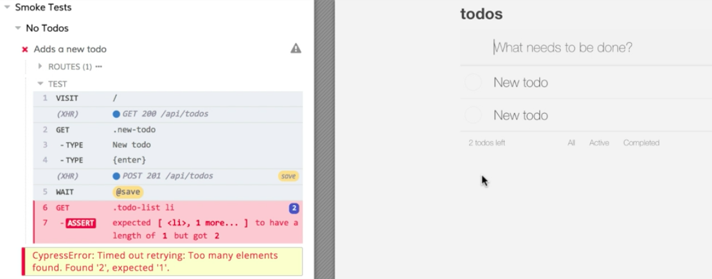
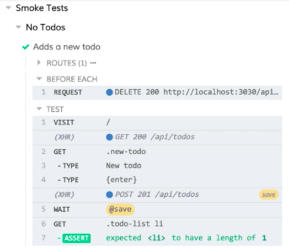
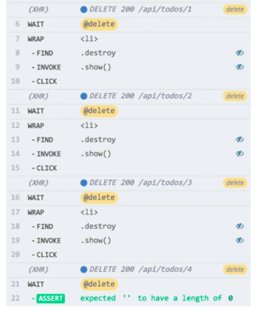

Instructor: [00:00] We want the majority of our tests in Cypress to be integration tests. We can be very confident in our application code with a solid suite of those integration tests. 

[00:07] That being said, having a handful of full end-to-end tests will help us make sure we haven't missed anything while mocking out our services. Let's see how we can use Cypress to create complete end-to-end tests. 

[00:19] First, let's take a look at our server setup for this project. This project is setup to use JSON Server to back our application. It's using this `db.json` file as our database. 

[00:30] When we have `"todos"` populated for the application, those go in this array. Those are just our objects with our todo properties, so our ID, our name, and our isComplete flag. 

#### db.json
```javascript
{
  "todos": []
}
```

[00:44] All of that is controlled using the `server.js` file. That wires up our JSON Server and gives us the ability to create a couple of custom endpoints that I have here for doing a bulk delete operation and a bulk insert operation, which we'll see in a moment. 

[01:00] Let's create a new spec file in our Cypress `integration` Directory. I'm going to call this one `smoke-tests.spec.js`. We'll start this off with a `describe` block. We'll make our description `'Smoke Tests`. 

#### smoke-test.spec.js
```javascript
describe('Smoke Tests', () => {
  
})
```

[01:22] Then we're going to break this down into different `context`. We'll start with context where we have `'No Todos'`, and then we're going to put a test in here. `it(Adds a new todo' ...`. 

```javascript
describe('Smoke Tests', () => {
  context('No Todos', () => {
    it('Adds a new todo', () => {

    })
  })
})
```

[01:35] Now, when we add a new todo, that's going to cause a post to our API. We want to listen to that. We don't need to stub it out anymore, but we still want to still listen to it. 

[01:45] I'm going to add a `cy.server` followed by a `cy.route`. I'm going to set up the route for a `'POST'` to `'/api/todos'`. I'm not going to give it a return value. 

[01:59] This is going to listen to this, but it's not going to stub it out for us. Then I'm going to give it an alias, and we'll call it `'save'`. 

```javascript
describe('Smoke Tests', () => {
  context('No Todos', () => {
    it('Adds a new todo', () => {
      cy.server()
      cy.route('POST', '/api/todos').as('save')

    })
  })
})
```

[02:08] With that configured, now we need to `cy.visit` our page. We're not going to use `seedAndVisit` because we don't want to seed it or stub anything out. We just want to visit it and let it do its thing. 

[02:18] Now we're going to drop down. We'll use `cy.get`. We're going to get our input. That has a class of `'.new-todo'` on it. 

[02:24] Then we're going to `type` into it. We'll just type in the string, `'New todo'`, and then we want to `type` enter to submit our form. 

[02:34] I'll just put enter and curly braces there. We could combine this. This enter could be part of the initial string. That would work just fine. I like to separate them for readability. I'm going to drop this down here. 

[02:49] Then, once we press Enter, we expect that post to complete and respond. We're going to do a `cy.wait` for our `'@save'` alias. 

```javascript
describe('Smoke Tests', () => {
  context('No Todos', () => {
    it('Adds a new todo', () => {
      cy.server()
      cy.route('POST', '/api/todos').as('save')

      cy.visit('/')

      cy.get('.new-todo')
        .type('New todo')
        .type('{enter}')

      cy.wait('@save')
    })
  })
})
```

[02:58] Again, this isn't stubbed. This will make an actual call to our server. It'll wait for that response, and then we can make some assertions. 

[03:06]I'm going to use `cy.get`. I'm going to get the todo list, so `'.todo-list li'` We'll just assert that that has a length of `1`. 

```javascript
describe('Smoke Tests', () => {
  context('No Todos', () => {
    it('Adds a new todo', () => {
      cy.server()
      cy.route('POST', '/api/todos').as('save')

      cy.visit('/')

      cy.get('.new-todo')
        .type('New todo')
        .type('{enter}')

      cy.wait('@save')

      cy.get('todo-list li')
        .should('have.length', 1)
    })
  })
})
```

[03:20] We're going to make sure our new item is in there, and there are no other items in our list because we're starting with no todos. With that done, let's save this. 

[03:29] I'll switch over to the Cypress UI. We're going to click on the `smoke-tests.spec.js` file. 

[03:37] We'll see our test runs and passes as we would expect. 



I'm not going to change anything. I'm going to run this test one more time. 

[03:45] We'll see that we got along delay in our test failed because now there are two new todos in our list. Our assertion that the length should be one is going to fail. 



[03:55] If I switch back to the editor and we look at `db.json`, we'll see that we now have two items in our database. 

#### db.json
```javascript
{
  "todos": [
    {
      "name": "New todo",
      "iscomplete": false,
      "id": 1
    },
    {
      "name": "New todo",
      "iscomplete": false,
      "id": 2
    }
  ]
}
```

Our test isn't that reliable because we're not starting with a known state. 

[04:07] Let's go back our `smoke-test.spec.js` and see how we can fix that. What we need to do is make sure that even though we're calling an actual database, that we know the state of that database when we start. 

[04:17] What we need to do here is empty out our database so that our test can be reliable. I'm going to come up here to the top-level describe block. I'm going to add a `beforeEach`. 

[04:27] In that `beforeEach`, I'm going to use `cy.request` to make an API call. I'm going to make a `'DELETE'` call to that bulk delete operation that we defined in `server.js`. 

#### smoke-test.spec.js
```javascript
describe('Smoke Tests', () => {
  beforeEach(() => {
    cy.request('DELETE', )
  })
  context('No Todos', () => {
      ...
  })
})
```

[04:39] Real quick, let's just take a look at that. We'll see that we made a `DELETE` call to `api/todos/all`. That's going to set our state in our todos to an empty array. 

#### server.js
```javascript
server.delete('/api/todos/all', (req, res) => {
  router.db.setState({todos: []})
    .then(() => res.sendStatus(200))
})
```

[04:53] This is what we want. We'll make that call. Now then, let's save this and switch back. 

#### smoke-test.spec.js
```javascript
describe('Smoke Tests', () => {
  beforeEach(() => {
    cy.request('DELETE', '/api/todos/all')
  })
  context('No Todos', () => {
      ...
  })
})
```

[05:02] We'll see that our test is passing again. If I run it again, it's passing again. In our beforeEach, you'll see that this DELETE call is being made. We're effectively clearing out the database before we start our tests. 



[05:16] Now that we know we can start with a clear slate on our database, let's set up a new context. I'm going to collapse all of `context`. We'll drop down, create a new `context`. This will be a context where our starting state has some todos.

[05:30] Again, we want to work against the actual API which is going to hit our `db.json` file for our database. We want to make sure that whatever todos we want to start with exist in the database. 

```javascript
describe('Smoke Tests', () => {
  beforeEach(() => {
    cy.request('DELETE', '/api/todos/all')
  })

  context('No Todos', () => {
      ...
  })

  context('With todos', () => {

  })
})
```

[05:42] To do this, I'm going to create a `beforeEach` that's specific to this context. I'm going to use `cy.fixture` to take some data that we already have created in a fixture file as `'todos'`. Then I call `then`, and this is going to yield the `todos`. 

[06:05] Then, in this function, I'm going to `cy.request` again. This time, I'm going to use that bulk load API that we have in `server.js`. 

[06:15] This is going to be a `'POST'`. It's going to post to `'/api/todos/bulkload'`. The payload on that is going to be an object with our `{todos}`.

```javascript
context('With todos', () => {
  beforeEach(() => {
    cy.fixture('todos')
      .then(todos => {
        cy.request('POST', '/api/todos/bulkload', {todos})
      })
  })
})
```

[06:28] I'm going to drop down here. I'm going start `cy.server`. I'm going to define a `cy.route`. This is going to be for a `'GET'` to `'/api/todos'`. We're going to give this alias of `'load'`. Then we're going to `cy.visit` and `cy.wait` for our `'@load'` alias. 

```javascript
context('With todos', () => {
  beforeEach(() => {
    cy.fixture('todos')
      .then(todos => {
        cy.request('POST', '/api/todos/bulkload', {todos})
      })

    cy.server()
    cy.route('GET', '/api/todos').as('load')

    cy.visit('/')

    cy.wait('@load')
  })
})
```

[06:57] This is going to make sure that, in this `beforeEach`, we've populated the database with some data. We've started our server, listened for the route for that initial get call that's going to happen in our application. We do the visit, and we wait for the load. 

[07:14] That way, when we get into our tests, we can be confident that that data exists and has been loaded into the application before we start interacting with it or making assertions. 

[07:23] Now let's drop down and define our test. We'll say `it('Deletes todos')`. I'm going to throw an `only` on here. 

```javascript
context('With todos', () => {
  beforeEach(() => {
    cy.fixture('todos')
      .then(todos => {
        cy.request('POST', '/api/todos/bulkload', {todos})
      })

    cy.server()
    cy.route('GET', '/api/todos').as('load')

    cy.visit('/')

    cy.wait('@load')
  })

  it.only('Deletes todos', () => {

  })
})
```

[07:37] The first thing we're going to do is we'll do a `cy.get`. We'll get all our list items. We'll do `'.todo-list li'`. Let's say this, run our test, and make sure everything's set up before we finish this.

```javascript
it.only('Deletes todos', () => {
  cy.get('.todo-list li')
})
```

[07:51] Let's save the file. Switch over to the Cypress runner. We have our route configured for our initial get. We're making our request to empty the database. 

[08:01] Then we're making our request to populate the database. We visit. We wait for the GET. We'll see that, once that's done, our application is populated with our todos from our fixture. 

[08:12] Then we're getting the list items. We have four of them. Everything's working as expected. Let's finish up our test. 

[08:19] This GET is going to yield us four elements. I want to iterate through those. For `each` one of these, we're going to get an `$el`, and that will get passed into this function. 

[08:29] I'm going to call `cy.wrap`. I'm going to wrap that `$el`, put it back in a Cypress context, and then, for each one of these, I want to find the underlying button that's going to delete. That has a class of `destroy` on it. 

```javascript
it.only('Deletes todos', () => {
  cy.get('.todo-list li')
    .each($el => {
      cy.warp($el)
        .find('.destroy')
    })
})
```

[08:44] These are hidden. They're displayed as part of a CSS hover. For Cypress to interact with this button, we're going to need to show it. 

[08:53] I'm going to call `invoke` and pass it `show`. That's going to make that button visible, and then we can `click` on it. 

[09:04] Once we click on the button, we're going to `wait` for a delete. I want to come in here, and I want to wait for `@delete`, which we still need to create. 

```javascript
it.only('Deletes todos', () => {
  cy.get('.todo-list li')
    .each($el => {
      cy.warp($el)
        .find('.destroy')
        .invoke('show')
        .click()

      cy.wait('@delete')
    })
})
```

[09:13] I'm going to come up to the top of this test. I'm going to create a `route`. I don't need to run server here because it's part of our `beforeEach`. I'm going to create a `route` for a `'DELETE'` call. 

[09:25] That `DELETE` is going to be to `/api/todos/*`, the ID of the item. We're going to use a wild card here. I'm going to give this the alias `delete`. 

```javascript
it.only('Deletes todos', () => {
  cy.route('DELETE', '/api/todos/*').as('delete')
  cy.get('.todo-list li')
    .each($el => {
      cy.warp($el)
        .find('.destroy')
        .invoke('show')
        .click()

      cy.wait('@delete')
    })
})
```

[09:38] Now we have this route defined so we can listen for each one of those individual `DELETE` calls. We're going to take each item, and we'll iterate through. 

[09:45] For each one, we'll find the `destroy` button. Make sure it's visible. `click` on it. `wait` for a response from that delete, and then we're going to do this for every item in our list, effectively deleting each item one at a time. 

[09:58] Now, at the end of this, I'm going to through in a `should` here. Because this is going refer to this outer subject of the list item, what I can do is I can say `should('have.length', 0)`. 

```javascript
it.only('Deletes todos', () => {
  cy.route('DELETE', '/api/todos/*').as('delete')
  cy.get('.todo-list li')
    .each($el => {
      cy.warp($el)
        .find('.destroy')
        .invoke('show')
        .click()

      cy.wait('@delete')
    }).should('have.length', 0)
})
```

[10:13] We'll save this. When we run our test, we'll see that it deletes each item, waits for that response, and then moves onto the next item, deleting that, effectively clearing out our database using the UI and verifying our UI behavior all the way back to the server. 



[10:30] We can do one quick refactor here. I'm going to switch back to my test. Because we're going to end up with an empty list here, we can remove this. We can just assert that our list does not exist at this point because there won't be any list items. 

```javascript
it.only('Deletes todos', () => {
  cy.route('DELETE', '/api/todos/*').as('delete')
  cy.get('.todo-list li')
    .each($el => {
      cy.warp($el)
        .find('.destroy')
        .invoke('show')
        .click()

      cy.wait('@delete')
    }).should('not.exist')
})
```

[10:45] I can save this. Switch back to the runner, verify that my tests still pass, and everything's good.
