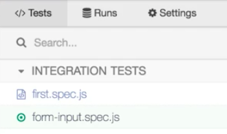
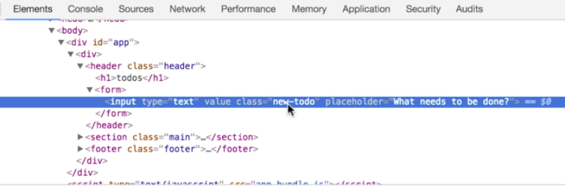
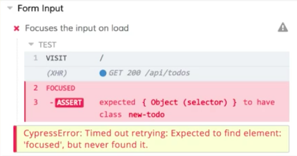
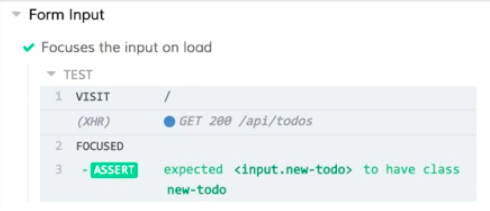

Instructor: [00:00] Right now, we have a test that just visits our application. We'd really like to test some actual functionality. The first thing we're going to do is, with this existing test that just has a `visit`, we're going to run our application locally with `npm run dev`. 

#### Terminal
```Bash
$ npm run dev
```

[00:16] Then, in a second terminal tab, we're going to use `npm run cypress` to launch the Cypress UI. 

```Bash
$ npm run cypress
```

Then we can click on this `form-input.spec.js` to run our test. 



When our test runs, it'll visit our application right in Chrome. 


[00:34] We'd like our application to focus this input at the top of our application when the page loads. Currently, that's not the case, so let's write a test that'll test this behavior for us. 

[00:43] First thing we need to do is make sure that we're testing that the right element is focused. I need to know how to identify this input. Right now, I don't remember what the class name is. 

[00:54] I'm going to right-click. I'm going to choose `Inspect`. Because we're running our application in Chrome, we can use Chrome's DevTools to get information about our application. 

[01:05] In this case, we want the class. We'll see that the class here is newTodo. I'm going to copy this, and then I'm going to go back into my test. 



[01:16] Let's start by updating our description. I want to say that it `'Focuses the input on load'`. I'm going to visit the application. 

#### form-input.spec.js
```javascript
describe('Form Input', () => {
  it('Focuses the input on load', () => {
    cy.visit('/')
  })
})
```


[01:29] Then after that, what I'm going to do is I'm going to issue another command using that global `cy` object. I'm going to say `cy.focused`. 

```javascript
describe('Form Input', () => {
  it('Focuses the input on load', () => {
    cy.visit('/')
    cy.focused()
  })
})
```

[01:38] Focus is going to find the focused element on the page. Then I'm going to chain an insertion onto that using `should`. In our `should`, we're going to say that it should `have.class`. We're going to use that value that we just copied, `new-todo`.

```javascript
describe('Form Input', () => {
  it('Focuses the input on load', () => {
    cy.visit('/')
    cy.focused()
      .should('have.class', 'new-todo')
  })
})
```

[01:55] This test is going to verify that we have a focused element and that it's the element that we expect it to be. We haven't focused a different element instead. I'm going to save this. 

[02:04] I'm going to switch back to the test. We'll see that it's already started running. It picked up the change in my test, and then it ran. We have a failing test. 



[02:16] You might notice that our test took a long time. I'm at 4.9 seconds. 

[02:21] What happened is Cypress tried to find a focused element on the page. When it didn't find it, it continued to retry that for four seconds, giving you the benefit of the doubt that eventually, your application would reach that desired state. 

[02:34] In a lot of cases where something's async, this going to help us out where we don't necessarily have to worry about the timing specifically as long as our app is fast enough for things to happen within that four-second window. With our test failing, let's go and update our application code to get this test to pass. 

[02:50] We're going to come down here into `src` `components` and open up this `TodoForm.js` file. We're going to add `autoFocus` as an attribute. We'll save this. 

#### TodoForm.js
```html
export default props => 
  <form onSubmit={props.handleTodosubmit}>
    <input
      type='text'
      autoFocus
      value={props.currentTodo}
      onChange={props.handleNewTodochange}
      className="new-todo"
      placeholder="what needs to be done?"/>
  </form>
```

[03:06] Now we can switch back to our test. Cypress isn't going to pick up changes in our application code. We'll have to go in here. We'll run the test again. 

[03:16] We'll see that it visits our application. It asserts that our input is focused. This time it's passing. 



[03:22] We can see the cursor's blinking in here. Everything's working as expected. Our test is verifying that behavior.