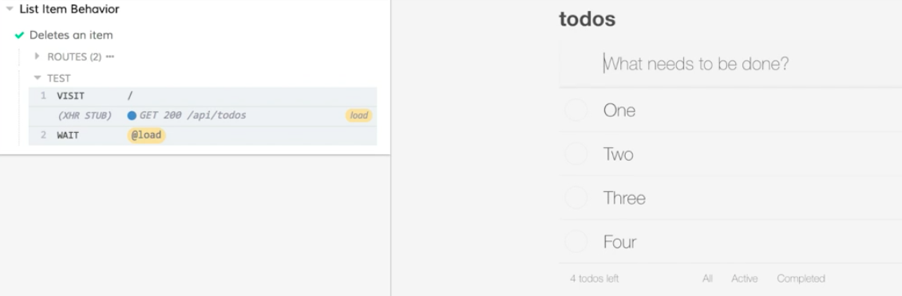
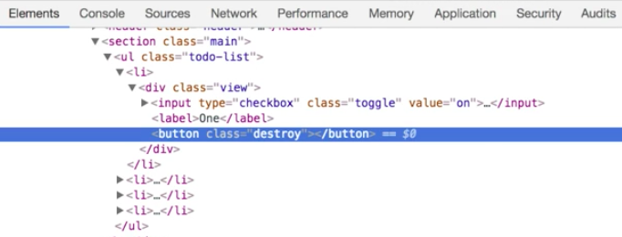
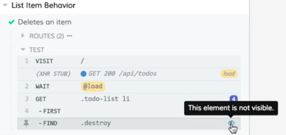
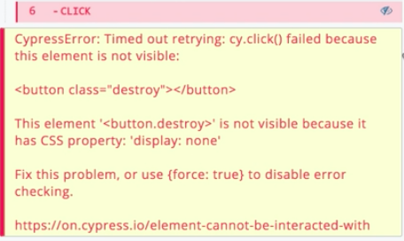
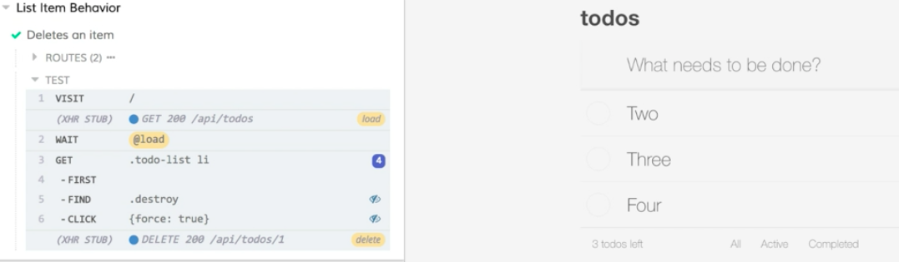

Instructor: [00:01] I've created a `list-items.spec.js` file to test the behavior of individual list items, and we're going to test our app's ability to delete an item. Our app will make a delete request to remove an item, let's start by stubbing that delete call. 

#### list-items.spec.js
```javascript
describe('List Item Behavior', () => {
  it('Deletes an item', () => {

  })
})
```

[00:11] I'll start by adding a `cy.server`, followed by `cy.route`, and we'll pass an options object into route. We'll give this a `method` of `delete` and a `url`, and that's going to go to our `/api/todos` endpoint. 

[00:32] This is going to take an ID as part of the URL. We can just use a wildcard here, and then, it'll accept any ID as part of that URL. We'll set up our `response`, and that's just going to be an empty object. 

```javascript
describe('List Item Behavior', () => {
  it('Deletes an item', () => {
    cy.server() 
    cy.route({
      method: 'DELETE',
      url: '/api/todos/*',
      response: {}
    })
  })
})
```

[00:46] At the end of that route, I'm going to tack on an `as` to give this an alias, and I'll call it `delete`. With that setup, let's use our customized `seedAndVisit` command to seed our initial data and visit our page. 

```javascript
describe('List Item Behavior', () => {
  it('Deletes an item', () => {
    cy.server() 
    cy.route({
      method: 'DELETE',
      url: '/api/todos/*',
      response: {}
    }).as('delete')

    cy.seedAndVisit()
  })
})
```

[01:03] Let's save this, then back in the Cypress UI, I'm going to click on the `list-items.spec.js` file to open and launch this in the runner. Our test is going to run; we'll see that our app's been seeded with our fixture data when we visit it. 



[01:21] Let's take a look at how we're going to delete an item. When I hover over an item, we'll see this red x appear on the right-hand side. I'm going to right-click on that, and I'm going to choose inspect. 



[01:32] We'll see that for each item in our list, we have an `li` with a `div` that has the class `view`, followed by an `input` and a `button` that are siblings. The `button` that we're interested in has a class of `destroy`. 

[01:43] Let's go back to our test and write the code that's going to drill down to this destroy button. For this test, let's delete the first item in our list. Let's call `cy.get`, we'll get our `.todo-list`, and we'll get all of our `li`. 

[02:03] From here, I'm going to chain on the `.first` command and get just the first item. Then, I want to drill into this and find that button with the class destroy. I'm going to use the `.find` command and pass it in the class selector for `.destroy`. 

```javascript
describe('List Item Behavior', () => {
  it('Deletes an item', () => {
    cy.server() 
    cy.route({
      method: 'DELETE',
      url: '/api/todos/*',
      response: {}
    }).as('delete')

    cy.seedAndVisit()

    cy.get('.todo-list li')
      .first()
      .find('.destroy')
  })
})

```

[02:24] Let's save this and run it, and see what it does. Our test will run again. We'll see that everything is successful, so far, so good. We're finding all of our elements now exist. But we notice in the command log, next to find for our destroy button; we have this icon that's telling us this element is not visible. 



[02:44] Let's go back to our code, and ultimately, we want to `click` on this button. I'm going to chain a `click` command after `find`. 

```javascript
cy.get('.todo-list li')
  .first()
  .find('.destroy')
  .click()
})
```

I'm going to save this again, switch back, and watch the test run. 

[02:59] This time, we'll see, after a delay, our test is ultimately going to fail. 



Cypress is going to tell us that it timed out retrying `cy.click`, because the element is not visible. It's also telling us that it's not visible, because it has a css property, display none. 

[03:14] The suggestion is to fix this problem, meaning, make the button visible, or we can pass this object into our click command with force set to true. Setting force to true here is going to disable error-checking. 

[03:27] Let's switch back and try that out, see what happens. I'll pass click an object, and I'll give it this `force` property. I'll set that to `true`. 

```javascript
cy.get('.todo-list li')
  .first()
  .find('.destroy')
  .click({force: true})
})
```

I'll save this, and we'll run the test again. This time, our test passes. 

[03:40] But we'll see that in both of these find and click steps, our element is still not visible. 



Let's take a look at another approach. I'm going to switch back into the code, and I'm going to remove this object. 

[03:52] Instead of telling it to force the click, before I `click`, I'm going to make the element visible. We can do that by chaining on an `invoke`, and passing it the string, `'show'`. This is going to show the button before it attempts to click it. 

```javascript
cy.get('.todo-list li')
  .first()
  .find('.destroy')
  .invoke('show')
  .click()
})
```

[04:06] I'm going to save this and switch back, and our test is going to run. We'll see that it passes again, but this time, our element is not visible at the `find` or the `show`. But by the time we get to the click, that element is visible. 

[04:22] We can see in the snapshot if we pin this down, that button was, in fact, visible at that point in our test. 


Now that our visibility has been dealt with let's switch back to the code and finish our test with some assertions. 

[04:40] After this chain, I'm going to drop down, and I'm going to throw a `cy.wait` in here. I'm going to wait for that `@delete` call to respond, and I'm going to use `cy.get` again. I'm going to get that todo list and all the lis. I'm going to assert that they `should('have.length', 3)`, because we know we're starting with four because of our seed data. 

```javascript
cy.get('.todo-list li')
  .first()
  .find('.destroy')
  .invoke('show')
  .click()

cy.wait('@delete')

cy.get('.todo-list li')
  .should('have.length', 3)
})
```

[05:07] We've deleted an item. I'll save this; we'll switch back and verify that everything in our test is working as expected and our assertion is passing.