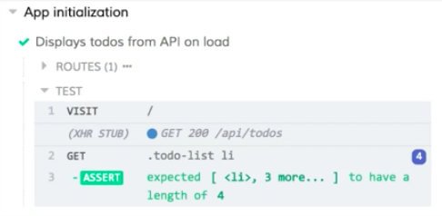

Instructor: [00:01] Here we have a test that stubs out a get call to the API/to-dos endpoint and responds with some test data. 

#### app-init.spec.js
```javascript
describe('App initialization', () => {
  it('Displays todos from API on load', () => {
    cy.server()
    cy.route('GET', '/api/todos', [
      {id: 1, name: 'One', iscomplete: false},
      {id: 2, name: 'Two', iscomplete: false},
      {id: 3, name: 'Three', iscomplete: false},
      {id: 4, name: 'Four', iscomplete: false},
    ])
    cy.visit('/')
    cy.get('.todo-list li').should('have.length', 4)
  })
})
```

We'll do this in a lot of our tests, and having all this data scattered around our test will make our test messy after a while. 

[00:14] Let's see how we can move this data into a fixture file and use it from there. In the Cypress directory, we have another directory called `fixtures`. 

[00:21] I'm going to add a new file to that fixtures directory. I'm going to call it, `todos.json`. Now, I'm going to grab that sample data from the test. I'll copy that and paste it into `todos.json`. 

[00:39] Because this is a JSON file, not JavaScript, I'll wrap everything in quotes. 

#### todos.json
```json
[
  {"id": 1, "name": "One", "iscomplete": false},
  {"id": 2, "name": "Two", "iscomplete": false},
  {"id": 3, "name": "Three", "iscomplete": false},
  {"id": 4, "name": "Four", "iscomplete": false},
]
```

With that done, I'll save the file. 

[00:48] Now, I'm going to go back to the `app-init.spec.js` file. I'm going to delete this array. Above our call to `cy.route`, I'm going to add a call to `cy.fixture`. I'm going to pass fixture the name of our JSON file. 

[01:05] I'm going to tack a `then` onto it. Here we're going to get our result. I'll move `cy.route` into the then. I'll pass `todos` as the data. 

#### app-init.spec.js
```javascript
describe('App initialization', () => {
  it('Displays todos from API on load', () => {
    cy.server()
    cy.fixture('todos')
      .then(todos=> {
        cy.route('GET', '/api/todos', todos)
      })
    cy.visit('/')
    cy.get('.todo-list li').should('have.length', 4)
  })
})
```

I'll save this. 

[01:23] We'll double-check that our test is running in cypress. Everything's working just fine. This has cleaned up our test quite a bit. We've moved all that data out into a fixture file. 

[01:34] We can easily re-use it in other spec files. This is such a common setup that we can shorten this and make it even cleaner. Rather than calling `cy.fixture` and then using our `then`, we can call `cy.route`. 

[01:50] We can replace this data with a string that uses a `fixture` prefix followed by the name of our fixture file. 

```javascript
describe('App initialization', () => {
  it('Displays todos from API on load', () => {
    cy.server()
    cy.route('GET', '/api/todos', 'fixture:todos')

    cy.visit('/')
    cy.get('.todo-list li').should('have.length', 4)
  })
})
```

[01:59] Now we're back down to one line. We've cleaned up all the test data. If I save this and switch back to the Cypress runner, we'll see that our test is still running as it was before. 



[02:09] Just to verify that this is using our fixture file, let's open our `todos.json`. We'll update one of the items. We'll save it. 

[02:21] We'll re-run our test, and we'll see that that is, in fact, the data being loaded from our fixture file.