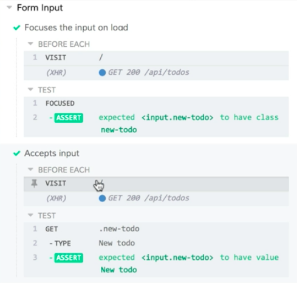

Instructor: [00:00] I have two terminal tabs. One is running my application and build process locally, and the other one is running Cypress. Cypress is already running my `form-input.spec.js` file, which has two tests, focuses the input on load, and accepts input. We can see that both tests are passing. 

[00:17] Let's switch to the code and see how we can refactor this a little bit. We'll notice that each one of these tests has a call to `cy.visit` at the beginning. Rather than duplicating this through all of our tests, we can take advantage of the fact that Cypress is using Mocha under the hood. We can use Mocha's built-in capability to run code before each test. 

[00:37] To remove the duplication for `cy.visit`, all we have to do is go to the top of our `describe` block. We can add a call to `beforeEach`. BeforeEach is going to run for each `it` within our `describe` block. 

#### form-input.spec.js
```javascript
describe('Form Input', () => {
  beforeEach(() => {

  })
  it('Focuses the input on load', () => {
    cy.visit('/')
    cy.focused().should('have.class', 'new-todo')
  })

  it.only('Accepts input', () => {
    const typedText = 'New todo'
    cy.visit('/')
    cy
      .get('.new-todo')
      .type(typedText)
      .should('have.value', typedText)
    })
})
```

[00:53] We can add our `cy.visit` here, visiting the root of our application. Then we can come down here, and we can remove it from our first test, and then remove it again from our second test. 

```javascript
describe('Form Input', () => {
  beforeEach(() => {
    cy.visit('/')
  })
  it('Focuses the input on load', () => {
    cy.focused().should('have.class', 'new-todo')
  })

  it.only('Accepts input', () => {
    const typedText = 'New todo'
    cy
      .get('.new-todo')
      .type(typedText)
      .should('have.value', typedText)
    })
})
```

When we save this, our test will run again, and we can verify that our tests continue to pass. 

[01:12] If we come over here to the command log, we can expand this. We'll see that our visit and our XHR to get our to-dos is now happening inside this beforeEach. If we click on accepts input, we'll see the same thing, BeforeEach running to do our visit.

