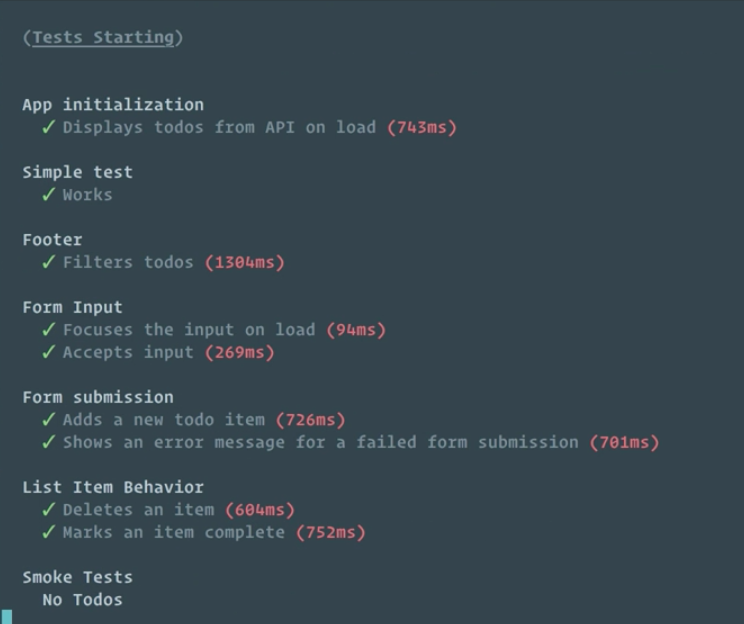

Instructor: [00:01] The Cypress UI is a great tool for building our application in a test-driven style. It gives us nice capabilities when we need to debug our application. 

[00:08] The UI isn't a great option for running an entire suite of tests. The overhead that makes all of that utility possible can slow things down for a large suite of tests. The UI isn't going to be seen when running on a CI server, anyway. 

[00:21] Let's see how we can do a full test run without launching the Cypress Test Runner UI. We'll add a new command to our npm scripts. Right under our existing `"cypress"` command, we'll create a new one. We'll make it `"cypress:all"`. 

[00:36] Instead of cypress open, this one is going to run `cypress run`. 

#### package.json
```
"cypress:all": "cypress run"
```

I'll save this. 

[00:45] Now I'm going to open up a terminal. In one tab of my terminal, I'm going to start my application because we still need the application running to test against. I'll do that with `npm run dev`. 

#### Terminal Tab 1
```bash
$ npm run dev
```

[01:01] This'll do a webpack build and start the JSON server. Then in a second tab, I'll do `npm run cypress:all`. 

#### Terminal Tab 2
```bash
$ npm run cypress:all
```

[01:11] We'll see that it's going to run through our entire suite of tests. 



In the end, we get a nice summary of our test run. We're even going to get a video of our test run that we can watch. 

[01:35] We'll see that the video's been saved in our project. I can open that up. If we run through the video, we'll see that if something were to go wrong, we have a nice view into our test. 

[01:52] We can actually come in here, take a look, see if we can figure out what the problem was, and then maybe jump back into the UI to do a little bit of investigation.