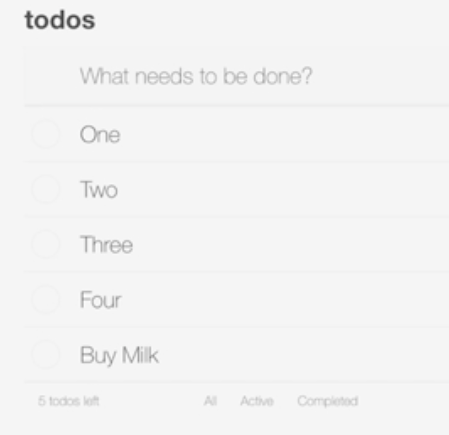

Instructor: [00:00] Here, I have a brand new spec file defined called `form-submission.spec.js` that has a `describe`. We're going to be testing `'Form submission'`. I have a single empty test `'Adds a new todo item'`. 

#### form-submission.spec.js
```javascript
describe('Form submission', () => {
  it('Adds a new todo item', () => {

  })
})
```

Let's write our test to submit a new todo item, and assert that our application behaves the way we expect it to. 

[00:15] Let's start by just defining the text that we're going to type into the input. We'll define a new constant. I'll call this `newTodo`. This is just going to contain the string `'Buy Milk'`. 

```javascript
describe('Form submission', () => {
  it('Adds a new todo item', () => {
    const newTodo = 'Buy Milk'
  })
})
```

Submitting this form is going to make a post request. We want to stub that out. 

[00:30] Let's do `cy.route`. We're going to define route passing in an options object this time. Our `method` is going to be `'POST'`. Our `url` will be the `/api/todos` end point. We're going to stub the `response`. 

[00:51] This is going to be an object which we'll give an `id`. It'll have a name, which is going to be `newTodo`. Then, it's going to have a default `isComplete` set to `false`. Then, we're going to tack on an `as`. We'll call this `'save'`. This way, we can wait for it to respond. 

```javascript
describe('Form submission', () => {
  it('Adds a new todo item', () => {
    const newTodo = 'Buy Milk'
    cy.route({
      method: 'POST',
      url: '/api/todos',
      response: {id: 123, name: newTodo, isComplete: false}
    }).as('save')
  })
})
```

With that setup, let's visit our application and submit our form. 

[01:17] We'll start with a `cy.seedAndVisit` using a custom command. Once we've visited our page, we're going to use `cy.get` to get our input. We'll do that with our class of `new-todo`. Once I have my input, I want to type into it. 

[01:36] I'm going to use the `type` command. I'm going to pass it in a string that I want to be typed into the input. In this case, it's going to be that `newTodo` constant. I also want to issue a second `type` command. This time I'm going to pass it the string `'{enter}'` inside curly braces. This is going to issue the enter key in that input. 

[01:55] At this point, I expect the application to make that post request that we stubbed up top. I'm going to call `cy.wait`, passing it `save` prefixed with the `@` symbol. 

```javascript
describe('Form submission', () => {
  it('Adds a new todo item', () => {
    const newTodo = 'Buy Milk'
    cy.route({
      method: 'POST',
      url: '/api/todos',
      response: {id: 123, name: newTodo, isComplete: false}
    }).as('save')

    cy.seedAndVisit()

    cy.get('.new-todo')
      .type(newTodo)
      .type('{enter}')
    
    cy.wait('@save')
  })
})
```

Once we get a response from that post, then I want to make some assertions about the state of our application. 

[02:13] Once we've had a successful post with our item, we expect that item to be added to our list. Let's use `cy.get` to get all of our list items. We'll use the class named `todo-list` to get the top-level UL and then `li` to get all the LIs. 

[02:30] We'll make our assertion with a `should`. We'll say it should `'have.length'` of `5`. 

```javascript
describe('Form submission', () => {
  it('Adds a new todo item', () => {
    const newTodo = 'Buy Milk'
    cy.route({
      method: 'POST',
      url: '/api/todos',
      response: {id: 123, name: newTodo, isComplete: false}
    }).as('save')

    cy.seedAndVisit()

    cy.get('.new-todo')
      .type(newTodo)
      .type('{enter}')
    
    cy.wait('@save')

    cy.get('.todo-list li')
      .should('have.length', 5)
  })
})
```

We know we can assert that it has a length of five because the default behavior for `seedAndVisit` is to seed our application with the data from our fixture. Our fixture has four todos in it. 

[02:51] Now, we can save this file. We can go into the Cypress UI. We can run our `form-submission.spec.js`. We're going to get an error, `cy.route` cannot be invoked before starting the `cy.server`. 

[03:08] Let's switch back to our code. Up at the top of our test, before our call to `cy.route`, we'll do `cy.server`. 

```javascript
describe('Form submission', () => {
  it('Adds a new todo item', () => {
    const newTodo = 'Buy Milk'
    cy.server()
    cy
    .route({
      method: 'POST',
      url: '/api/todos',
      response: {id: 123, name: newTodo, isComplete: false}
    }).as('save')

    cy.seedAndVisit()

    cy.get('.new-todo')
      .type(newTodo)
      .type('{enter}')
    
    cy.wait('@save')

    cy.get('.todo-list li')
      .should('have.length', 5)
  })
})
```

We can save it, switch back, and we'll see that this has run and everything has passed. 



[03:24] We've successfully automated the process of loading up our page, entering a new to-do into our form, submitting that form, and verifying that our UI behaves as expected for the given network responses.