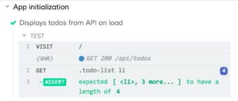
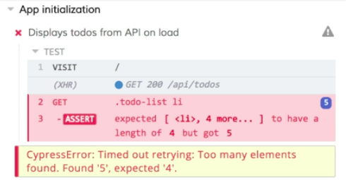
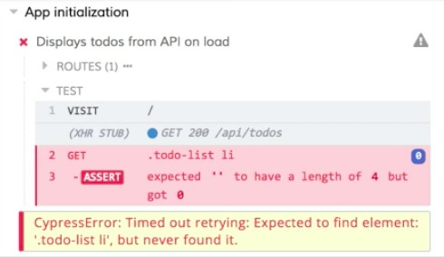
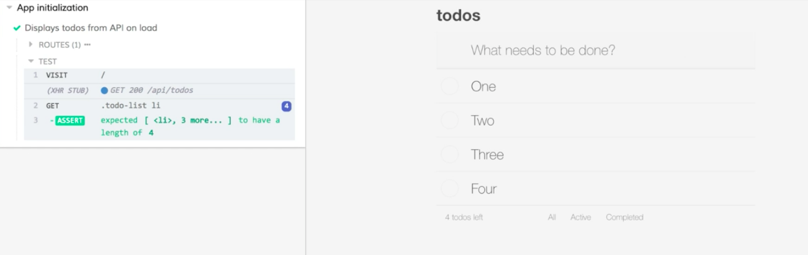

Instructor: [00:00] I have my application and Cypress both running locally. I've created this `app-init.spec.js` file with a single test. The test visits the application and asserts that the list todos has a length of four. 

#### app-init-spec.js
```javascript
describe('App initialization', () => {
  it('Displays todos from API on load', () => {
    cy.visit('/')
    cy.get('.todo-list li').should('have.length', 4)
  })
})
```

[00:11] Let's run the test and see if it passes. I'll switch to the Cypress UI and click on this new spec file, `app-init.spec.js`. 

[00:22] We'll see when this runs it visits our page and makes our API call to the todos endpoint. Our list does, in fact, have a length of four. 



[00:31] While I'm in this test, I'm going to come over to the app. I'm going to add a new todo right inside Cypress. 

[00:38] We'll see that it makes my post and my new todo is added to the list. 

[00:43] Now I'm going to rerun this existing test. Let's see what happens. 

[00:50] We'll see here that our test fails because it's expecting a length of four but it got five. 



The problem here is that we're using the actual database. When we make changes to that database, and this API call is made to load the todos, it's going to load whatever's in the database at the time, so our test isn't all that repeatable, especially if we're using the application locally for development. 

[01:12] Let's see how we can stub out this API call to make our test more reliable and repeatable. Back in our code, I'm going to update the test. 

[01:22] Before our call to `cy.visit`, I'm going to add a call to `cy.server`. This is going to start a server that's going to allow us to keep track of and stub out our API calls. 

[01:34] After our call to `cy.server`, I'm going to call `cy.route`. Route's going to take an argument for a method. Its second argument here is going to be the URL, which is our `api/todos` endpoint. 

[01:49] Then we're going to give it a response. For right now, we'll just pass it an empty array. 

```javascript
describe('App initialization', () => {
  it('Displays todos from API on load', () => {
    cy.server()
    cy.route('GET', '/api/todos', [])
    cy.visit('/')
    cy.get('.todo-list li').should('have.length', 4)
  })
})
```

[01:54] When this test runs, it's going to intercept our get call to `api/todos`. It's going to respond to our application with this empty array. Let's save the test and see it run. 

[02:08] Our test is still failing, but now it's failing for a new reason. This time, it's looking for a length of four, but it got zero. 



If we look at our application in the preview pane, we'll see that there are no todos in the list. This is because our XHR call was stubbed and we gave it an empty array as the response. 

[02:25] We can see over here in the command log that our XHR call that was being logged out before now says stub next to it. We know this is using our stubbed call. Now, all we have to do is update our return value to match our expectation. 

[02:39] Back in the code, I'm going to update this array. I'm going to give it four todo objects. Each one of these will have an `id` and a `name` and an `isComplete` value. 

[02:48] We'll just update these IDs and the names. They can all be incomplete. 

```javascript
describe('App initialization', () => {
  it('Displays todos from API on load', () => {
    cy.server()
    cy.route('GET', '/api/todos', [
      {id: 1, name: 'One', iscomplete: false},
      {id: 2, name: 'Two', iscomplete: false},
      {id: 3, name: 'Three', iscomplete: false},
      {id: 4, name: 'Four', iscomplete: false},
    ])
    cy.visit('/')
    cy.get('.todo-list li').should('have.length', 4)
  })
})
```

I'll save this again, switch back to our test. 

[03:17] This time when it runs, we'll see that we get our mocked API response with our one, two, three, four values. Our test is now passing. 



[03:24] If I do the same thing again and I add a new todo, this is going to make our actual API call, because we haven't stubbed out the post. This has been saved to our database. Our new todo is showing on localhost:3030. 

[03:37] If I start this test from the beginning, we'll see we've been isolated from what's in our database using this stubbed API call.