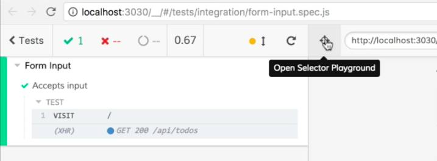

Instructor: [00:00] I have two terminal tabs open. One is running the application locally, and the other is running Cypress. Let's add a new test to the spec to test that our controlled input accepts text and has its value set appropriately. 

[00:14] In the code, I'm going to add a new test in the same `describe` block. I'll start with `it` and I'll give this a description, `'Accepts input'`. The first thing I want to do is `cy.visit` and we'll just visit the root of our application. 

#### form-input.spec.js
```javascript
describe('Form Input', () => {
  it('Focuses the input on load', () => {
    cy.visit('/')
    cy.focused().should('have.class', 'new-todo')
  })

  it('Accepts input', () => {
    cy.visit('/')
  })
})
```

[00:32] The other thing I'm going to do is I'm going to update this, and I'm going to add a `.only` to the `it`, so that we run just this new test, and we can focus on it. 

```javascript
describe('Form Input', () => {
  it('Focuses the input on load', () => {
    cy.visit('/')
    cy.focused().should('have.class', 'new-todo')
  })

  it.only('Accepts input', () => {
    cy.visit('/')
  })
})
```

With that done, I'll save that. Then I'm going to switch to the Cypress UI, and I'm going to click the `form-input.spec.js` file to run that test in Chrome, so see that all this test does is visit our application. 

[00:55] The first thing I'm going to do after we visit our page for this test, is getting our input and type into it. For that, I'm going to click on this little bullseye up here to open the selector playground. 



With the selector playground, I can hover over elements like my todo. 

[01:12] When I click on the input, we'll see that we get `cy.get` with our class name in there. This is going to give us the command that we need to get this input in our test. 

[01:23] I can just copy to clipboard, and then I can switch back to the code. And under the `cy.visit`, I can paste. 

```javascript
describe('Form Input', () => {
  it('Focuses the input on load', () => {
    cy.visit('/')
    cy.focused().should('have.class', 'new-todo')
  })

  it.only('Accepts input', () => {
    cy.visit('/')
    cy.get('.new-todo')
  })
})
```

[01:33] This'll give our test access to this input. Now I'm going to chain on another command called `type`, and I'm going to type some input into this field. We'll type in just `'New todo'`, and we'll save this and switch back. 

```javascript
describe('Form Input', () => {
  it('Focuses the input on load', () => {
    cy.visit('/')
    cy.focused().should('have.class', 'new-todo')
  })

  it.only('Accepts input', () => {
    cy.visit('/')
    cy
      .get('.new-todo')
      .type('New todo')
  })
})
```

[01:50] We'll see they are tests we'll run again, and new todo was typed into our input.  


We can see everything's working as expected. Let's go back to our test, and make sure our test verifies this behavior to guard against future changes. 

[02:05] We're going to chain an assertion onto this using `should`. Then we'll assert that they should `'have.value'`, and we'll use the value that we typed in which was `'New todo'`. 

```javascript
describe('Form Input', () => {
  it('Focuses the input on load', () => {
    cy.visit('/')
    cy.focused().should('have.class', 'new-todo')
  })

  it.only('Accepts input', () => {
    cy.visit('/')
    cy
      .get('.new-todo')
      .type('New todo')
      .should('have.value', 'New todo')
  })
})
```

When we save this test, and we switch back to the browser, we'll see that it runs, and everything's passing just like we would expect it to. 

[02:28] So I'll switch back and let's do just a little bit of refactoring. We have the string `'New todo'`, and we have this duplicated. This is prone to errors, so let's cut this. 

[02:38] Up at the top of our test, we can just define a constant that we'll call `typedText`, and we'll give it that value and then we'll use that in both our `type` command and down here in our assertion. 

```javascript
it.only('Accepts input', () => {
  const typedText = 'New todo'
  cy.visit('/')
  cy
    .get('.new-todo')
    .type(typedText)
    .should('have.value', typedText)
})
```

Now we can just save this file, and verify that we didn't break our test with our refactoring, and everything's still working.