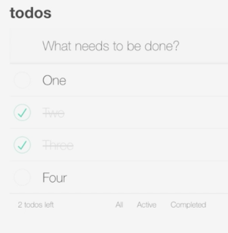
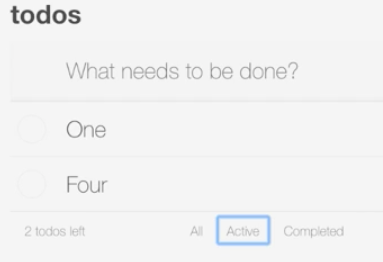
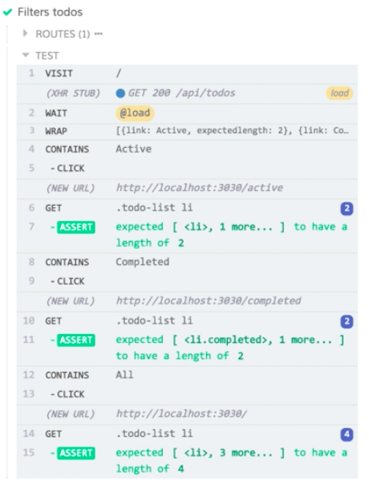

Instructor: [00:00] I've created a spec file for the footer. We're going to test that our footer links filter our to-dos. To do this, we're going to need to create a new fixture with data that has mixed to-dos, some that are done, some that are not. 

#### footer.spec.js
```javascript
describe('Footer', () => {
  it('Filters todos', () => {

  })
})
```

[00:12] Under `cypress`, I'll expand out the `fixtures` directory. I'm going to open `todos.json`. I'm going to copy this, and I'm going to create a new file under `fixtures`. I'm going to call this `mixed_todos.json`. 

[00:25] In this file, I'm going to paste those todos, and I'm going to toggle todos two and three to be complete. 

#### mixed_todos.json
```javascript
[
  { "id": 1, "name": "One", "isComplete": false },
  { "id": 2, "name": "Two", "isComplete": true },
  { "id": 3, "name": "Three", "isComplete": true },
  { "id": 4, "name": "Four", "isComplete": false }
]
```

I'll save that, and back in `footer.spec.js`, we're going to start our test. 

[00:42] The first thing we're going to do is we're going to use `cy.seedandVisit` to run that custom command we created. We want to pass it different seed data from the default. 

[00:51] I'm going to give it the string, `'fixture:mixed_todos'`. 

#### footer.spec.js
```javascript
describe('Footer', () => {
  it('Filters todos', () => {
    cy.seedAndVisit('fixture:mixed_todos')
  })
})
```

Now, when this stubs out our initial API call to load the to-dos into the app, it's going to use our mixed todos fixture file that we just created. 

[01:08] Let's verify this works. I'm going to save this test, and I'll load up the Cypress UI. I'm going to find my `footer.spec.js` file and run. As we can see, we have two active items and two completed items.

 

[01:26] Let's switch back to the code and write our test. I'm going to start with the `cy.contains` command, and I'm going to find the element that contains the word `'Active'`. This should give us our active link in the footer. 

[01:40] I'm going to `.click` it. 

```javascript
describe('Footer', () => {
  it('Filters todos', () => {
    cy.seedAndVisit('fixture:mixed_todos')

    cy.contains('Active').click()
  })
})
```

I'm going to save this test, switch back to the runner, and just verify that that's working. We'll see that our active link was found, and the click worked. Nothing has failed, no errors. 



[01:52] If we look at the preview, we'll see that it's doing what we expect. Now we just have to write our assertion. From here, we're going to drop down, and we'll throw in a `cy.get`. 

[02:02] We're going to get our `'.todo-list li'`, and we're going to say that they `should(have.length, two)`. There are about two items remaining on our list. 

```javascript
describe('Footer', () => {
  it('Filters todos', () => {
    cy.seedAndVisit('fixture:mixed_todos')

    cy.contains('Active').click()

    cy.get('.todo-list li')
      .should('have.length', 2)
  })
})
```

[02:17] We can save this, switch back to the runner, and everything's working as expected. We have a passing test for our active link; we have two other links in the footer. We could duplicate this test and click on different links and make different assertions, but we're essentially running the same test three times with slightly different parameters. 

[02:37] Instead, we can use some simple data to drive this test, and test all three links in the same test. I'm going to start at the top of the test; I'm going to define a constant which I'll call `filters`. 

[02:48] `filters` is just going to be an array of objects, and each object is going to get a `link` property. That's going to represent the text of the link we want to click, and we're going to give it an `expectedLength` property. 

[03:01] That's going to be the number of items we expect in the list after clicking that link. I'll create two more of these, and we'll just update the link text. We're going to have a `Completed` link, and we're going to have an `All` link. 

[03:16] The `completedLength` will be `2` and the `All` length should be `4`. 

```javascript
describe('Footer', () => {
  it('Filters todos', () => {
    const filters = [
      {link: 'Active', expectedLength: 2},
      {link: 'Completed', expectedLength: 2},
      {link: 'All', expectedLength: 4}
    ]
    cy.seedAndVisit('fixture:mixed_todos')

    cy.contains('Active').click()

    cy.get('.todo-list li')
      .should('have.length', 2)
  })
})
```

Now, I'm going to drop down under `seedAndVisit`, and I'm going to call `cy.wrap`. Wrap is going to take in our `filters` object and put that in the context of a Cypress command. 

[03:31] We can chain on the Cypress `each` method, which is going to take a function that will receive our individual filters, and it's going to loop through them. I'm going to take our `cy.contains` with our `click`, our `cy.get` with our assertion, and I'll move those up into the `each`. 

```javascript
describe('Footer', () => {
  it('Filters todos', () => {
    const filters = [
      {link: 'Active', expectedLength: 2},
      {link: 'Completed', expectedLength: 2},
      {link: 'All', expectedLength: 4}
    ]
    cy.seedAndVisit('fixture:mixed_todos')

    cy.wrap(filters)
      .each(filters => {
        cy.contains('Active').click()

        cy.get('.todo-list li').should('have.length', 2)
      })

  })
})
```

[03:47] Now, I'm going to replace this `'Active'` string with `filter.link`. I'm going to replace the number in our assertion here to `filter.expectedLength`. 

```javascript
describe('Footer', () => {
  it('Filters todos', () => {
    const filters = [
      {link: 'Active', expectedLength: 2},
      {link: 'Completed', expectedLength: 2},
      {link: 'All', expectedLength: 4}
    ]
    cy.seedAndVisit('fixture:mixed_todos')

    cy.wrap(filters)
      .each(filters => {
        cy.contains(filter.link).click()

        cy.get('.todo-list li').should('have.length', filter.expectedLength)
      })

  })
})
```

I'm going to save this, and I'll switch back to the runner. 

[04:04] We'll see that our single test is going to run and test each one of our links individually.

