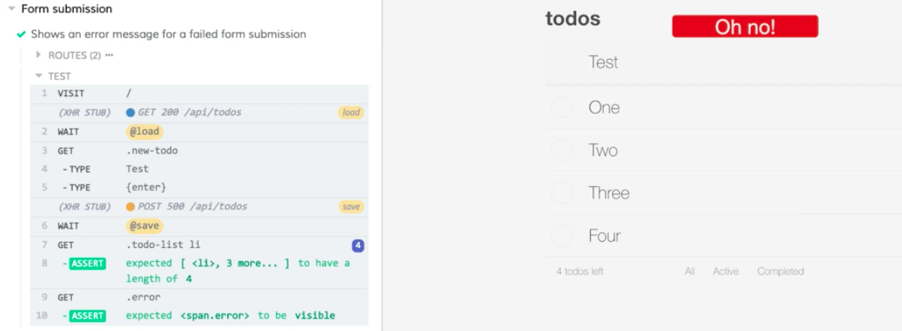

Instructor: [00:00] Here I've created a new test with the description `'Shows an error message for a failed form submission'`. 

#### form-submission.spec.js
```javascript
describe('Form submission', () => {
  it('Adds a new todo item', () => {
    ...
  })

  it.only('Shows an error message for a failed form submission', () => {

  })
})
```

One of the advantages of stubbing out our network request in these integration tests is that it's very easy for us to set up a failure situation that would be difficult to set up otherwise. 

[00:17] We'll start by defining a constant that's going to hold the string we'll type into our form. Then we'll call `cy.server` so we can stub out our API call. Then we'll call `cy.route`, passing it an options object. 

```javascript
it.only('Shows an error message for a failed form submission', () => {
  const newTodo = 'Test'
  cy.server()
  cy.route({

  })
})
```

[00:36] We're going to stub out our post request, and we're going to respond with a failure. 

[00:41] Our method here is going to be `'POST'`. Our `url` is going to be `/api/todos`. Then we're going to set a `status` of `500` and a `response` of an empty object. 

[00:59] We're going to tag an `as` on here. We'll give this a name so that we can wait for it. 

```javascript
it.only('Shows an error message for a failed form submission', () => {
  const newTodo = 'Test'
  cy.server()
  cy.route({
    method: 'POST',
    url: '/api/todos;,
    status: 500,
    response: {}
  }).as('save')
})
```

With that setup, we'll call `cy.seedAndVisit`. 

[01:09] Now we'll use `cy.get` to get our input. We'll issue the `type` command to type our `new-todo` into the input. 

[01:27] We'll chain on a second `type` command to press the `'{enter}'` key. Upon enter, we want to wait for the response from our server, so we'll `cy.wait` using the `@` symbol to prefix our alias. Then we'll use `cy.get` to get our list and select all of the `li`. 

```javascript
it.only('Shows an error message for a failed form submission', () => {
  const newTodo = 'Test'
  cy.server()
  cy.route({
    method: 'POST',
    url: '/api/todos;,
    status: 500,
    response: {}
  }).as('save')

  cy.seedAndVisit()

  cy.get('.new-todo')
    .type(newTodo)
    .type('{enter}')
  
  cy.wait('@save')

  cy.get('.todo-list li')
})
```

[01:53] We'll assert that it `should` `have.length` that it started with, of `4`. We're also going to `cy.get` another element that has the class `'.error'`. This is the error message that we display when things go poorly in our application. 

[02:14] Then we're just going to assert that this `should(be.visible)`. 

```javascript
it.only('Shows an error message for a failed form submission', () => {
  const newTodo = 'Test'
  cy.server()
  cy.route({
    method: 'POST',
    url: '/api/todos;,
    status: 500,
    response: {}
  }).as('save')

  cy.seedAndVisit()

  cy.get('.new-todo')
    .type(newTodo)
    .type('{enter}')
  
  cy.wait('@save')

  cy.get('.todo-list li').should('have.length', 4)

  cy.get('.error').should('be.visible')
})
```

With our test set up, I'll save that. I'll switch over to the Cypress UI. 

[02:25] I'll run the `form-submission.spec.js`. We'll see that everything passes and our stubbed 500 response leads to our error message being displayed. Our item is not added to the list.

