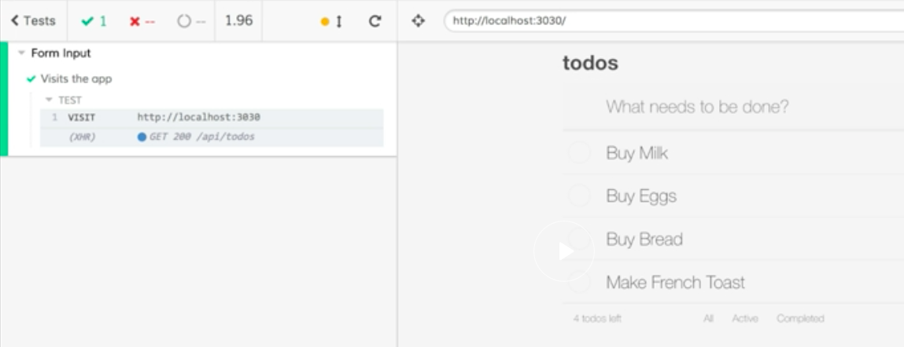

Instructor: [00:00] Here we have a new spec file with an empty describe block in the cypress/integration directory of this project called `form-input.spec.js`. Let's add a new test by adding an `it` block. For us to test anything in our application, the first thing we need Cypress to do is to visit our application. For now, let's just make the description `'Visits the app'`. 

### form-input.spec.js
```javascript
describe('Form Input', () => {
  it('Visits the app', () => {

  })
})
```

[00:19] Cypress exposes a global object called `cy`. This gives us access to all the commands in the Cypress API. 

[00:26] One of those commands is `visit`. I'm going to type `cy.visit`. Then into `visit`, I'm going to pass in the URL of our application. For now, it's going to be `localhost:3030`. 

```javascript
describe('Form Input', () => {
  it('Visits the app', () => {
    cy.visit('http://localhost:3030')
  })
})
```

[00:42] I'm going to save the spec, then down in the terminal, we need to do two things. For Cypress to hit our application by visiting this URL, we need our application to run. I'm going to use `npm run dev`, which is going to run our npm script that builds and runs this application locally. 

#### Terminal
```Bash
$ npm run dev
```

[01:01] I'm going to leave that running. Then in a second terminal tab, I'm going to run `npm run cypress`. This will open the Cypress UI. 

```Bash
$ npm run cypress
```

[01:12] We'll see that our `form-input.spec.js` file is available. I'm going to click on that. 

[01:20] This will run the Cypress runner in Chrome. This is going to visit our application. We'll see in the command log on the left that we have our visit with our address. We'll see our application is showing up on the right. 



[01:31] We'll also see that an XHR call was made to api/todos, which is where our data is being loaded from. By running our application locally and using `cy.visit`, we have a real copy of our application running in an actual browser. 

[01:44] Let's go back to our code. We're going to need to visit our application in all of our tests.

[01:50] Let's simplify this. We're going to take this long address, this `localhost:3030`. I'm going to cut that out of here. I'm going to find, in the root of the project, `cypress.json`. 

[02:00] I'm going to add a new property to this called `baseUrl`. `baseUrl` is going to get that value that I just copied. That's going to be our `localhost:3030`. I'm going to save that. 

#### cypress.json
```javascript
{
  "baseUrl": "http://localhost:3030"
}

```

[02:15] Then back in my test, I'm going to change my `cy.visit`. Instead of giving it the entire URL, I'm just going to give it a forward slash. 

#### form-input.spec.js
```javascript
describe('Form Input', () => {
  it('Visits the app', () => {
    cy.visit('/')
  })
})
```

We can save that. I'm going to switch back to Cypress. 

[02:27] Because we changed the config, it stopped our test. We'll run this again by clicking `form-input.spec.js`. 

[02:34] We'll see that we got our visit. It's forward slash. We're still loading our application.