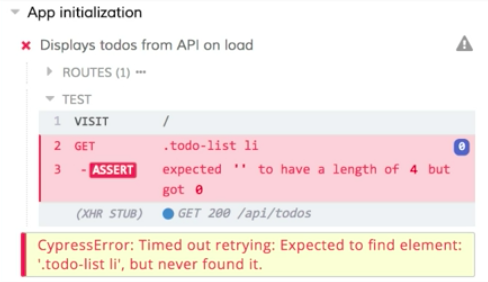
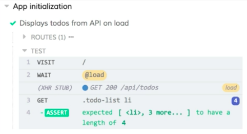

Instructor: [00:00] Here we have a test that stubs out a get call to our api/todos endpoint, responding with data from our fixture. Then it visits our page and asserts that our list should have a length of four. 

#### app-init.spec.js
```javascript
describe('App initialization', () => {
  it('Displays todos from API on load', () => {
    cy.server()
    cy.route('GET', '/api/todos', 'fixture:todos')

    cy.visit('/')
    cy.get('.todo-list li').should('have.length', 4)
  })
})
```

If we run this test, we'll see that everything runs and passes as we expect. 

[00:14] If I come back into the code in `TodoApp.js`, however, and I add an artificial delay using a `setTimeout` to my load call... We'll delay this by five seconds. We'll move that into the `setTimeout`, 

#### TodoApp.js
```javascript
...
  componentDidMount() {
    setTimeout(() => {
      loadTodos()
        .then(({ data}) => this.setState({ todos: data}))
        .catch(() => this.setState({ error: true }))
    }, 5000)
  }
...
```

save it, we'll come back, and we'll rerun our test. 



[00:39] We'll see that we get our visit, and Cypress tries for four seconds to retry that assertion. Then eventually, our call does get made and returned. We'll see that the output in our preview pane contains our items, but our test failed because our items weren't there by the timeout that Cypress was using. 

[00:56] It would be better if we could tell Cypress to wait for this API call before making our assertion. Back in `app-init.spec.js`, we're going to chain a call to the Cypress `as` command, and we're going to give it the name `'load'`. 

[01:09] This is going to create an alias for our route. Then after our `visit`, we're going to call `cy.wait`, and we're going to pass it our load alias, prefixed with the `@` symbol. 

#### app-init.spec.js
```javascript
describe('App initialization', () => {
  it('Displays todos from API on load', () => {
    cy.server()
    cy.route('GET', '/api/todos', 'fixture:todos').as('load')

    cy.visit('/')

    cy.wait('@load')

    cy.get('.todo-list li').should('have.length', 4)
  })
})
```

With this in place, let's save our test, and we'll watch it run again. 

[01:30] This time, we're still going to get the delay, but you'll see it's hanging on the wait. It's waiting for that load API call to be made. 



As soon as it is, it continues with our test and runs our assertions. Now, our test is going to be more resilient to delays, whether artificial or intended. 

[01:48] Our test code is going to more clearly communicate exactly what should happen. We're going to visit, we're going to wait for that load call to complete, and then we expect our list to have a length of four.