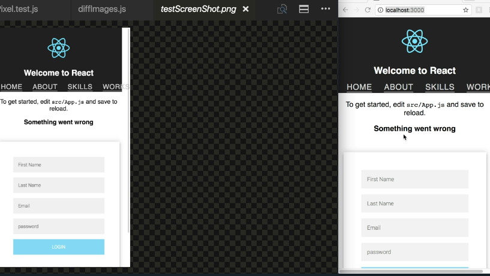
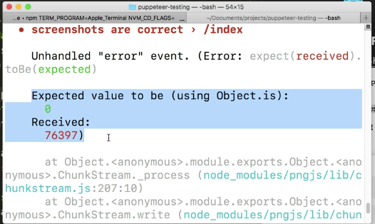

Instructor: [00:00] The first thing we need to do is `npm install pixelmatch`. With that installed, we can navigate to our `Pixel.test.js` page, and we'll write `const puppeteer = require('puppeteer')`, `const devices = require('puppeteer/DeviceDescriptors')`, `const iPhone = devices['iPhone 6']`, and we're going to do `let browser` and `let page`, `beforeAll(async`

[00:25] `browser = await puppeteer.launch({headless: false})` , `page = await browser.newPage()`, `await page.goto('http://localhost:3000/')`, `await page.emulate(iphone)`, then a `afterAll` with `browser.close()`.

```js
const puppeteer = require('puppeteer')
const devices = require('puppeteer/DeviceDescriptors')
const iPhone = devices['iPhone 6']

let browser
let page

beforeAll(async () => {
    browser.close()
})
```

[00:46] With our `require` statements and basic Puppeteer setup ready to go, we're now able to start writing our pixel test. We'll write a `describe` block. `('screenshots are correct'`. Then inside this, we'll do `it('/index', async () => { const file = 'screenshot.png'`. `await page.screenshot({ path: file})`. Then `return pixelTest.compareScreenshots(file)`.

```js
describe('screenshots are correct', () => {
    it('/index', async () => {
         const file = 'screenshot.png'
         await page.screenshot({ path: file})
         return pixelTest.compareScreenshots(file)
}
```

[01:18] Inside of this test, we are going to take and save a screenshot of our current view of localhost 3000. This `file` path is what we're going to use to pass through to our `screenshot`, as well as our `pixelTest.compareScreenshots` method.

[01:32] This is where we will do the actual comparing of this current screenshot and our already saved screenshot that we'll be testing against. Let's go ahead and require `const pixelTest = require('./diffImages.js')`.

```js
const pixelTest = require('./diffImages.js')
```

[01:45] We'll save this, and navigate to that page. Awesome. In this file, we're going to do `const pixelmatch = require('pixelMatch')`, `const fs = require('fs')`, `const png = require('pngjs').PNG`. Next, we'll do `exports.compareScreenshots = fileName => {`, `const img1 = fs.createReadStream('testScreenshot.png').pipe(new PNG())`.

[02:22] Then `const image2 = fs.createReadStream(fileName).pipe(new PNG()).on('parsed', doneReading)`. Awesome. We use a combination of FS and PNG in order to read and parse our two images.

```js
const pixelmatch = require('pixelMatch')
const fs = require('fs')
const png = require('pngjs').PNG

exports.compareScreenshots = fileName => {
    const img1 = fs.createReadStream('testScreenshot.png').pipe(new PNG())
    onst image2 = fs.createReadStream(fileName).pipe(new PNG()).on('parsed', doneReading)
}
```

[02:35] As you can see, once the second image is parsed, we want to call a function called `doneReading`. Inside of this function, we're going to use pixelMatch, and our Jest assertions. Before we do that, we're going to wrap this `return new Promise`, and move everything inside of it.

[02:54] Now, inside this promise, we'll do `const doneReading = () => {`. We'll `expect(img1.width).toBe(img2.width)`, `expect(img1.height).toBe(img2.height)`. Then `const numDiffPixels = pixelmatch( img1.data, img2.data, null, img1.width, img1.height, {threshold: 0.1}`.

```js
exports.compareScreenshots = fileName => {
    return new Promise((resolve, reject) => {
        const doneReading = () => {
            expect(img1.width).toBe(img2.width)
            expect(img1.height).toBe(img2.height)

            const numDiffPixels = pixelmatch(
                img1.data,
                img2.data,
                null,
                img1.width,
                img1.height,
                { threshold: 0.1 }
            )
            expect(nimDiffPixels).toBe(0)
            resolve()
    }
```

[03:23] Then we'll `expect(nimDiffPixels).toBe(0) `. Finally, `resolve()` our promise. Perfect. Again, after we've parsed our static test image and our new test instance screenshot, we walk through `doneReading`. Our first tests are to make sure that the width and height match.

[03:42] This is helpful to catch potential pixel test differences. Next comes the actual pixel testing. Here, we're trying to get the number of pixels that the two images are off by. The first two parameters are the two images that we're testing. In our case, `img1` and `img2`.

[03:59] Next is a differing output image, but since we're not working with one, we're just going to put `null`, and then the `.width` and `.height` of the images. This last object is for any options we want to specify. This `threshold` property is the degree of sensitivity that we want the test to work on.

[04:17] This ranges from zero to one. Smaller values makes the comparison more sensitive. Then we expect that the number of differing pixels is zero, and then finish by resolving our promise. Now, before we actually run our test, let's take a look at our test screenshot picture.

[04:38] We can assume that when we run this test, it's going to pass. Both our test screenshot and our active running are the exact same. If we grab our terminal and run our `npm test` script, we'll see a browser open, take a screenshot, and compare the two. It passes.




[04:56] We could easily break this test by going to our `App.js` file, and adding a `<p>Break pixel test</p>`. When we save this, we'll see it in our application. Now, we can grab our terminal and rerun our test. This is going to update our screenshot, and compare it. We'll see that we do fail, and this is the amount of pixels that it was off by.

```js
<p>Break pixel test</p>
```

