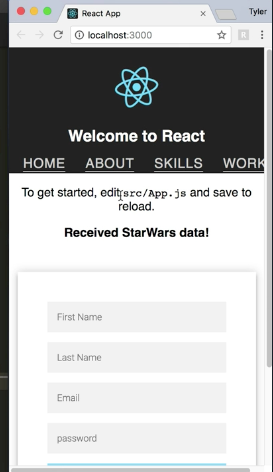
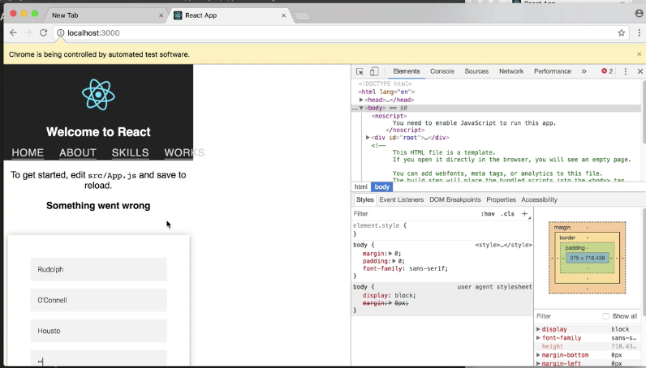

Instructor: [00:00] Inside of our application, we're going to do `async componentDidMount()`, `const data = await fetch('https://swapi.co/api/people/1/').then(res => res.json())`. And set our Star Wars property to our data. We'll add that to our state object `this.setState({starWars:data})`.

```js
async componentDidMount() {
    const data = await fetch('https://swapi.co/api/people/1/').then(res => res.json())
    this.setState({starWars:data})
```

[00:16] Then inside of our HTML, let's add an `h3` with a data property of `"starWars"`. Then we'll do `(this.state.starWars.url ? 'Received Star Wars data!' : 'Something went wrong')`. Puppeteer gives us the ability to intercept requests made on a page.

```js
<h3 data-testid="starWars">(this.state.starWars.url ? 'Received Star Wars data!' : 'Something went wrong')</h3>
```
[00:37] Not only can we write tasks that check the content of our h3 with successful requests, but we can intercept the request and force the failure. This way, we can test our UI on both successful requests and unsuccessful ones.

[00:51] Inside of our tests, we going to add a `await page.setRequestInterception(true)`. We'll do `page.on('request', interceptedRequest => if (interceptedRequest.url.includes('swapi'))`. Then we're going to abort this request `interceptedRequest.abort()`. If not, then we'll continue it on `else { interceptedRequest.continue()`.

```js
await page.setRequestInterception(true)
page.on('request', interceptedRequest => {
    if (interceptedRequest.url.includes('swapi')) {
        interceptedRequest.abort()
    } else {
        interceptedRequest.continue()
    }


```

[01:15] This `setRequestInterception` is basically a flag that enables us to access each request made by the page. Once a request is intercepted, the request can be aborted with a particular error code. We could cause a failure, or we can intercept, then continue after checking some conditional logic.

[01:34] Now, let's go ahead and run a test checks this h3 content. We'll do `test('fails to fetch starWars endpoint'`. We'll do `const h3 = await page.$eval('[data-testid="starWars"]')`. We'll grab the inner HTML out of it `e => e.inerHTML`, and then `expect(h3).toBe('Received Star Wars data!')`.

```js
test('fails to fetch starWars endpoint', async () => {
   const h3 = await page.$eval('[data-testid="starWars"]', e => e.innerHTML)
    expect(h3).toBe('Received Star Wars data!')
}
```




[02:00] As we can see in our running app, as soon as the page loads, it goes out and fetches the Star Wars API. When it receives the data, our h3 text changes to received Star Wars data. Let's throw a `.only` on this test, so we're only testing this one, then save it, and run our `npm test`.


[02:19] That test is failing. It looks like it's getting the `"Something went wrong"` text, instead of our `"Received Star Wars data!"` that we put to test. This goes to show that our request interception logic that we wrote is working as intended.

[02:38] On each request, we filter out the one that includes the swampy string and abort it. Everything else, we let continue on. Our failed request text should actually be, `"Something went wrong"` Now, let's remove this `.only`, and `.skip` our console and exceptions tests, because they will fail with the failed fetch request.

```js
test.skip('does not have console logs', () => {
    const newLogs = logs.filter( s => !== '%cDowndload the React DevTools for a better development experience: https://fb.me/react-devtools fount-weight:bold')

    expect(newLogs.length).toBe(0)
})

test.skip('does not have exceptions', () => {
   expect(errors.length).toBe(0) 
```


[03:01] Run our test in debug mode this time, so we can actually see the h3. If we notice, that `Something went wrong` text stays the same the whole time. All of our tests pass, which means that we successfully aborted the Star Wars request.



[03:19] It's also worth noting that, when intercepting requests, we can control what headers are sent, what error codes are returned, and return custom body responses.