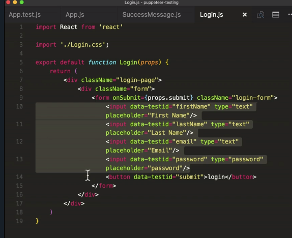
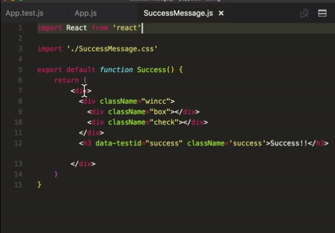
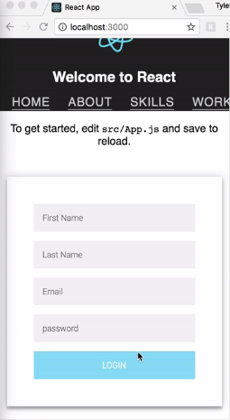
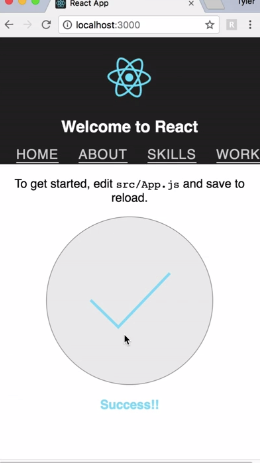
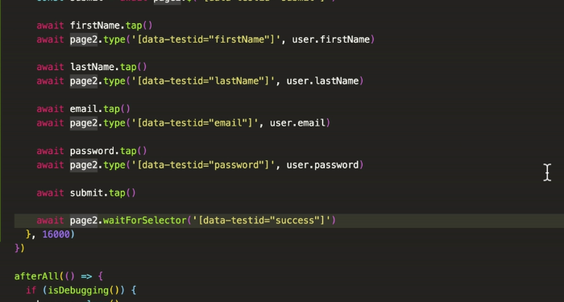
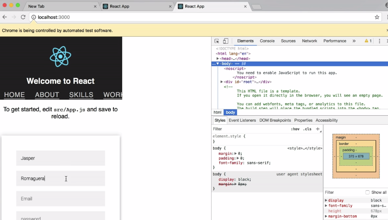

Instructor: [00:00] Inside of our application I've gone ahead and added a `./Login.css` component that basically is just a form with four input boxes and a button to submit it. Once this form is submitted we want our `app.js` to show the `"success"` message component that basically just has a check mark and an `h3` to tell us `"success"`. Signs out of our `App.js`.





[00:23] Let's go ahead an add these. Let's import our `./Login.css` component as well as our `.SuccessMessage.css` component. Then we'll add `state` to our class with `{ complete: false }`, a `handleSubmit` method where we'll `e.preventDefault()`. Then `this.setState({ complete: true})`.

```js
import Login from './Login.js'
import SuccessMessage from './SuccessMessage.js'
```

```js
state = { complete: false }

handleSubmit = e => {
    e.preventDefault()
    this.setState({ complete: true })
}
```

[00:44] Next, we'll add a ternary down here in the bottom of our HTML where depending on state we're either going to show our `Login` form or our `successMessage`. Perfect. Now we'll save it. You can see we have our login form with its four input boxes and a login button. Once this form is filled out and the login button is submitted, we're going to get the success message.

```js
{ this.state.complete ?
<SuccessMessage >
: <Login submit={this.handleSubmit}
}
```





[01:08] Let's use Puppeteer to write an end to end test to make sure this feature works correctly. Back inside of our `App.test` file we're going to import `faker`. Next, we'll create a `user` object with four properties, `email`, `password`, a `firstName`, and a `lastName`.

```js
const faker = require('faker')

const user = {
    email: faker.internet.email(),
    password: 'test',
    firstName: faker.name.firstName(),
    lastName: faker.name.lastName()
}
```

[01:35] Faker is helpful because every time we run our test it will generate a new different email and first name and last name. This is helpful to test certain different scenarios. Now let's go ahead and write our end to end test.

[01:46] We'll do a `test` that our login form works correctly. Then we're going to `click` into our `firstName` attribute and then `type` into that attribute our `user.firstname`. Then next we'll click into our `lastName` attribute and then type in that attribute our `user.lastname`.

```js
test('login form works correctly', async () => {
    await page.click('[data-testid="firstName"]')
    await page.type('[data-testid="firstName"]', user.firstName)

    await page.click('[data-testid="lastName"]')
    await page.type('[data-testid="lastName"]', user.firstName)

})
```

[02:08] Next is our `email`. We'll type in that, our `user.email`. Next is our `password` attribute. We'll type in that, our `user.password`. Then we'll `click` the `"submit"` button and wait for our `success` message. Then we'll add a 16 second timeout.

```js
await page.click('[data-testid="email"]')
    await page.type('[data-testid="email"]', user.email)

    await page.click('[data-testid="password"]')
    await page.type('[data-testid="password"]', user.password)
    
    await page.click('[data-testid="submit"]')

    await page.waitForSelector('[data-testid="success"]')
   }, 1600)
```

[02:28] This is how we tell Puppeteer to click and type into each part of our login form. Once it's finished typing into each input box we click the send it button and then we wait to check for the success message.

[02:40] We'll run our `debug` script and we can watch Puppeteer open up a Chromium browser and step through each input box using Faker generated content. It'll click the submit button and our test passed.

```html
$ npm run debug
```

[02:56] Each time that we run this test Faker is going to generate new different content to test with. If you remember, this page is emulating a page that is 500 by 2,400 pixels. Puppeteer gives us some built in user experiences that we can use to test with. Import `devices` from our `puppeteer/DeviceDescripters` and pluck off the `iPhone 6` from our `devices`.

```js
const devices = require('puppeteer/DeviceDescripters')
const iPhone = devices['iPhone 6']
```

[03:22] Next, we're going to want to create a new page. Inside of our `test` we'll `const page2 = await browser.newPage()`. Then we're going to `emulate(iPhone)` and `.goto('http://localhost:3000/')`. Our browser instance can have any number of pages.

```js
const page2 = await browser.newPage()
await page2.emulate(iPhone)
await page2.goto('http://localhost:3000/')
```

[03:40] Here we're telling it to create a new page that emulates an iPhone, which means it's going to use an iPhone user agent and it's going to replicate in height and width an iPhone. Then finally we tell it to navigate to our localhost:3000.

[03:54] Now we need to switch out our clicks with touchscreens. Let's assign our first name input box to a variable called `firstName` as well as our last name input box. Our email input, the password, and then our submit button.

```js
const firstName = await page2.$('[data-testid="firstName"]')
const lastName = await page2.$('[data-testid="lastName"]')
const email = await page2.$('[data-testid="email"]')
const password = await page2.$('[data-testid="password"]')
const submit = await page2.$('[data-testid="submit"]')
```
[04:17] With these variables we can switch out our `click`s with a method called `tap`. We'll do that for our first name and our last name as well as our email and our password input. Also our submit button. Then switch out our pages with `page2`.



[04:39] Now not only does this second page emulate an iPhone view, but we're using the touchscreen event instead of a mouse click. Now we can open up our terminal and run our `debug` script again and watch Chromium open up in the background. You'll notice that it opens up a third page.

[04:58] This is the iPhone view where it's entering in information, using the touch screen event, and submitting the button. Perfect.


