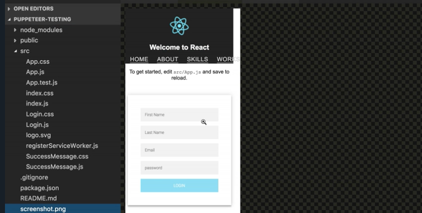
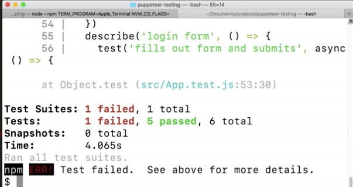

Instructor: [00:01] sometimes, it can be helpful to save out screenshots when tests fail. This makes it easy to see what the test was working with at the time the error happened. We can test this out inside of our `test('nav loads correctly'`. We'll add this `if` check, where we'll check the `if (listItems.length !== 3)`.

[00:15] We screenshot the page `await page.screenshot({path: 'screenshot.png'})`. Then, we'll update our test to be three `expect(listItems.length).toBe(3)`. Perfect. Now, this test should fail, because we still have four LIs in our app.

```js
expect(navbar).toBe(true)
if (listItems.length !== 3)
    await page.screenshot({path: 'screenshot.png'})
expect(listItems.length).toBe(3)
```

[00:26] Now, it will save a screenshot to our directory called, `screenshot.png` If we run our `test` script in our terminal, we can watch our test fail, as well as watch for our screenshot to be added to our directory here.





[00:40] As you can see, the test failed because it had four LIs. We can configure our screenshot method to take on some other configurations. Some of them are `fullPage: bool`, `quality: 0-100`, and `clip: {}`. `fullPage`, when it's true, it takes a screenshot of the full scrollable page. Its default is false. `quality` is the quality of the image 0-100.

[01:11] Then, `clip` takes an object which specifies a clipping region of a page to screenshot. Now, we can also make a PDF of the page by doing `page.pdf`. Then, it itself can have some configurations like `scale`, `format`, and `margin`. Now, `scale` is a number, and it refers to the web page rendering.

```js
expect(navbar).toBe(true)
if (listItems.length !== 3)
    await page.pdf({
        path: 'screenshot.pdf',
        scale: number,
        format: string,
        margin: object
})
expect(listItems.length).toBe(3)
```

[01:33] The default is one. `format` is referring to paper format. If it's set, it takes priority over any width or height options that is passed to it. The default is letter. `margin`, which is referring to the paper margins.