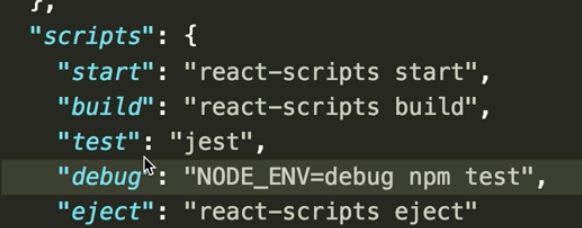

Instructor: [00:00] I've gone ahead and installed `createReactApp`. Now, we don't have to have our applications in `React` in order to use `Puppeteer` and `Jest`. `createReactApp` just makes it easy for us to get up and going. Now, let's grab our terminal, and install a couple of our dependencies.

[00:14] Some of these include `faker`, `jest`, `jest-cli`, and `puppeteer`. Then this might take some time, because with Puppeteer, you need to install an instance of `Chromium`. Perfect. Next, let's update our `test` script to just call `jest` specifically.

```html
$npm install --save-dev faker jest jest-cli puppeteer
```
In `package.json`:



[00:32] Then we'll add another script. We'll call it `debug`, and it's going to set our node environment variable to debug mode, and we'll call `npm test`. Puppeteer gives us the option to run our test headless, or live in a Chromium browser.

```html
"debug": "NODE_ENV=debug npm test", 
```

[00:47] This is handy to have, because it lets us see exactly what views, dev tools, and network requests the tests that we've written are evaluating. However, this can be slow, heavy, and problematic in CIs.

[00:59] We can use environment variables to control when we run headless or not. We'll make sure to set up our test so that when we want to see our test evaluated, we'll run this `debug` script. All other times, we'll run just the `test` script.

[01:13] Now, let's go to our `App.test.js` file, and remove the code that's already there. Then let's require `puppeteer`, create our first described test, where we'll check on the initial page load. We'll test the `h1`, and make sure that it loads the correct information.

```js
const puppeteer = require('puppeteer')

describe('on page load', () =>{
    test('h1 loads correctly', async () => {

    })
})
```

[01:35] Next, we'll do `let browser = await puppeteer.launch`, and then `let page = await browser.newPage`. These two variables are a browser and page instance. We'll use these to walk through our test.

```js
const puppeteer = require('puppeteer')

describe('on page load', () =>{
    test('h1 loads correctly', async () => {
        let browser = await puppeteer.launch({})
        let page = await browser.newPage()
    })
})
```

[01:51] With this `launch` method, we can pass through any config options to our browser. This way, we can control and test our applications in different browser settings. We can also change the settings of the browser page that we've created by setting emulating options.

[02:05] First, let's set up our browser, and how we want to use it. Up here at the top, let's create a function called `isDebugging`. It'll have an object called `debugging_mode`, which will have three property, `headless: false`, `slowMo: 250`, and `devtools: true`.

[02:22] Then the `return` is going to be a ternary, based on the environment variable, where we return either `debugging_mode` or an `{}`. Then we'll invoke `isDebugging` inside of our launch method. Perfect.

```js
const puppeteer = require('puppeteer')

const isDebugging = () => {
    const debugging_mode = {
        headless: false,
        slowMo: 250,
        devtools: true
    }
    return process.env.NODE_ENV === 'debug' ? debugging_mode : {}
}

describe('on page load', () =>{
    test('h1 loads correctly', async () => {
        let browser = await puppeteer.launch({isDebugging})
        let page = await browser.newPage()
    })
})
```

[02:35] If you remember back to our `package.json`, we created this script, `debug`, where when it runs, it'll set our environment variable to debug `NODE_ENV=debug`. Now, instead of our test, the `isDebugging` function is going to return our customized browser options, which is dependent on our environment variable, `debug`.

[02:53] This `headless` option is where we define whether or not we have Chromium open and running. When it's `false`, we can watch the browser interact with our app. `slowMo` slows down Puppeteer operations by the specific amount of milliseconds described. This is helpful so that we can see what's going on.

[03:11] Then `devtools` is a Boole that tells the browser to have dev tools open while interacting with the site. Some other helpful options are `executablePath`, which takes a `string`, `timeout` as a `number`, and `ignoreHTTPSErrors` as a `Boole`.

```js
const isDebugging = () => {
    const debugging_mode = {
        headless: false,
        slowMo: 250,
        devtools: true
        executablePath: string,
        timeout: number,
        ignoreHTTPSErrors: bool
    }
```


[03:26] `executablePath` is a path to a Chromium or a Chrome executable, instead of the bundled Chromium. `timeout` is the maximum time in milliseconds to wait for the browser instance to start. The default is 30 seconds, and we can pass through 0 to disable the timeout. Also, `ignoreHTTPSErrors` skips through any HTTPS errors that may pop up while navigating through your app.

[03:53] We'll just stick to the top three today. Now, we can set options for our page. We'll do that by doing `page.emulate`. We'll set the `viewport` properties of `width` and `height`. Then we'll set a user agent as a string.

```js
const puppeteer = require('puppeteer')

const isDebugging = () => {
    const debugging_mode = {
        headless: false,
        slowMo: 250,
        devtools: true
    }
    return process.env.NODE_ENV === 'debug' ? debugging_mode : {}
}

describe('on page load', () =>{
    test('h1 loads correctly', async () => {
        let browser = await puppeteer.launch({isDebugging})
        let page = await browser.newPage()

        page.emulate({
            viewport: {
                width: 500,
                height: 2400
            }
            userAgent: ''
        })
    })
})
```

[04:09] Not only do we have the ability to test different browser options, but we can replicate different page attributes with this `page.emulate`.