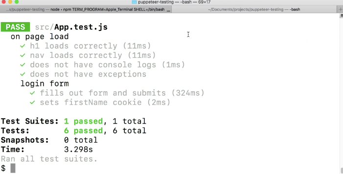
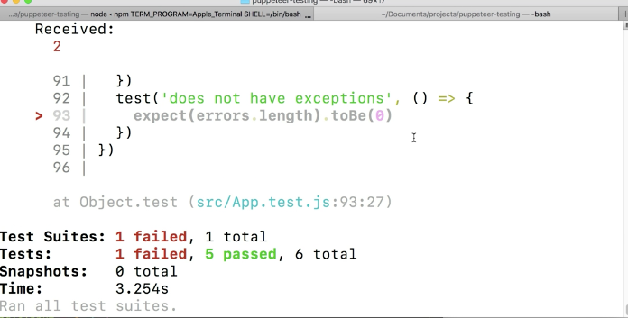

Instructor: [00:00] It is generally good practice to only write end to end tests on application features and not implementation details. However, it can be useful to know how to test and log console warnings and or thrown exceptions. There are times when new features might pass their tests, however cause an untested to throw an exception.

[00:20] Let's write `let logs = []` and `let errors = []` then we'll do `page.on('console', c => logs.push(c.text))`. Then, we'll do `page.on('pageerror', e => errors.push(e.text))`  Then we'll write our test. We'll do a `test('does not have console logs'`. We'll `expect(logs.length).toBe(0)`. We'll `test('does not have exceptions'`. We'll `expect(errors.length).toBe(0)`.

```js
let logs = []
let errors = []

page.on('console', c => logs.push(c.text))
page.on('pageerror', e => errors.push(e.text))
```
```js
test('does not have console logs', () => {
    expect(logs.length).toBe(0)
})
test('does not have exceptions', () => {
   expect(errors.length).toBe(0) 
})
```
[01:01] We're able to capture any console or page errors by the use of the `page.on` method. Where the first parameter is the event type we're listening for and the second parameter is a callback function. Here, we're just going to push the text into the corresponding array. As we look into our apps `console`, we can see that we don't have any exceptions or logs, we can assume that our tests are going to pass.

[01:24] If we try it out in our terminal, we can see that we actually do have a `test` that's failing. We do have a `console log`. As we can see that we expected `0`, but we did receive one for our `logs.length`. However, we did not have any `exceptions`. This is a good reminder that what we see in our browser is not exactly the same as what we're testing against with Puppeteer. Let's see what the console log is that we're getting.

[01:50] Inside of our console callback, let's add a `console.log(c.text)`. Now, we've run our test script again, we can see what log we are getting. It looks like it's this `download React DevTools`. For kicks and grins, if we wanted to get this test to pass, we could just filter out this `console.log`. We can use just the `filter` method on the logs array and check for that React dev tools log.

```js
page.on('console', c => {
    console.log(c.text)
    logs.push(c.text)
})
```
```js
test('does not have console logs', () => {
    const newLogs = logs.filter( s => !== '%cDowndload the React DevTools for a better development experience: https://fb.me/react-devtools fount-weight:bold')

    expect(newLogs.length).toBe(0)
```

[02:21] Perfect. Not only do we have tests for catching console logs and exceptions, but we can log these out to our terminal. If we wanted to test that our exceptions test was working we could simply throw an exception inside of our `App.js`.

[02:35] Instead of our handle and submit, the last thing we'll do is `throw new Error('Whoops!') `. Before we save this change, if we `npm test` our tests as they are now, we can see that they do pass. If we save this and re-run our tests, it looks like our exceptions test is failing as we are getting an exception.

```js
handleSubmit = e => {
    e.preventDefault()
    if (document.cookie.includes('JWT')) {
        this.setState({ complete: true })
    }
    document.cookie = `firstName=${this.state.firstName}`
    throw new Error('Whoops!')
}
```





