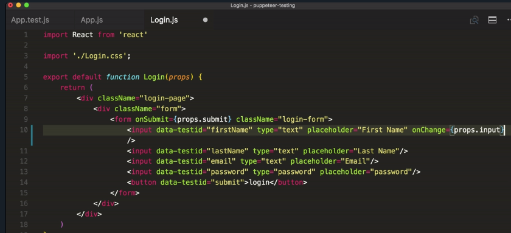
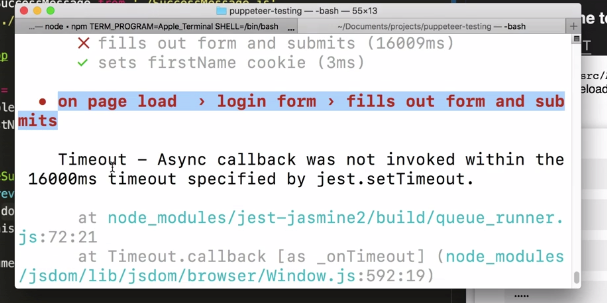
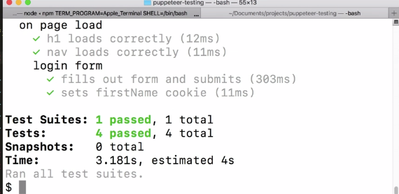

Instructor: [00:00] Now, let's say that when our form is submitted, we save a cookie to the page. This cookie will hold the user's inputted first name. Let's write an end-to-end test that checks the document after the form is submitted for this cookie.

[00:12] For simplicity, I've gone ahead and refactored our test to only open one page. This one page will emulate the iPhone 6. Since the saving of this cookie depends on the submission of the form, we'll add this test within the context of the form.

[00:28] We'll write a new `describe` block here for our `login form`, and then copy and paste our login form text inside of it. Next, we'll rename it, and go new text, where we'll check to make the `firstNameCookie` is set.

```js
describe('login form', () => {
    test('fills out form and submits', async () => {

    
```

[00:46] We'll do `const cookies = awaitPage.cookies()`. Then we're going to get the `firstNameCookie` out of that using the `find` method, checking on the `c.name` and the `c.value` of the cookie. Then we're `expect(firstNameCookie).not.toBeUndefined()`.

```js
test('sets firstName cookie', async () => {
    const cookies = awaitPage.cookies()
    const firstNameCookie = cookies.find(c => c.name === 'firstName' && c.value === user.firstName)

    expect(firstNameCookie).not.toBeUndefined()
})
```

[01:07] Page.cookies returns an array of an objects for each document cookie. We use the array prototype method `find` to see if the cookie we set exists. We want to make sure that it's using our Faker-generated content, `firstName`.

[01:20] Then we test to make sure that we get something back. If we run our test script, we can see that our test fails. It is getting back an undefined. Let's go ahead and implement this. Inside of our `App.js` file, we're going to add a `firstName` property to our `state` object. That'll be a string.

```js
state = {
    complete : false,
    firstName : ''
}
```

[01:39] Then inside of our `handleSubmit`, we're going to `document.cookie = firstName=${this.state.firstname}'`. Next, we'll create a `handleInput` that will fire on each input to update the state. We'll pass this method on through to our `login` component as a prop.

```js
handleSubmit = e => {
    e.precentDefault()
    this.setState({ complete: true})
    document.cookie = `firstName=${this.state.firstname}`
}

handleInput = e => {
    this.setState({firstName: e.currentTarget.value })
}
```
```js
<Login submit={this.handleSubmit} input={this.handleInput} />
```

[02:06] Then inside of our login component, on our firstname input, we're going to `onChange={props.input}`. Perfect. Now, every time our firstname input box is typed in, it's going to fire this input method. If we save this, and go back to our app JS file, it's going to update our `state` object.



[02:26] Then every time our submit method is fired, we're going to save a `firstName cookie` to the page. Now, if we run our test script in our terminal, we'll see that our test passed. Perfect. We are setting our `firstName cookie`.

[02:44] Now that we know how to test setting cookies to a document, what if an application requires a certain cookie be present before performing any actions, and this cookie was set on a series of previous authorization pages?

[02:57] For example, what if we had an `if (document.cookie.includes('JWT')` before it actually submitted? Now, we're not going to see our success message unless our document includes this JSON web token.

```js
handleSubmit = e => {
    e.precentDefault()
    if (document.cookie.includes('JWT')){
    this.setState({ complete: true})
    }
    document.cookie = `firstName=${this.state.firstname}`
}
```

[03:12] Inside of our browser, we can test this out. You can see as I click on this login button, it doesn't show us that success message. Now, our login form test is going to fail. You can see that our test timed out, because the login form submitted, but the success message never showed up.



[03:34] To fix this, we have to go back inside of our `App.test.js` file, do `await page.setCookie`. That takes an object with name and value properties. Similar to how we read cookies in our firstname cookie test, we can actually set cookies inside of our Chromium browser that's running the test.

```js
await page.setCookie({ name: 'JWT', value: 'kdkdkddf' })
```

[03:56] In this case, we're going to set a cookie that's actually setting our JSON web token`'JWT'` with just some gibberish value. Now, when we run our test, it'll pass. If we run the NPM test script, you can see that we'll step through all of our tests, and it'll pass.


