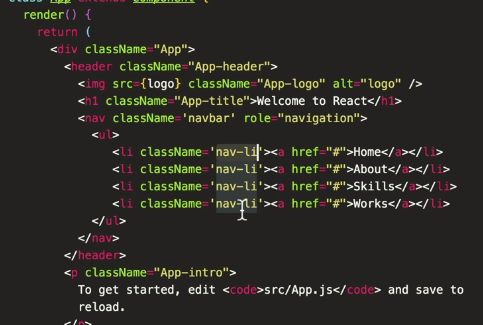
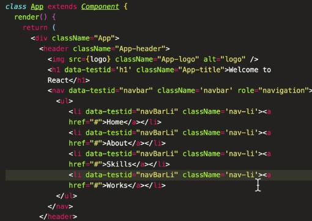

Instructor: [00:00] Now that we've got our setup done, let's write our first test. Let's make sure that the `h1` has the correct text. Inside of our test block, we're going to do `await page.goto`, and our `localhost` URL. Next, we'll do `const HTML = await page.$eval`, a selector, and then a callback function.

[00:23] Next, we'll do `expect(html).toBe('Welcome to React')`. Finally, we'll close the browser, and give a timeout to our test. The first thing that we did was use this `page.goto`, which is how we tell Puppeteer where to navigate inside the browser. We're telling to go to our `http://localhost:3000`.

```js
    await page.goto('http://localhost::3000')

    const html = await page.$eval('.App-title', e =>
    e.innerHTML)

    expect(html).toBe('Welcome to React')

    browser.close()
  },16000)
})
```

[00:42] Once it gets there, we want to look for this`.App-title` class, which lives on our `h1` inside of `createReactApp`. This `$eval` method basically runs document.querySelector within whatever frame it's passed into.

[00:55] Once it finds a selector that matches this class, it's going to pass that to the callback function `e.innerHTML`, where we can grab stuff, and do stuff with it. In our case, we want to grab that HTML that's inside of it. Once we have that extracted, we can write under `expect` to look, and make sure that the text says, `'Welcome to React'`.

[01:12] Once we're done with that test, we want to close the browser `browser.close`. Perfect. Now, let's grab our terminal, and run our `debug` script. We're going to see our Chromium instance open, since we are debug mode, and we can see that it's stepping through, and checking our tests.

```html
$ npm run debug
```

! [Run Debug](../images/react-test-html-content-on-a-webpage-with-puppeteer-run-debug.png)

[01:29] We can see that our `h1` did load correctly. Then if you also notice that our `viewport` that we've set inside of our `page.emulate` was respected. Our `height` was 2,400 pixels, and our `width` was only 500 pixels. Then our `slowMo` that we've set, we can speed it up, or slow it down, so that we can see what the browser's doing a little bit more clearly.

[01:52] Next, let's go ahead and write a couple more tests. Inside of our `App.js` file, we'll add a `className` to our `nav`. We'll call it `navBar`. Then I'm going to zoom out, and paste in an `ul`. We'll use this to replicate a nav bar.



[02:07] You can see that all of our LIs share the same class. Now, let's save this, go back to our `App.test.js` file, and run a test to make sure that our nav, as you can see, will load correctly. Now, we don't want to create a new running browser and web page on every single test.

[02:24] Before we actually write our navigation test, let's refactor some of this shared code. Let's define two global variables, `browser` and `page` up here at the top. Then we're going to do `beforeAll( async () => {`, and we're going to do `browser = await puppeter.launch(isDebugging()).

[02:41] Then we're going to do `page = await browser.newPage()`, `await page.goTo('http://localhost:3000/')`, and then `page.setViewport`, with our viewport properties. Now, inside of our test, we can remove some of this code, as well as our `page.emulate`.

```js
let browser
let page
beforeAll( async () => {
    browser = await puppeteer.launch(isDebugging())
    page = await browser.newPage()
    await page.goto('http://localhost:3000/')
    page.setViewport({width: 500, height: 2400 })
})
```

[03:01] Because we didn't have anything for `userAgent`, we could just use `setViewport` instead of a `beforeAll`. Now, we can rid of our `localhost`, and we can also get rid of our `browser.close`, and use an `afterAll`, where we check to see if we're in debugging mode. If we are, then we want to remove that browser.

```js
afterAll(() => {
    if (isDebugging()) {
        browser.close()
    }
})
```

[03:23] Now, we can go ahead and write our nav test. Overwrite `test('nav loads correctly', async () => {` where we'll grab the `navbar` using the `$eval` function again on the nav bar class. Then we'll use a ternary to return `true` or `false` if the element exists.

[03:40] Then we'll grab our list items, and we'll do that by grabbing the `navLI` class. Then we're going to expect `navbar` to be `true`, and that our `(listItems.length).toBe(4)`. Just like in our `h1` test, we're using this `$eval` method to find the provided selector on the page, in our case, the `navbar` class.

```js
test('nav loads correctly', async () => {
    
    const navbar = await page.$eval('.navbar', el => el ? true : false)
    const listItems = await page.$$('.nav-li')

    expect(navbar).toBe(true)
    expect(listItems.length).toBe(4)
}
```

[04:01] For our list items, we're using the double dollar sign method `$$`. This is like running `document.querySelector` all from within the page. When the `eval` title is not used alongside the dollar signs, it just means that there's no callback.

[04:17] Our `expect` checked for the existence of the `navbar`, and we use a node list length property `listItems.length` to check the total number of nav LIs. Now, let's finish up by rerunning our `debug` script. Awesome, they both passed.

```html
$ npm run debug
```

[04:36] One last thing to note. We are using classes as the selector, instead of our `$eval` and `$$` methods. This works great inside of `createReactApp`, but can be brittle inside of other applications that use something like CSS modules.

[04:51] Instead, it's better to add data types. We'll paste in a data type selector for the `h1`, for our `navbar`, and for our `listItems`. Finally, adding these data attributes to our HTML.

```js
const html = await page.$eval('[data-testid="h1"]', e =>
    e.innerHTML)


 const navbar = await page.$eval('[data-testid="navbar"]', el => el ? true : false)   
 const listItems = await page.$$('[data-testid="navBarLi"]')

```
In `App.js` :


