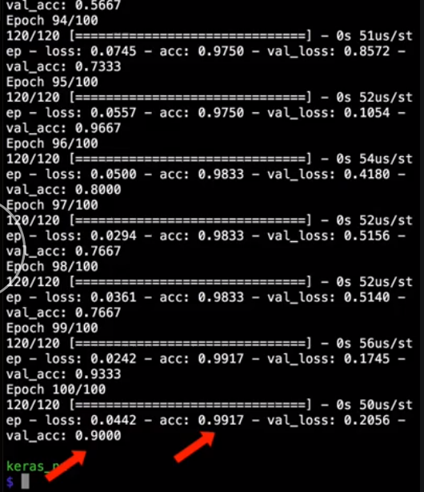

We're using the `adam` optimizer for the network which has a default learning rate of `.001`. To change that, first import `Adam` from `keras.optimizers`. 

#### neural_net.py

```python
from keras.optimizers import Adam
```

Then, instead of just saying we're going to use the `Adam` optimizer, we can create a new instance of the `Adam` optimizer, and use that instead of a string to set the optimizer.

```python
opt = Adam()

model.compile(
  optimizer=opt, 
  loss='categorical_crossentropy',
  metrics=['accuracy']
)
```

One of the optional parameters is `lr`, which stands for learning rate. Setting the learning rate is like saying how large the steps are that the network takes while learning. If the learning rate is too small, the network will never have a chance to get where it's going. The accuracy will always be low, or training will take a really long time.

If the learning rate is too large, then the network will jump all over the place and will never be able to find the best solution, because it will keep jumping over it. Let's set a learning rate of `.005` and see how that works for our problem set.

```python
opt = Adam(lr=0.005)
```

After `100 epoch`, we're seeing good progress on the training in validation accuracy, so we'll keep that learning rate. It's important to test different learning rates for your network, because each dataset in network topology will respond slightly differently to different learning rates.

