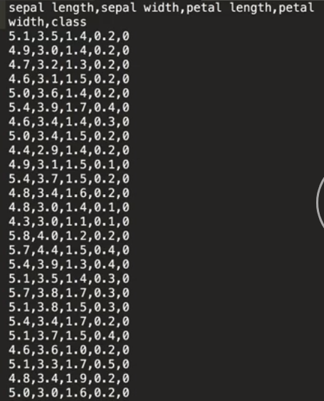
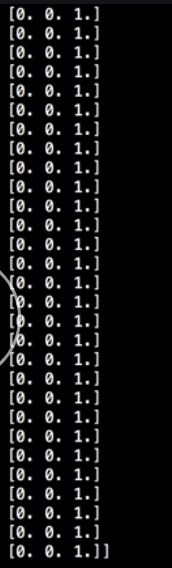
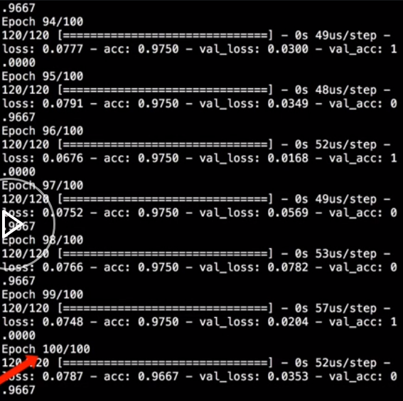

We're training the neural networks on a CSV with two classes, `0` for `low` and `1` for `high`. Now, we're going to switch that to a new dataset. 



This is the Iris dataset, which is a common training set used to test neural networks. Each row represents a different `flower` and each `flower` has four data points, the `Sepal Length`, `Sepal Width`, `Petal Length`, and `Petal Width`.

The final column is the `class` of the flower, which is a `0`, a `1`, or `2`. A `0` represents `Iris setosa`, a `1` is `Iris versicolor`, and `2` is `Iris virginica`. We can import the `iris.csv` file. 

#### neural_net.py
```python
data = np.genfromtxt('iris.csv', delimiter=',')
```

We have three classes, but before we just had two. Now, we have to convert the network from a binary classification network to a multi-class classification network.

First, we can't use `binary_crossentropy` anymore, because that's only for two-class problems. We'll update that to `categorical_crossentropy`, which can use any number of classes. `categorical_crossentropy`, however, can't take up the flower classes as just a number like `0`, `1`, or `2`, but instead, it needs to have the class represented by a one-hot encoded vector.

Keras has a built-in function to do that translation for us. 

```python
from keras.utils.np_utils import to_categorical
```
If we check the `y_train` values we have now, we have an array filled with `0`'s, `1`'s, and `2`'s. 


We can call `to_categorical` and pass in our `y_train` values.

```python
y_train = to_categorical(data[1:, 4])
```

Now, we have an array of one-hot encoded vectors, which means the index 0 value is a `1`, if the class was a `0`, the index 1 value is a `1`, if the class was a `1`, and the index 2 value is a `1`, if the class was a `2`.



Since we are using `validation_split` in the model `fit` and we have auto-data, we also want to make sure to shuffle the data before we do a `fit`, whereas the validation set would only select from the end of the file, which would only ever include the flowers of class `2`.

```python
perm = np.random.permutation(y_train.shape[0])
x_train = x_train[perm]
y_train = y_train[perm]
```
We have the data in the correct format for the `fit` network call now. Our network output has to change from a single `0` or `1` value to a one-hot encoded vector of length 3. First, we have to change the size of the output from 1 to 3, which means, we want to reconsider our `sigmoid` activation function.

We can think of the three outputs as the probability that the inputs are each one of the classes. In this example output, there is a 10 percent chance that the flower is Iris setosa, a 20 percent chance that the flower is Iris versicolor, and a 70 percent chance the flower is Iris virginica.

By using a `sigmoid`, means we can range from `0` to `1` for all of the probabilities. What if we get an output where all the probabilities are `0.9`. To avoid this type of case, we'll use an `activation` function called `softmax`, which will ensure that all three probabilities add to `1`, which will help our neural network decide which class it might belong to then we can run our model.

```python
model.add(Dense(3, activation='softmax'))
```

In only `100 epoch`, we're getting fairly good results with our new multi-class model.

