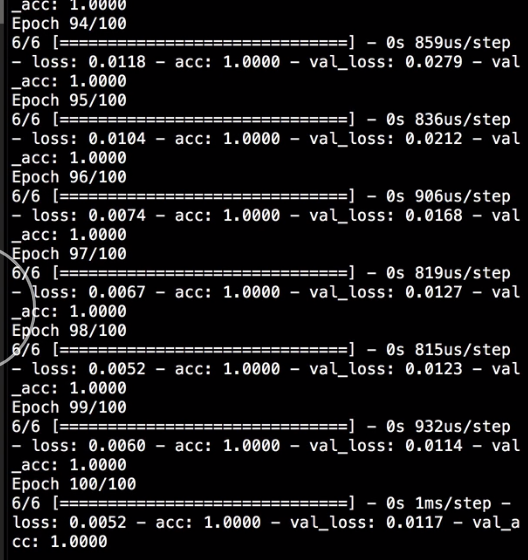

We have a neural network defined, which takes in four numbers and returns a numerical value that represents the mean of those four numbers. Instead, what if we wanted to classify our data with the network?

For example, we'll call the numbers less than 50 `low`, and the numbers greater than 50 will be `high`. In this example, the numbers are less than 50, so the class of this set of numbers is `low`. The main structure of the network can remain exactly the same. We're taking in four numbers, and the layers are still fine. It's only the output that is different.

We have a `linear` activation function on the output, but that will give us values like `12` or `-1.5`. Instead, we want to pick a class, `low` or `high`. First, let's assign the number `0` to the class `low`, and the number `1` to the class `high`.

Then, instead of a `linear` activation, we should use `sigmoid`, which is a function that will return a single number between `0` and `1`. 

#### neural_net.py

```python
model.add(Dense(1, activation='sigmoid'))
```

The closer it is to `0`, the more likely the input is to be `low`. The closer it is to `1`, the more likely the input is to be `high`.

There are some changes to make in the `compile` step as well. First, change the `loss` from `mean_squared_error` to `binary_crossentropy`, which is a loss function that will optimize the data for being a part of one of two classes.

```python
model.compile(
  optimizer='adam', 
  loss='binary_crossentropy'
)
```

Then we want to make a new `metric` to our `model` and call it `accuracy`, which can tell us the percentage of our training, validation, or test data points that were correctly identified.

```python
model.compile(
  optimizer='adam', 
  loss='binary_crossentropy',
  metrics=['accuracy']
)
```
Now, we can train our `x_train` and `y_train` `numpy` arrays, and fill in several examples.

```python
x_train = np.array([
  [1, 2, 3, 4],
  [4, 6, 1, 2],
  [10, 9, 10, 11],
  [101, 95, 89, 111],
  [99, 100, 101, 102],
  [105, 111, 109, 102]
])
```

Now, the `y_train` variable, instead of the mean of the four numbers, we'll use the value `0` for `low` and `1` for `high`. The first three inputs are `0`, and the next three are `1`. 

```python
y_train = np.array([
  [0],
  [0],
  [0],
  [1],
  [1],
  [1]
])
```

We can also define a validation set in the same way, and then train the model with the `fit` method, using the same parameters that we would if we were only using a linear output.

```python
x_val = np.array([
  [1.5, 4, 3, 2.5],
  [10, 14, 11.5, 12],
  [111, 99, 105, 107]
])

y_val = np.array([
  [0],
  [0],
  [1],
])

model.fit(
  x_train, 
  y_train,
  epochs=100, 
  batch_size=2, 
  verbose=1,
  validation_data=(x_val, y_val)
)
```

When we run that, we see `100` epochs of training, where we still see the `loss` value, but we also see accuracy for both `training` and `validation`. In just `100` epochs, we can get 100 percent accuracy on our small data set.



This is admittedly a small data set, and a very contrived example, but it shows the potential power of a fully connected neural network for problems like two-class classification or sentiment analysis.