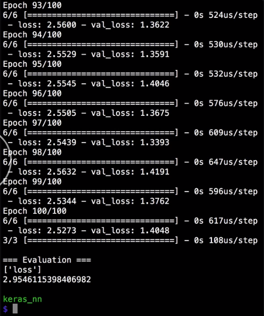

Make another set of data called `x_test` and `y_test`. This data will be used to test the neural network after training is fully complete. The format should match the train and validation data sets.

#### newural_net.py
```python
x_test = np.array([])

y_test = np.array([])
```

In this case, there is four input numbers per line in a single output value, which is the correct answer for what we're asking the neural network to predict. For this example case, it's the mean of the four inputs.

```python
x_test = np.array([
  [2, 5, 4.5, 1],
  [9, 16, 11, 10.5],
  [100, 95, 99, 102]
])

y_test = np.array([
  [3.125],
  [11.625],
  [99.0],
])
```

We can evaluate the loss of our trained network by calling the `evaluate` method on the `model` and passing in the `x_test` and the `y_test` values that we just created. The `output` will be an array of one or more numbers, which represents the metrics that we told our neural network to optimize for.

```python
output = model.evaluate(x_test, y_test)
```

We can print those metric names by calling them `metric_name`s Method on the `model` and then print the `output` to see the actual values. 

```python
print("")
print("=== Evaluation ===")
print(model.metrics_names)
print(output)
```
When we run that, we see the hundred epochs like normal with our training loss and validation loss.

We also see a single run with the three-new test data points. Finally, we see that our metric is `loss`. This value represents the `loss` on the as yet unseen data, which is the test set that we created.




In a well-trained and well-tuned, neural network, the training loss, validation loss, and test loss should be similar, which means there is on under or overfitting issues. Also, notice that we've only checked the test set after we fully trained the network.

It's a best practice to reserve the test set until the very end of training and validation. Otherwise, it isn't as effective at telling you the actual performance of your network on future unseen data.