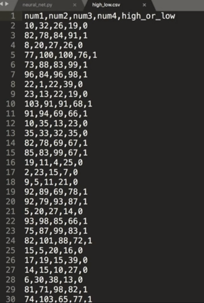
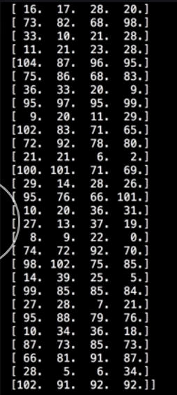
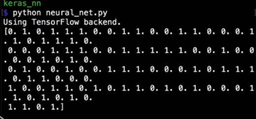
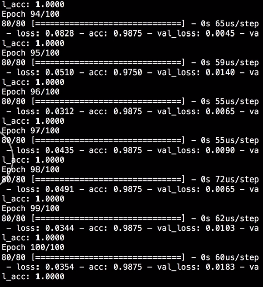

We have a CSV that contains a hundred rows of inputs that we want to use to train our neural network. Each row has four numbers and a single output value of a `0` or `1`. 



`0` represent the numbers are generally `low` which for us means less than `50`, and `1` means the values are generally `high` which means over `50`.

After defining a neural network, import the CSV using `numpy`'s `genfromtxt` method. 

#### neural_net.py

```python
data = np.genfromtxt('high_low.csv', delimiter=',')
```

`genfromtxt` takes the CSV to import as the first argument and an optional `delimiter` argument which is just a `,` in this case. Then we can assign the output of that to `data` variable, which is now a numpy array that contains all of the rows and columns that were in the CSV.

We can split the `data` into the input values by taking all the rows except for the first, because that's the header row, and the first four column which are inputs. Then, we can extract the output class values by taking all the rows except for the header again, and only the fourth column this time which is the output value.

```python
x_train = data[1:, :4]
y_train = data[1:, 4]
```

If we `print` the `x_train` values at this point, we have a numpy array with a hundred rows and four columns in each row. 



If we `print` the `y_train` values, we have a numpy array with a hundred values which are all the output classes. 



We can then use the `x_train` and `y_train` values to `fit` the `model`, passing them into the X and Y arguments, specifying `100` epoch and a validations split of 20 percent.

```python
model.fit(
  x_train, 
  y_train,
  epochs=100, 
  validation_split=0.2
)
```
When we run that, the network successfully trained on the init data.

