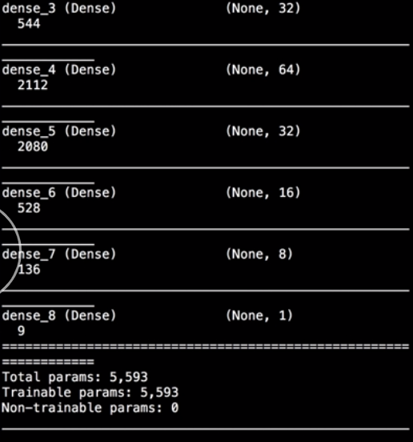
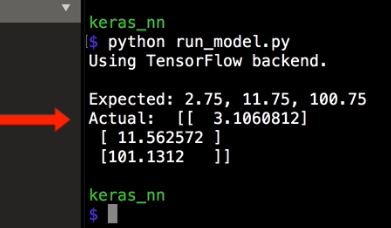

In a new Python file, `import load model` `from keras.models`. 

#### run_model.py
```python
from keras.models import load_model
```
Then we can call the `load_model` function, passing the file name of the model file that we saved. The result of that will be the entire trained model, so we can assign that to the `model` variable.

```python
model = load_model('mean_network.h5')
```

We can see the `model` details by calling `model.summary()`. When we run that, we see all of the layers in the network and their sizes. 



This allows us to load and even inspect models that we didn't make ourselves. Then we can use this model to make predictions since it's a fully-trained model.

First, `import numpy`, and then make a few input arrays to make predictions on. Then use the model's `predict` method to actually make those predictions. 

```python
from keras.models import load_model

import numpy as np

model = load_model('mean_network.h5')

# Predict
x_predict = np.array([
  [1.5, 2, 3.5, 4],
  [13, 11, 9, 14],
  [102, 98.5, 102.5, 100]
])

output = model.predict(x_predict)

print("")
print("Expected: 2.75, 11.75, 100.75")
print("Actual: ", output)
```

When we run that, we see the model's output predictions.

