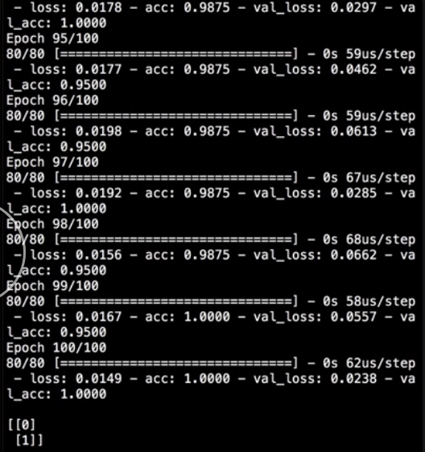

Our neural network takes in four numerical values and predicts a class of `0`, if the values are `low`, and `1`, if the values are `high`. After the neural network is trained, make some inputs to test that are numpy arrays of four values each. 

#### neural_net.py
```python
x_predict = np.array([
  [10, 25, 14, 9],
  [102, 100, 75, 90]
])
```

Then, we will call the models `predict` method to make predictions on those inputs and print the `output` to the screen.

```python
output = model.predict(x_predict)
```

When we run that, we see that the network returns a floating point value and not a class of `0` or `1` like you might expect. 


What you are seeing is the raw output from the `sigmoid` function that we defined on the output node and not the classes as we define them.

We could round these predicted values to get to a class, or we'd have Keras do that for us by calling the `predict_classes` method instead of just `predict`. 

```python
output = model.predict_classes(x_predict)
```

Once we change to that, we see the proper classes for our input data.

