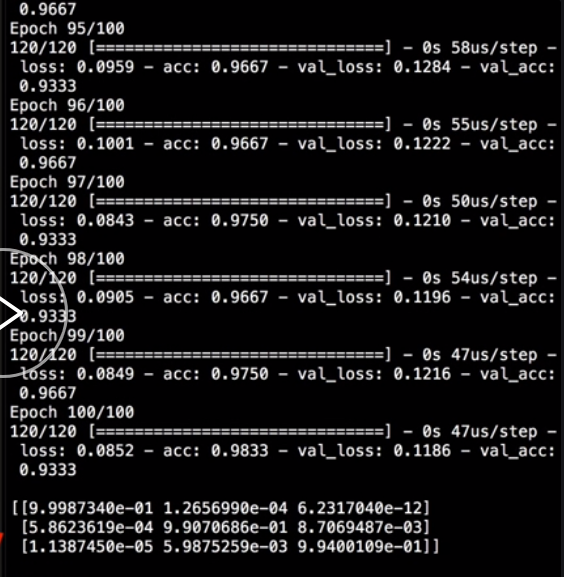
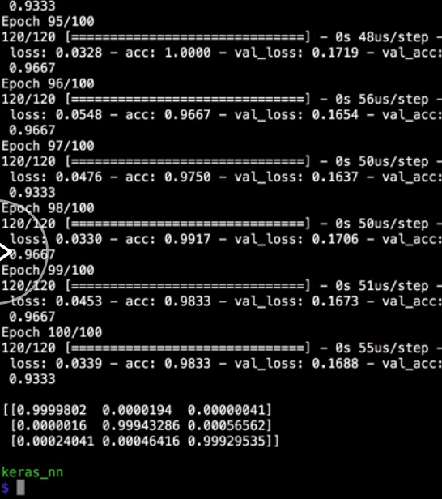
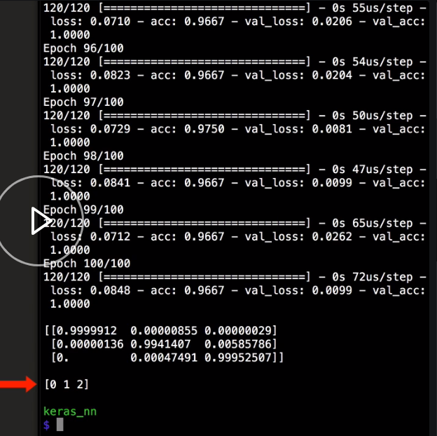

We've defined our `model` for multiclass classification, and then `fit` it on data that we've pulled in from a CSV. After we `fit` our network, we would like to use that `model` to make predictions on new data.

Let's make some new data by making a numpy array with three new data rows. This is new data that the model hasn't seen yet. I've picked one new data row for each class of data that we have. 

#### neural_net.py

```python
predict_data = np.array([
  [4.9, 3.0, 1.5, 0.2], #0 Iris-setosa
  [5.7, 3.0, 4.5, 1.2], #1 Iris-versicolor
  [7.2, 3.2, 6.4, 2.3]  #2 Iris-virginica
])
```

The first row is class `0`, which is `Iris setosa`.

The second row should be class `1`, which is `Iris versicolor`. The third row is an example of class `2`, which is `Iris virginica`. Now, we can make a class prediction for each row by calling the `predict` method on the `model`, and pass in the data that we want to make predictions on.

```python
output = model.predict(predict_data)
```

Then we can print the `output` with a blank line, just for formatting. 

```python
print("")
print(output)
```

When we rerun that, the model trains like normal. Then we see predictions each for the three rows that we just created. You might notice that the values are all scientific notation, and that can be difficult to read.



Let's clean that up by telling numpy to suppress scientific notation, by calling `set_printoptions` on numpy, and set `suppress` equal to `True`. Then we can run that again, and now, the output is easier to read.

```python
np.set_printoptions(suppress=True)
```



To interpret this `output`, remember that the input was made into categorical data by calling `to_categorical` with the data, which turns it from an integer like zero, one, or two into a one hot encoded value.

What we're seeing on the `output` is the probability that each of the inputs belongs to each one of the classes. It's also one hot encoded. Each row is the row of our input data, and each column represents one of the possible classes.

If you were to round these values, you can see that the first value would have a one in the index zero spot, and a zero in the two other spots, which means the prediction for this row is class zero, or Iris setosa.

For the second row, the highest value is in the index one spot, and for the last row, the highest value is in the index two spot, which means our network is correctly predicting those as well. This can be confusing to read and deal with, however.

If you don't care about the probability for each of the output classes, you can just see the class predictions by calling the `predict_classes` method, instead of just the `predict` method.

If we add a line to call `predict_classes`, and rerun that, we can see that the `output` is just the class numbers that are being predicted, which match up with the one hot encoded output that we saw before, but it may be easier to interpret and use.

```python
output = model.predict_classes(predict_data)
```

