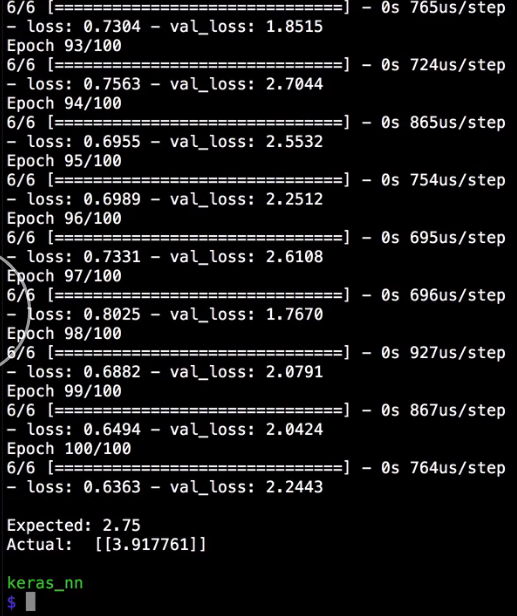
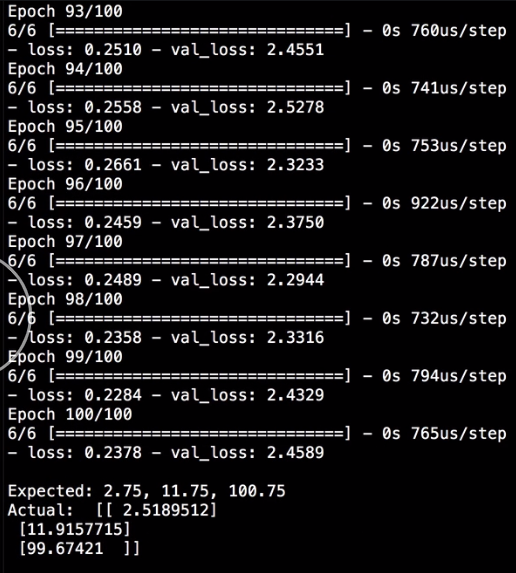

Keras models that have been trained with the `fit` method can be used to make predictions using the `predict` method. The only required parameter to `predict` is the input values. The shapes of those values need to be `numpy` arrays that matches the training input data.

For this example, that is an array of four numeric values, make a variable called `x_predict` which would be a numpy array just like the training in validation data. Then we can add one or more set of inputs that we want to make predictions for.

#### neural_net.py

```python
x_predict = np.array([
  [1.5, 2, 3.5, 4]
])
```

Let's start with just this one. We can supply that to the `predict` method and assign that to the `output` variable. 

```python
output = model.predict(x_predict)
```

The mean of all four inputs, `1.5`, `2`, `3.5`, and `4`, is `2.75`. We'll print out that we expect to see `2.75`, and we'll print the actual value that the network predicts.

```python
print("")
print("Expected: 2.75")
print("Actual: ", output)
```

The value we get is pretty close. 



In just `100` epochs, we were able to train the neural net to get close to calculating the mean of four numbers. At least, that is, for inputs that look similar to our trained inputs. Also, notice that the `output` is actually an array that contains an array that contains the output value.

That's because the `predict` method can take more than one input data at the same time. Let's add a few more and record the expected mean values. 

```python
x_predict = np.array([
  [1.5, 2, 3.5, 4],
  [13, 11, 9, 14],
  [102, 98.5, 102.5, 100]
])

output = model.predict(x_predict)

print("")
print("Expected: 2.75, 11.75, 100.75")
print("Actual: ", output)

```
When we run that, we see all three outputs come out at the same time which is the reason the outputs are in an array.



Finally, the reason that each individual output is an another array is because we could have defined our neural network with more than one output. 

```python
model.add(Dense(1, activation='linear'))
```

If we did, we would get all the outputs here, but we just defined a single output, so we only get one numeric value in each output array