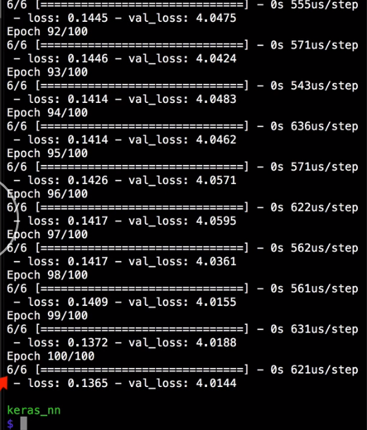
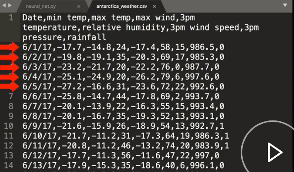

Create a manual validation set by defining two numpy arrays -- `x_val` and `y_val` -- which will hold the inputs in the correct outputs. 

#### neural_net.py
```python
x_val = np.array([])

y_val = np.array([])
```

Validation sets need to match the format of the trained data exactly, which in this case means four numeric inputs and a single numeric output, which is the mean of the four inputs.

```python
x_val = np.array([
  [1.5, 4, 3, 2.5],
  [10, 14, 11.5, 12],
  [111, 99, 105, 107]
])

y_val = np.array([
  [2.75],
  [11.875],
  [105.5],
]
```

Instead of using the automatic `validation_split`, we can supply those `x`- and `y`-validation sets to the model using the `validation_data` parameter. 

```python
model.fit(
  x_train, 
  y_train,
  epochs=100, 
  batch_size=2, 
  verbose=1,
  validation_data=(x_val, y_val)
)
```

When we run that, we see the network training on all six input data points and a validation loss being calculated on the three new validation points that we just entered.



When manually separating validation data, is important to get a representative sample of the data that you have, otherwise, your validation loss may not be a valid representation of your data.

When using the `validation_split `parameter, we achieve that by first shuffling the data. However, every time you train the network, it will shuffle in the data, so it may be difficult to get repeatable results.

This is one reason that it may be better to manually set the `validation_data` parameter. Another reason to manually set the `validation_data` is if you have data where it doesn't make sense to pick a random validation set.

For example, with some time series data sets, you may want to select a contiguous chunk of time to validate on, instead of just random data points across all of the data.

