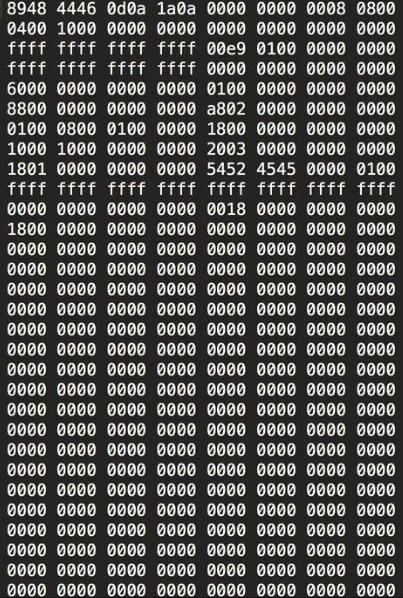

Every time we run this file, it defines the network and retrains the entire network before it can make a prediction. This is definitely not optimal since training will always take longer than predicting.

Instead of predicting here, we can save the entire model definition with the trained weights by using the model's `save` method. 

#### neural_net.py
```python
model.save()
```

The model save only takes one argument, which is the path to the file that you want to save.

We'll save our file as `mean_network.h5`. 

```python
model.save('mean_network.h5')
```

We use the `h5` file extension because Keras uses the h5py library to make a binary file, but you can name this file whatever you'd like, like `.model` or `.network`.

When we run that now, we have a saved model file. It's a binary file that we can't read in a text editor, but it contains all the model information that we need to make predictions with the model, without requiring training again.

