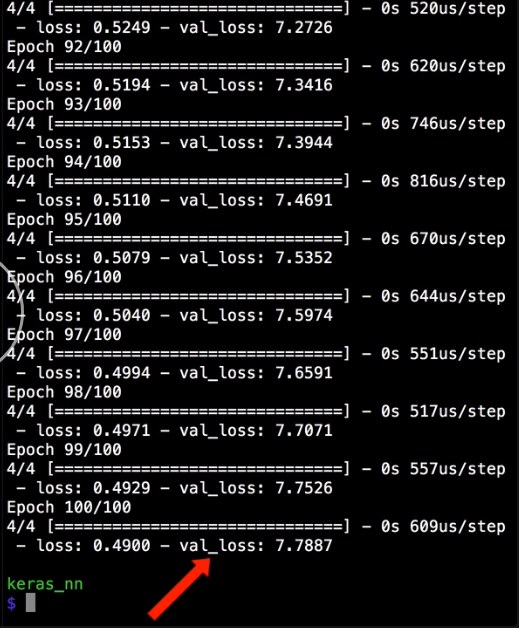
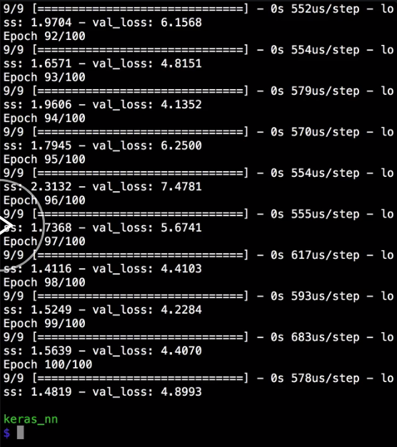

We've gotten a low loss in only `100` epochs, but that loss number is calculated with the same data that we're using to train the network, which might mean that we're just overfitting to that data. Keras has a built-in way to split data into training and validation data sets.

We'll use it by supplying a `validation_split` parameter to the `fit` function. `validation_split` is a decimal between `0` and `1`, which represents the percentage of the training data to use as the validation data set.

For this example, we'll split into 20 percent validation and 80 percent training. 

#### neural_net.py

```python
model.fit(
  x_train, 
  y_train,
  epochs=100, 
  batch_size=2, 
  verbose=1,
  validation_split=0.2
)
```
Common values are `0.2` or `0.33`, but you can try different values to see what works best for your data set. There's one very important note when using Keras's automatic validation split, though.

It always takes the last X percent of the data that you give it, so that if you have ordered data of any kind, you may want to shuffle your data before training. We want to make sure to keep the correct Y value with the correct X value, if we shuffle, though.

Let's first make a permutation of numbers that match the size of the output array.

```python
perm = np.random.permutation(y_train.size)
```

Which gives us a random array of array indices that we can use to reset the order of our X and Y arrays. 

```python
perm = np.random.permutation(y_train.size)
x_train = x_train[perm]
y_train = y_train[perm]
```

When we retrain the network with the validation set, now, there is an extra val_loss output value, which represents the mean squared error loss on the validation set.



We want to see low values for the validation loss, and hopefully around the same values as the regular loss. If we rerun this several times, the validation and training losses tend to jump all over the place. This tells us that sometimes, the network is overfitting the data, and sometimes, the network is underfitting the data.

For the specific example, this is because we don't have enough data. We only have six input data points. After we take 20 percent off to be the validation set, we're only left with four. It makes sense that we can't get the network to fit properly all of the time.

The real key thing to look for, though, is that the loss and the validation loss are more consistent as you increase the amount of data that you give the network.

For example, if we doubled the number of inputs and outputs so that we have `12` and rerun the training, we're now training on `9` data points instead of just 4. The loss and validation numbers are lower and more consistent across runs.

