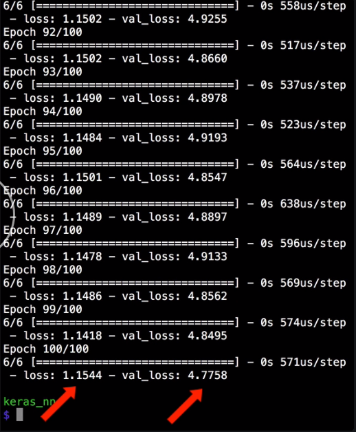
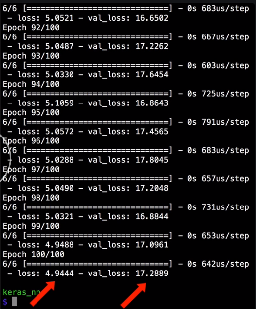
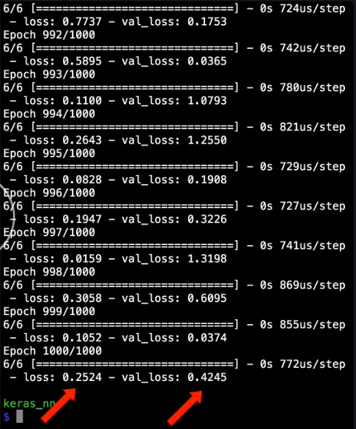
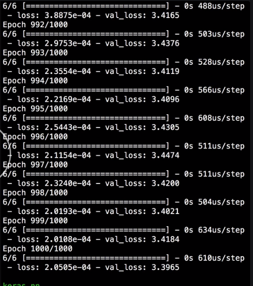

This neural network has three hidden layers and one output layer, so it has a depth of four. 

#### neural_net.py
```python
model.add(Dense(8, activation='relu', input_dim=4))
model.add(Dense(16, activation='relu'))
model.add(Dense(8, activation='relu'))
model.add(Dense(1, activation='linear'))
```

There are many other ways we could configure this network.

First, we'll run the network as is to check the training and validation losses, so that we can compare those losses to other networks that we can try.



To make this network deeper just means to add more hidden layers. Let's copy this layer two more times and increase the middle dense layers number of nodes to `32`. 

```python
model.add(Dense(8, activation='relu', input_dim=4))
model.add(Dense(16, activation='relu'))
model.add(Dense(32, activation='relu'))
model.add(Dense(16, activation='relu'))
model.add(Dense(8, activation='relu'))
model.add(Dense(1, activation='linear'))
```

Then we can run that network to see what, if any, effect that had on the training and validation loss.



We could even make the network deeper if we wanted to. 

```python
model.add(Dense(8, activation='relu', input_dim=4))
model.add(Dense(16, activation='relu'))
model.add(Dense(32, activation='relu'))
model.add(Dense(64, activation='relu'))
model.add(Dense(32, activation='relu'))
model.add(Dense(16, activation='relu'))
model.add(Dense(1, activation='linear'))
```

As you make the network deeper, you may also want to run more epochs because the more complex network will now take longer to train properly. 

```python
model.fit(
  x_train, 
  y_train,
  epochs=1000, 
  batch_size=2, 
  verbose=1,
  validation_data=(x_val, y_val)
)
```

When we run that, we can see that the combination of a deep network and a long training time can be very effective.



However, remember that we have a small data set which may be skewing our results some. It's important to test on a small data set, but also, to retest as you include more and more of your full data set.

Instead of a deep network, we could also try to make a very wide but shallow network which means removing many of the hidden layers, but then drastically increasing the size of one or more of the layers.

```python
model.add(Dense(8, activation='relu', input_dim=4))
model.add(Dense(1000, activation='relu'))
```

When we run that, we can see this network is also effective, at least on our small data set. Again, it's important to test different strategies on your data set because every one is different.



Once you have all your training and validation, and you have a network that you're happy with, you can go ahead and add back in your test data and evaluation step, in order to test the network on data that it has not yet seen and that you haven't been using to do validation.

This will help give you a final, less biased view on how your network is performing.

