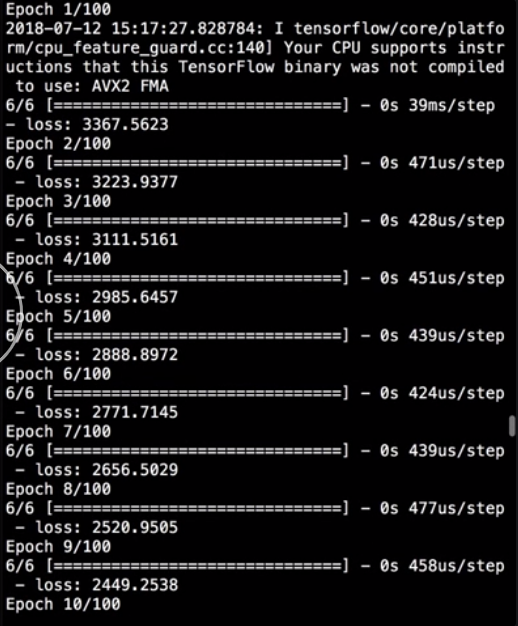
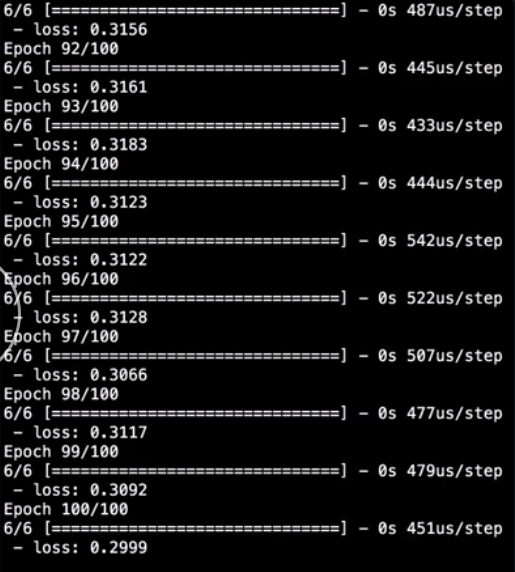

`import numpy as np`. 

#### neural_net.py

```python
import numpy as np
```

Then we can define our array of inputs, which we will call `x_train`, and outputs, which we will call y_train. They will both be `np.array`.

```python
x_train = np.array([])
y_train
```
The content should be the examples of our inputs and outputs that the network will use to learn its weights and biases. Our `model` is defined to take four numbers as inputs. We'll define several input examples, which will each be an array containing four numbers.

```python
x_train = np.array([
  [1, 2, 3, 4],
  [4, 6, 1, 2],
  [10, 9, 10, 11],
  [10, 12, 9, 13],
  [99, 100, 101, 102],
  [105, 111, 109, 102]
])
```

We want the network to learn how to take the mean of the four inputs. That means our output `Y` values will be the mean of each of the rows from the `X` inputs. Notice that the `Y` values are all arrays, even though they each contain only one element.

```python
y_train = np.array([
  [2.5],
  [3.25],
  [10.0],
  [11.0],
  [100.5],
  [106.75]
])
```
That's because the network expects the inputs and outputs to be arrays, no matter how many elements they contain. We have a set of inputs, and each input has a matching output value, which in this case is the mean of all the inputs.

To train the network on our sample data, we'll call the `fit` method of the model. The only required argument to train the model are the input `X` values and the output `Y` values, but there are several optional parameters that we can specify.

```python
model.fit(
  x_train,
  y_train
)
```

First, because we only have six input data points, we should pick a batch size that is smaller than that number. We'll define a `batch_size` of `2`. Normally, you would have a lot more data, so you could set your batch size to a more common 32, 64, or 256.

```python
model.fit(
  x_train,
  y_train,
  batch_size=2
)
```

Next, we'll set the number of `epochs` to `100`. An epoch represents how many times the network will loop through the entire data set. The more epochs you set here, the better the network accuracy will be, but the longer it will take to train.

```python
model.fit(
  x_train,
  y_train,
  batch_size=2,
  epochs=100
)
```

Finally, we'll set `verbose` to `1`, which will allow us to see the loss at every epoch.

```python
model.fit(
  x_train,
  y_train,
  batch_size=2,
  epochs=100,
  verbose=1
)
```

Then in the command line, we can run our file by typing `python neural_net.py`.

#### Terminal
```
$ python neural_net.py
```

The neural net has trained. If we scroll to the top of the output, we can see the training start with the first epoch. The loss here is what we're looking to reduce. It starts very high at the beginning because the network is initialized with random weights.



It's just totally guessing what the answer should be. With every training step, we want to see the loss go down further and further, until at last we see the loss start to flatten out.



If we keep training with more epochs, we should start to see this number go down even further. Already, after only `100`, we have a fairly low loss, which represents the mean squared error between the actual `Y` values and the predicted values from our network.