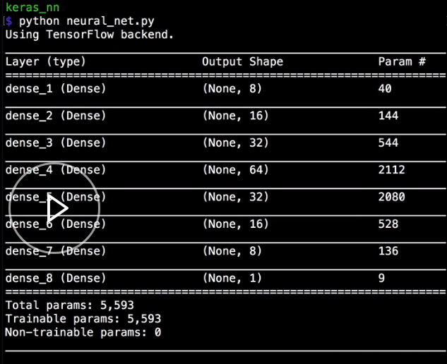

You can print a summary of the neural network with the `summary` method on the Keras `model`. 

#### neural_net.py
```python
model.summary()
```

When you run that, it will print a nicely-formatted summary that contains all of the network layers and a number that represents the total trainable weights in the network.



In general, the more weights a network has, the more complex the function it can approximate, but also, the longer it will take to train and the more data you will need to properly learn that function.

We can change the neural network by modifying the number of nodes in a layer, or by modifying the network entirely, to get a better feel for how complex the network is, and how many trainable weights it contains.

You can also use this `summary` method on networks that you didn't define yourself. It can be a helpful way to explore pre-trained networks.