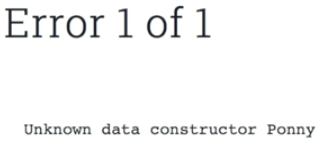

Instructor: [00:00] We'll make our first one by using a keyword data. We'll call it `Vehicle`, and that'll `= Car Wheels`. Now we have an error of unknown type, `Wheels`. Let's make this, so we call it `data Wheels = Wheels`, and we'll give it a type of `Int`.

```
data Vehicle 
    = Car Wheels
data Wheels = Wheels Int
```

[00:15] Next, let's add more attributes. To do this, we'll separate with a pipe, and we'll do `| motorcycle wheels | skateboard wheels | bicycle wheels`. 

```
data Vehicle 
    = Car Wheels
    | Motorcycle wheels 
    | Skateboard wheels 
    | Bicycle wheels
data Wheels = Wheels Int
```

Let's demonstrate how this would be used. Let's make `myVehicle`, and its type is `Vehicle`. On the next line `myVehicle = car [wheels 4]` .

```
myVehicle :: Vehicle
myVehicle = Car [Wheels 4]
```

[00:36] Let's change `Car` to `Pony` and see what happens. It has an unknown data constructor of pony, because we didn't create one. 


## Output
```javascript
Error 1 of 1

Unknown data constructor Ponny
```

Let's now change it to `Skateboard`, and then we'll give the `Wheels` a string of `"poop"`. Oh, another error. It couldn't match type `String` with type `Int`. That's because, on line 13, you'll see that `Wheels` are `Int`. Let's change that back to `4`, and that type checks.

[01:05] What we'll attempt now is to log `myVehicle`. Let's remove the string, add myVehicle.

```
main = render =<< withConsole do 
    logShow $ myVehicle
```

Oh, there's an error, `No type class instance was found for Data.Show.Show Vehicle`. This means that we need to add an instance. Right now, we can't show anything from our new data constructor. Let's do that.

[01:21] First of all, we'll create a function called `showWheels`, and that'll have a type of `Wheels -> String`. On the next line, `showWheels (Wheels a)` , and that will equal a string of `"Wheels: "`. To that, we'll append `show a`, and the `a` is the `Int` that we use with `Wheels`. Int already has a show instance, so that'll work here.

```
showWheels :: Wheels -> String
showWheels (Wheels a) = "Wheels: " <> show a
```

[01:44] Let's test this out. We'll do showWheels, and we'll bracket `(Wheels 4)`. Voila! We've created a function that can show our wheels and its value.

```
main = render =<< withConsole do 
    logShow $ showWheels (Wheels 4)
```

[01:55] Next, let's make one for showing our `Vehicle`. We'll call it `showVehicle`, and we'll give it a type of `Vehicle -> String`, and on a next line, `showVehicle (car a])` . That'll equal the string of `"Vehicle: Car, "` and then we'll give it a little space, and we'll append `show a`.

```
showVehicle :: Vehicle -> String
showVehicle (Car a) = "Vehicle: Car, " <> show a
```

[02:16] We've got an error, `"An expression cannot be determined to cover all inputs"`. We're pattern matching, and so far we've only pattern-matched against `Car`. We're missing on `Motorcycle`, `Skateboard`, and `Bicycle`. This is a really handy thing about ADTs. If you've not covered all your cases, then you're compiler will let you know.

[02:33] Let's cover these cases. We'll copy line 19, paste it three times. Let's grab car. We'll change that to `Motorcycle`, then we'll add `Skateboard`, and finally we'll get `Bicycle` and add that. 

```
showVehicle :: Vehicle -> String
showVehicle (Car a) = "Vehicle: Car, " <> show a
showVehicle (Motorcycle a) = "Vehicle: Car, " <> show a
showVehicle (Skateboard a) = "Vehicle: Car, " <> show a
showVehicle (Bicycle a) = "Vehicle: Car, " <> show a
```

The compiler's still returning something's wrong.

[02:52] There's `"No instance for Data.Show.Show Vehicle"`. We created a function that does that, but we need to make it an instance. We'll do that by using the keyword `instance`. We'll call it `showWheels'`, and that'll have a type of `Show Wheels where`. On the next line, `show = showWheels`.

```
instance showWheels' :: Show Wheels where
    show = showWheels
```

[03:14] The next time that we use a type `Show` with our type `Wheels`, we'll use our function `showWheels` to display the output. Let's make a show instance for our vehicle. That'll be instance `showVehicles'`, and that's got the type of `showVehicle where`, on the next line, `show = showVehicle`.

```
instance showVehicle' :: Show Vehicle where
    show = showVehicle
```

[03:29] This will work exactly in the same way as our instance of `showWheels`. Let's copy `myVehicle` from line 21, and we'll replace it on line 34. 

```
main = render =<< withConsole do 
    logShow $ myVehicle
```

There you go. You have the output. It's showing vehicle. There's a skateboard, and its wheels are four.


## Output
```javascript
Vehicle: Skateboard, Wheels: 4 
```

[03:45] Let's change `myVehicle` to a type of `Car`, and its wheels will have a string of `"poop"`. It couldn't match a type `String` with a type `Int`. It needs to be an integer. We'll give it a `6` instead of `"poop"`, and it'll display. My `Vehicle: Car`, and it's got `Wheels: 6`. Pretty strange car, but that's what it's got.

[04:04] There you go, an introduction to algebraic data types and show instances.